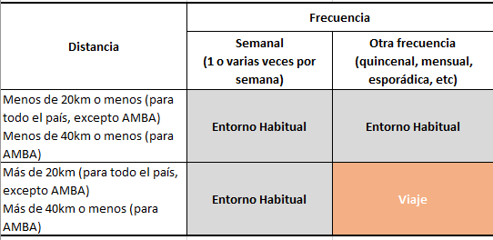
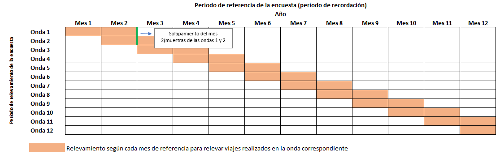
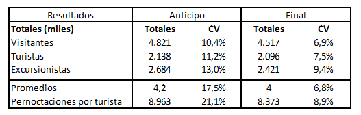
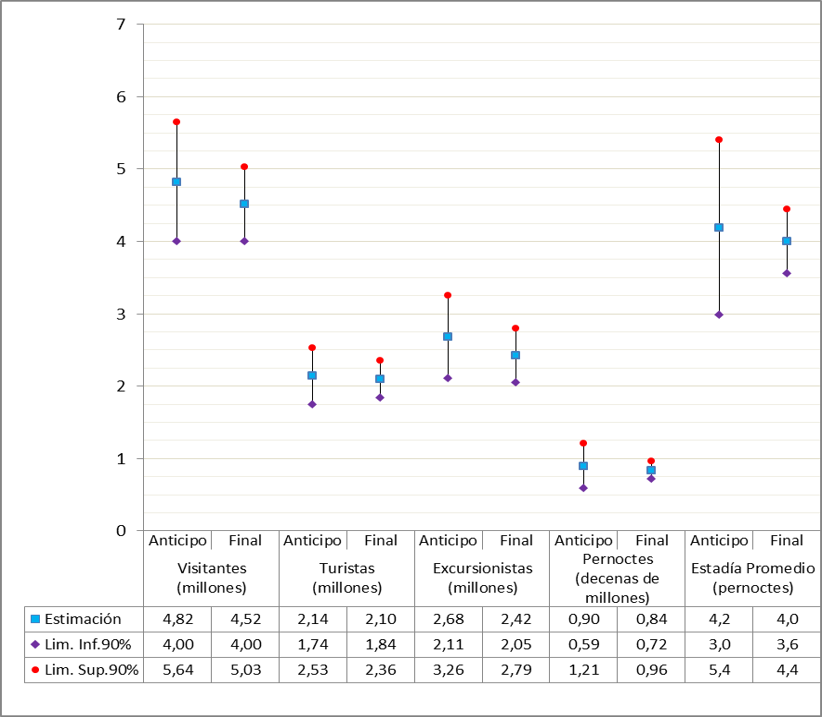

# **Aspectos metodológicos y técnicos**

A continuación, se detallan los aspectos metodológicos sobre los cuales se estructura el relevamiento de la EVyTH. Por consiguiente, se brinda una descripción pormenorizada sobre la unidad de observación, el marco muestral, el diseño muestral y el proceso de calibración implementados.

## Unidades de observación

Las unidades de observación de la EVyTH son las personas que residen en hogares particulares dentro del territorio argentino. Se considera hogar particular a aquel hogar constituido por una persona o grupo de personas, parientes o no, que conviven en una misma vivienda bajo un régimen de tipo familiar y consumen alimentos con cargo al mismo presupuesto. Asimismo, se considera miembros del hogar a las personas que habitan en una misma vivienda bajo un régimen de tipo familiar, comparten sus gastos de alimentación, habitan la vivienda desde hace 6 o más meses o, si viven en ella hace menos de 6 meses, han fijado o piensan fijar allí su residencia.

## Marco conceptual: definición de viaje turístico

Siguiendo las definiciones habituales y las recomendaciones internacionales de la Organización Mundial del Turismo, a los efectos del relevamiento de la EVyTH, se define como viaje de turismo a todo aquel desplazamiento realizado por todos, algunos o al menos uno de los miembros del hogar fuera de su entorno habitual (las segundas viviendas por definición no forman parte). Debe tenerse en cuenta que: 

    1.	Debe tener una duración inferior a un año y quien viajó no haber fijado su residencia en el lugar de destino.

    2.	Comprende los traslados, estancias y todas las actividades que las personas realizan en el lugar de destino.

    3.	Puede haber ido a un sólo destino o haber tenido varias etapas.

Los motivos del viaje pueden ser esparcimiento, ocio o recreación; visita a familiares y amigos; negocios o motivos profesionales; estudios y formación; razones de salud, religión u otros (trámites, compras, etc.) excepto ser empleado por una unidad residente del lugar visitado. Se incluyen tanto los viajes en los que el viajero pernocta al menos una noche en el lugar visitado como las visitas de un día (excusiones sin pernocte).

El entorno habitual comprende la zona cercana al lugar de residencia habitual del hogar más todos los lugares visitados frecuentemente, aunque no sean cercanos a su lugar de residencia. Operacionalmente, la distancia que abarca el entorno habitual se define como el radio de 20 Km. desde la ciudad/localidad en que se encuentra la vivienda principal del hogar, a excepción del Gran Buenos Aires (la Ciudad Autónoma de Buenos Aires más los 24 Partidos que conforman el conurbano de esta provincia), donde la distancia que determina el entorno habitual es el radio de 40 Km. de la localidad donde reside habitualmente el hogar. La frecuencia mínima de visita a un sitio, para que éste sea considerado como parte del entorno habitual, es de una vez por semana. Por lo tanto, los viajes que aquí consideramos son los realizados a destinos ubicados a más de 20/40 Km. de la localidad donde está la vivienda principal y que fueron visitados con una frecuencia no semanal.

En el caso de los desplazamientos internacionales, el criterio de distancia mínima es reemplazado por el de traspaso de la frontera administrativa. No obstante, el criterio de frecuencia sigue rigiendo, por lo cual, si una persona habitualmente traspasa la frontera una o más veces por semana, se considera que estos desplazamientos son parte de su entorno habitual. 

Un desplazamiento a un lugar fuera del entorno habitual, en términos de distancia y frecuencia, puede no ser un viaje. Estas exclusiones rigen en todos los casos, incluso cuando el viaje se realice a una segunda vivienda del hogar.

Si una persona realizó un desplazamiento cuyo motivo principal fue trabajar como empleado de una empresa o institución residente en el lugar visitado (a cambio de un salario, se trate de un empleo en “blanco” o no) no se considerará visitante de ese lugar y, por tanto, no se registra como viaje turístico. No se considera “empleado” si quien viaja por trabajo brinda un servicio por el cual percibe honorarios, o bien si recibe dinero en concepto de “viáticos”, es decir, una asignación para cubrir los gastos del viaje (pasajes, alojamiento, alimentación, etc.). Por ejemplo, no se consideran viajeros cuando son empleados en el lugar de destino:

    -	trabajadores en temporada en hoteles, explotaciones agropecuarias, etc.;

    -	trabajadores temporarios en internados, hospitales y similares;

    -	estudiantes que viajan por períodos inferiores a 12 meses y trabajan para mantenerse (tanto quienes reciben un salario por su trabajo como quienes ayudan a una familia en las labores de la casa y el cuidado de los niños a cambio de la estancia y el mantenimiento);

    -	quienes viajan como acompañantes (familiares, servicio doméstico, etc.) de aquellos que lo hacen por cualquiera de los motivos ya enunciados, aunque hayan realizado actividades turísticas.

En cambio, si se consideran que realizaron viajes aquellas personas que viajaron por trabajo, pero no fueron empleados en el lugar de destino, por ejemplo:

    -	conferenciantes, artistas de espectáculos y consultores;

    -	un abogado que defiende en un juicio a una persona o empresa del lugar visitado;

    -	un cirujano que viaja a realizar una operación por única vez.

No se consideran viajes aquellos desplazamientos realizados por las personas para quienes el traslado es parte de su trabajo. Por ejemplo, los pilotos de avión, conductores de camión o de ómnibus de larga distancia, viajantes de comercio y similares (incluyendo personal de seguridad, de asistencia – azafatas-, etc.).

El cuadro a continuación resume la definición de entorno habitual discutida anteriormente.

**Cuadro 1: Definición de Entorno Habitual**

## Unidades de análisis

El marco conceptual antes definido permite obtener conclusiones a partir de diversas unidades de análisis. A continuación, se las repasan junto con una breve descripción de cada una de ellas:

    1.	Hogar: es la persona o grupo de personas, parientes o no, que habitan bajo un mismo techo en un régimen de tipo familiar; es decir, comparten sus gastos en alimentación con cargo a un mismo presupuesto.
    
    2.	Persona: cada uno de los individuos integrantes de un hogar.
    
    3.	Turista: significa el desplazamiento que realiza una persona fuera del entorno habitual, con una duración inferior al año, pernoctando en el/los lugar/es de destino, por cualquier motivo excepto de ser empleado por una unidad residentes.

    4.	Visita de un día: es el recorrido de una persona fuera del entorno habitual sin pernoctar en el lugar de destino.

    5.	Pernoctación: se trata de una noche de alojamiento de una persona.

## Universo bajo estudio

El universo bajo estudio de la encuesta son los grandes aglomerados urbanos definidos en la EPH del INDEC. Por lo tanto, se consideran 32 aglomerados (para mayor detalle ver el cuadro en el Anexo). Los aglomerados se agrupan en las siguientes Regiones: [^aspectos-metodologicos-y-tecnicos-3]

        1.	Región Ciudad de Buenos Aires.
        
        2.	Partidos del Conurbano de la Provincia de Buenos Aires.
        
        3.	Región Interior de la Provincia de Buenos Aires: compuesto por todos los aglomerados pertenecientes a dicha Provincia, excepto Partidos del Conurbano de la Provincia de Buenos Aires.
        
        4.	Región Córdoba: compuesto por todos los aglomerados pertenecientes a la Provincia de Córdoba.
        
        5.	Región Litoral: compuesto por todos los aglomerados pertenecientes a las Provincias de Santa Fe, Entre Ríos, Corrientes, Misiones, Formosa y Chaco.
        
        6.	Región Norte: compuesto por todos los aglomerados pertenecientes a las provincias de Jujuy, Salta, Tucumán, Santiago del Estero, Catamarca y La Rioja.
        
        7.	Región Cuyo: compuesto por todos los aglomerados pertenecientes a las provincias de Mendoza, San Luis, San Juan.
        
        8.	Región Patagónica: compuesto por todos los aglomerados pertenecientes a las provincias de La Pampa, Neuquén, Río Negro, Chubut, Santa Cruz y Tierra del Fuego.

[^aspectos-metodologicos-y-tecnicos-3]: Se debió decidir en qué regiones incluir los aglomerados urbanos “San Nicolás – Villa Constitución” y “Viedma – Carmen de Patagones” puesto que las ciudades se encuentran en distintas provincias y, por ende, en diferentes regiones (según la definición que sigue). Se incluye al primer aglomerado (San Nicolás – Villa Constitución) en la Región Buenos Aires, mientras que el segundo (Viedma – Carmen de Patagones), en la Región Patagonia.

A continuación, se presenta un mapa que, a modo ilustrativo, indica los aglomerados que son relevados:

[AGREGAR] **Mapa con los aglomerados capitales de provincia o aglomerados urbanos de más de 100.000 habitantes del universo bajo estudio** 

## Diseño muestral

El diseño muestral a considerar durante el relevamiento de la EVyTH se estructura en las siguientes pautas:

    1.	Cada una de las regiones definidas es considerada como estrato y se seleccionan muestras independientes en cada uno de ellos.
    
    2.	El método de selección implementado es el sistemático.
    
    3.	Cada región, se ordena por Aglomerado – Partido/Departamento – Localidad – Característica Telefónica.

## Tamaño muestral y manejo de los reemplazos

El tamaño de muestra mensual titular de 2.600 hogares distribuidos a lo largo de cada Región - Aglomerado – Partido/Departamento - Localidad. Asimismo, en caso de que la muestra titular no pueda ser completada (por ausencia de respondentes, rechazo a responder la encuesta o errores del marco), se seleccionan, con el mismo diseño muestral reemplazos para el hogar titular. Los reemplazos coinciden en la Región, Aglomerado, Partido/Departamento y Localidad y son utilizados luego de, al menos, seis intentos de comunicación insatisfactorios con la muestra inicial. 

De esta forma, con el mecanismo de períodos de referencia y ventanas de observación implementados se logra que, para la ventana de observación de un mes determinado, se duplique el tamaño de muestra (se relevan 5.200 hogares). 

## Marco de muestreo

La EVyTH se instrumenta a través de un sistema C.A.T.I. (Computer Assisted Telephone Interviewing). Para ello, se utiliza como marco de muestreo la Guía Telefónica Nacional (GTN) del año 2011 (actualizada anualmente). La encuesta cuenta con una Guía ya consistida y validada.

La GTN está compuesta por los siguientes campos:

    1.	Rubro/Actividad
    
    2.	Apellido y Nombre
    
    3.	Domicilio
    
    4.	Teléfono
    
    5.	CP
    
    6.	Ciudad
    
    7.	Localidad
    
    8.	Provincia

## Periodicidad, ventana de observación y período de referencia

Para llevar adelante el campo de la EVyTH, se utiliza una periodicidad de muestreo mensual; es decir, todos los meses se releva una muestra seleccionada de acuerdo a la metodología descripta anteriormente.

Además, se contempla una ventana de observación [^aspectos-metodologicos-y-tecnicos-4] bimestral para los meses a ser relevados, es decir, períodos de recordación de dos meses consecutivos. Las ventanas de observación de períodos cortos, como este caso, eliminan la necesidad de recordación por tiempos prolongados, lo que favorece la veracidad de la información.

[^aspectos-metodologicos-y-tecnicos-4]: El período para el cual se brinda información se denomina ventana de observación.

Para dar mayor detalle del mecanismo de ventanas de observación y solapamiento implementado, se presenta el siguiente esquema:

[AGREGAR] **Cuadro 2: Periodicidad, Ventana de Observación y Períodos de Referencia**

La EVyTH se desarrolla “durante doce ondas consecutivas, a razón de una onda por mes calendario”. El mes calendario de comienzo del relevamiento es marzo. Por lo tanto, para ese mes (que sería la Onda 1 de la EVyTH), se encuesta la muestra (titular) de 2.600 hogares (con los remplazos que hicieran falta) y se consulta por los períodos de referencia correspondiente a los dos meses calendarios anteriores (enero y febrero). Durante el segundo mes de relevamiento, abril (Onda 2), se procede de forma similar para los viajes realizados en los dos meses anteriores (febrero y marzo). Consecuentemente el Mes 2 (abril) la muestra queda “solapada”, habiéndose encuestado 5.200 hogares para este mes (es decir, luego del segundo mes de relevamiento). 

De este modo se garantiza que, las estimaciones contenidas en los informes correspondientes a cada mes en el apartado de Anticipo Mensual son obtenidas a partir de 2.600 encuestas efectivas, mientras que para las estimaciones mensuales finales la muestra queda duplicada a 5.200 (lo que garantiza la robustez del resultado). 

## Esquema de Rotación muestral

Con el objetivo de mejorar la comparación interanual de las principales variables relevadas, se renueva periódicamente el conjunto de hogares encuestados (panel de respondentes) [^aspectos-metodologicos-y-tecnicos-5]. Conceptualmente, el esquema de rotación de una encuesta tiene incidencia sobre los siguientes aspectos:

    1.	Precisión de las estimaciones del cambio entre dos períodos diferentes.
    
    2.	Precisión de las estimaciones obtenidas al agregar muestra.
    
    3.	Nivel de no respuesta (por cansancio del panel).

[^aspectos-metodologicos-y-tecnicos-5]: La forma en que se produce esta renovación se denomina esquema de rotación. 

El objetivo primordial de la EVyTH es medir la evolución de los viajes que, es sabido, es una variable que presenta una gran estacionalidad. Consecuentemente, la medición de la evolución no se realiza a partir de comparar dos meses consecutivos (excepto algunos meses en particular), sino que anualmente o agregando períodos (estival, invernal, etc.). 

Tal como se describió anteriormente, el manejo muestral exige escoger la muestra antes de cada mes de relevamiento de modo tal de obtener muestras independientes, pero solapadas. El esquema de rotación que se implementó consiste en incluir en la muestra del mes 1 del año t, la muestra titular de los hogares respondentes del mismo periodo (mes 1) del año anterior (t-1), no con el objetivo de estudiar el comportamiento de esos hogares en particular, sino de modo tal de hacer que las variaciones interanuales no presenten diferencias extremas. De esta forma se maximiza la precisión en cuanto a los cambios suscitados entre un año y otro. Un sistema de rotación muestral como este, permite evitar el cansancio del panel respondente ya que se repiten los hogares luego de doce meses. De esta manera, se logra una mejor ponderación entre ganancia en precisión (al rotar la muestra) y medición del cambio entre dos períodos (dos años).

Es relevante señalar que durante la EVyTH-12 se llevó a cabo una prueba piloto de esta metodología “de panel” entre los meses de abril y mayo (ondas 3 y 4). Los resultados fueron positivos ya que no se encontraron sesgos en las características de los respondentes [^aspectos-metodologicos-y-tecnicos-6] , a la vez que se aumentó la tasa de efectividad de las encuestas [^aspectos-metodologicos-y-tecnicos-7]. En efecto, en comparación con las ondas en las que no fue implementada esta metodología de panel (es decir, para las ondas 1 a 4 de la EVyTH-11 y ondas 1 y 2 de la EVyTH-12), la tasa de efectividad de encuesta para los hogares titulares durante las ondas en las que sí se adoptó, (es decir, ondas 3 y 4) fue del doble. Mientras que se halló que poco más de dos de cada diez hogares de la muestra titular decidieron responder la encuesta en las primeras ondas, casi cinco de cada diez decidieron hacerlo en las ondas 3 y 4 durante el relevamiento de la EVyTH-12.

[^aspectos-metodologicos-y-tecnicos-6]: El control consistió en evaluar las características principales de los respondentes de la encuesta durante las primeras cuatro ondas de relevamiento del año 2011 y del año 2012. El objetivo fue estudiar si se producía algún sesgo demográfico al utilizar muestras panel. Los relevamientos de las ondas 3 y 4 (relevamientos de abril y mayo) de la EVyTH-12 fueron panel (incluyeron a los hogares respondentes del mismo periodo del año anterior), mientras que las ondas 1 y 2 (febrero y marzo) no lo fueron. Los resultados del estudio demostraron que no se encontraron variaciones significativas en ningunas de las variables estudiadas (edad promedio edad en tramos, relación de parentesco del miembro respondente con el jefe de hogar, asistencia a establecimiento educativo, máximo nivel educativo alcanzado, situación ocupacional) entre los meses con muestra panel y los meses sin muestra panel.

[^aspectos-metodologicos-y-tecnicos-7]: Se estudiaron las características de los respondentes no notándose diferencias estadísticamente significativas entre los respondentes que aceptaron ser encuestados el año anterior respecto del mismo grupo que aceptó ser encuestado en el 2012.

Además, se realizó un control por características sociodemográficas del miembro respondente para verificar que no se hubiera sesgado la muestra. Las variables consideradas fueron:

    1.	edad promedio del miembro respondente
    
    2.	jefe de hogar o relación de parentesco con el jefe de hogar
    
    3.	asistencia a establecimiento educativo
    
    4.	máximo nivel educativo alcanzado
    
    5.	situación ocupacional

El estudio arrojó el resultado antes comentado: no se encontraron mayores diferencias socio-económicas entre aquellos que accedieron a contestar las preguntas de esta edición de la encuesta con aquellos que lo hicieron en las ondas con distinta metodología.

## Consistencia y validación

Con el objeto de garantizar la calidad de la información se utiliza un proceso de validación y consistencia de los ficheros resultantes de la encuesta para aplicarse previo a cualquier imputación o tratamiento de información faltante. Dicho proceso se implementa mediante un programa que permite gestionar el proceso de validación y las correspondientes correcciones en los casos de hallar inconsistencias que ha sido diseñado especialmente para la EVyTH.

En este tipo de procesos, el objetivo es controlar los valores o el campo de variación (rango de valores) de cada variable del cuestionario. En una primera etapa, la validación se realiza exclusivamente para cada uno de los individuos registrados, independientemente de su interrelación con la información relevada en otros individuos del mismo hogar. Esto significa que esta validación inicial se realiza en forma independiente para cada individuo y para cada variable del cuestionario. 

En las preguntas cerradas se controla que los códigos introducidos se encuentren dentro del rango de valores correspondientes a dicha variable. Por ejemplo, en la variable “NIVEL DE INSTRUCCIÓN”, sólo deben presentarse los códigos 01 a 10 y el código 99 para el caso de no respuesta. 

Una segunda etapa del proceso de validación y consistencia consiste en la validación cruzada de la información contenida entre variables relevadas en un mismo individuo. Es decir, se analizan las interrelaciones lógicas entre dos o más preguntas de un mismo individuo. Por ejemplo, si no responde en la pregunta sobre si trabaja o no, pero luego responde que es “ama de casa”, entonces debería corresponder la respuesta “No” a la pregunta sobre si trabaja.

El proceso de validación también implica el manejo de las encuestas parcialmente completas. Se implementó un criterio para determinar cuáles encuestas no pueden ser utilizadas para extraer información y cuáles si, de forma tal de minimizar la pérdida de datos. Se considera una encuesta válida cuando el respondente haya contestado todas las preguntas referidas al comportamiento turístico del hogar dentro del periodo de referencia correspondiente y, al menos, haya respondido sobre las características básicas del jefe (sexo, edad, nivel educativo). Si bien la gran mayoría de los entrevistados responden hasta el final de la encuesta (y, por ende, se cuenta con las características de cada una de las personas que integran el hogar), en algunas ocasiones el respondente se niega a suministrar información personal. Como se mencionó, en estos casos el criterio para dar por válida una encuesta es que al menos se haya obtenido la información básica sobre el jefe. En base a la información recolectada hasta allí (cantidad de integrantes, características del jefe, observaciones del encuestador sobre el sexo y/o la edad de las personas restantes -información que suele surgir durante el desarrollo de la entrevista), se procede a imputar las características básicas de las personas del hogar faltantes.

Por último, existe un proceso de validación “ex – post”. Este mecanismo consiste en estudiar cada una de las variables discriminadas en función de distintos cortes (etarios, regionales, etc.) con el fin de analizar respuestas que se ubiquen fuera de los rangos definidos como “normales”. 

## Procedimiento de imputación

Una vez finalizada la etapa de validación y consistencia de la información comienzan las tareas de imputación de la falta de respuesta en las variables de cada base de datos. En la sección a continuación se realiza una breve descripción del proceso de imputación de las principales variables relevadas por la EVyTH: ingreso total del hogar y gasto del viaje.

Desde el punto de vista conceptual, el método de imputación que se utiliza, al sustituir valores perdidos, requiere que la imputación no modifique las características de la variable en estudio. Por este motivo es recomendable demostrar, luego de la imputación, que no se han generado cambios relevantes en la distribución de la variable imputada.

En una primera instancia se procede a estudiar y evaluar la imputación de las variables “Ingreso Total del Hogar” y “Gasto en Viajes”, sin embargo, lo aplicado en esta situación es empleado en otras variables de interés (por ejemplo, edad, sexo y situación laboral). 

Para el caso de la variable Ingreso Total del Hogar, considerando que se trata de una variable categórica ordinal, para su imputación se utiliza un modelo de Regresión Logística Politómica con Variable Respuesta Ordinal. 

Para el caso de la imputación de la variable “Gasto del Viaje”, al ser una variable continua (no está categorizada), la metodología implementada para su imputación sigue un modelo de regresión en dos etapas puesto que debe contemplarse que la variable ingreso es una variable con distribución marcadamente sesgada (por lo que una técnica que asuma una distribución Normal no debería ser adecuada sin una previa transformación que asegure dicho supuesto). Esta metodología busca, en la primera etapa, “colocar” el valor del gasto faltante en una categoría de gasto, en función de los valores observados en las variables explicativas mientras que, en la segunda etapa, se selecciona un valor de esa categoría para “asignar” al registro. Por otra parte, entre las variables explicativas que se tomaron en cuenta para su imputación se encuentran: distancia recorrida, cantidad de noches, cantidad de miembros del hogar, tipo de alojamiento, medio de transporte utilizado, motivo del viaje, tiempo de organización del viaje, mes en que se realizó el viaje, entre otras. 

## Proceso de calibración

Una etapa crítica en toda encuesta por muestreo es la expansión de la información. Una selección adecuada, y el posterior desarrollo, de una metodología para ponderar los datos muestrales es importante, ya que debe atender simultáneamente varias necesidades. Las distintas temáticas estudiadas, y la necesidad de lograr estimaciones adecuadas para cada una de ellas, obliga a que ésta sea lo más eficiente posible, en términos de precisión, cuidando no privilegiar a algunas en perjuicio de otras. Al mismo tiempo, su implementación debe ser simple, flexible y económica en tiempos de ejecución y cálculo.

Uno de los problemas más comunes en las encuestas complejas de gran envergadura es que una vez desarrollado el trabajo de campo existen algunos subgrupos de la población objetivos sub o sobre-representados. 

Esta dificultad lleva a que los sesgos puedan ser importantes, impidiendo una interpretación correcta de las estimaciones o imposibilitando la comparación de los resultados con fuentes alternativas.

Para corregir esto, en la práctica es habitual corregir los pesos o factores de expansión iniciales (las inversas de las probabilidades de inclusión) con la ayuda de información auxiliar. El hecho de contar con dicha información auxiliar en la etapa de estimación permite el empleo de estimadores que la involucran. Dentro de este tipo de estimadores están los que se obtienen a través de los métodos de calibración. Éstos, en su forma más general, tienen como objetivo crear nuevos pesos que resultan de modificar o calibrar las ponderaciones iniciales por diseño. 

El empleo adecuado de la técnica de calibración permite:

    1.	Reducir el error cuadrático medio de las estimaciones.
    
    2.	Corregir posibles sesgos en la etapa de selección.
    
    3.	Dar una solución al problema de “no-respuesta”.
    
    4.	Lograr, a partir de las restricciones impuestas, una deseable consistencia, o concordancia, entre los totales conocidos y los obtenidos a través de la muestra, de las variables auxiliares.

La calibración consiste básicamente en la resolución de un problema de minimización numérica. Dicho problema queda planteado con la elección de una distancia, entre los nuevos ponderadores y los originales, y la utilización de un conjunto de restricciones impuestas sobre las variables auxiliares que intervienen en el ajuste.

Para el presente trabajo se utiliza y adapta la macro CALMAR [^aspectos-metodologicos-y-tecnicos-8], escrita en lenguaje SAS por Sautory (1991), la cual calcula los pesos calibrados cuando la información auxiliar de una encuesta consiste de totales marginales conocidos dispuestos en una tabla de frecuencias de dimensiones arbitrarias. La macro mencionada trabaja con cuatro funciones, de las cuales para la EVyTH se trabaja sólo con tres. A continuación, se brinda una pequeña descripción de cada una de ellas.

    1.	Método Lineal:  knitr::include_graphics("salidas/tabla1.png")
    
    2.	Método multiplicativo (o método ranking):  knitr::include_graphics("salidas/tabla1.png")  
    
    3.	Método logit: Fijar dos constantes L y U, tal que L<1<U, y sea knitr::include_graphics("salidas/tabla1.png") . Luego knitr::include_graphics("salidas/tabla1.png")
 
 
[^aspectos-metodologicos-y-tecnicos-8]: El algoritmo del Calmar a utilizar durante la calibración puede ser consultado en: http://www.restore.ac.uk/PEAS/saspackage.php

[AGREGAR] fórmulas en markdown

si L<x<U, y knitr::include_graphics("salidas/tabla1.png")  en otro caso. La función F correspondiente es:
knitr::include_graphics("salidas/tabla1.png") 
 
que toma valores entre L y U

La función logit descripta en el punto 3. constituye una función inusual que surge del deseo de restringir el rango de los nuevos pesos wk para evitar los pesos extremos, los cuales pueden ser eliminados a través de una apropiada elección de L y U. 

Para el proceso de calibración de la EVyTH se intenta, no siempre con éxito (de acuerdo con nuestra experiencia en las ediciones de la EVyTH anteriores), utilizar el método 1), dado que el proceso iterativo solamente involucra un paso. La dificultad que posee este método es que, en muchos casos y debido a la estructura interna de la muestra con respecto a las variables de calibración, brinda pesos negativos los cuales obviamente no tienen sentido dentro del muestreo. Es por ello que para aquellas Regiones donde se encuentran estas dificultades, se aplica el método 2., el cual posee la ventaja de evitar los pesos negativos.

El método 3. se aplica en aquellas Regiones donde los nuevos pesos calculados por el método 1. o 2. resulten extremos. Se intenta, en la mayoría de las Regiones, que los pesos resultantes cumplan con la siguiente condición: knitr::include_graphics("salidas/tabla1.png")  , necesitando en algunas Regiones ampliar dichos márgenes. 

Se realiza la calibración en forma independiente en cada Región dado que las muestras son independientes y además se brinda estimaciones de cada una de ellas.

Con respecto a la información auxiliar empleada para la calibración y el ajuste de las estructuras internas de la muestra, se recurrió a proyecciones de población en base al INDEC. Se tiene en cuenta los siguientes totales a nivel de cada una de las siete Regiones:

    1.	Total de personas por sexo.
    
    2.	Total de personas por grupos de edad. 
    
    3.	Total de personas por nivel educativo.
    
    4.	Total de viviendas.

Los grupos de edad están compuestos de la siguiente manera: 

    1.	0 – 17 años, 
    
    2.	18 – 34 años, 
    
    3.	35 – 54 años y 
    
    4.	mayores de 55 años. 

Nivel Educativo está conformado por cuatro grupos siendo los mismos: 

    1.	“Sin Instrucción/Hasta Primario Incompleto”, 
    
    2.	“Primario Completo/Secundario Incompleto”, 
    
    3.	“Secundario Completo/Terciario Incompleto/Universitario Incompleto” y
    
    4.	“Terciario Completo/Universitario Completo/Posgrado/Maestría/Doctorado” 

Importa aclarar que los Totales de Población y Viviendas utilizados en la calibración se obtienen de Proyecciones elaboradas por INDEC, las cuales actualiza a medida que se dispone de la información del Censo Nacional de Población, Hogares y Viviendas desarrollado en el 2010.

Por otra parte, para cada uno de los meses de relevamiento, se realizan 2 calibraciones. Una calibración, inmediatamente al final del relevamiento con el objetivo de dar el anticipo nacional de las principales estimaciones de interés correspondiente a los viajes realizados durante el mes anterior al de relevamiento. La segunda calibración se realiza al final del bimestre donde se dan todas las estimaciones definitivas a nivel regional para el mes que haya duplicado la muestra (5.200 encuestas). Es decir, si el mes de relevamiento fuera enero, por ejemplo, se consulta por los viajes realizados (que finalizaron) en el mes de diciembre y noviembre (1 y 2 meses atrás del mes de relevamiento). Al final del relevamiento de ese mes (enero) se brinda un anticipo nacional para el mes de diciembre con un tamaño de muestra de 2.600 hogares. Luego, durante el próximo mes de relevamiento (febrero), el período de referencia serán los meses de diciembre y enero, por lo que, al finalizar, producto del solapamiento descripto anteriormente, se relevan 5.200 hogares para el mes de diciembre (2.600 durante el relevamiento de enero y 2.600 casos durante el relevamiento de febrero). Por lo tanto, al finalizar el relevamiento de febrero se brinda una estimación definitiva con nivel de desagregación geográfica regional para el mes de diciembre y un anticipo nacional (con 2.600 casos) para el período de referencia de enero.

Es preciso aclarar que tanto la calibración correspondiente al anticipo (con representatividad nacional) y definitiva (con desagregación por región) de cada uno de los meses, se realiza en forma independiente en cada una de las Regiones. Por lo tanto, la calibración del anticipo se lleva a cabo en cada una de las regiones, brindándose resultados nacionales, y luego, al mes siguiente, se vuelve a realizar una calibración en cada región con el total de la muestra definitiva (para lo que no se consideran los ponderadores estimados durante el anticipo).

Para salvar posibles inconsistencias en los cuadros a publicar, los pesos calibrados son tratados por un algoritmo de redondeo para eliminar la componente decimal con los que salen del proceso iterativo sin destruir las concordancias alcanzadas.

## Coeficientes de variación

La metodología de la EVyTH-13 incorporó el cálculo de estadísticos (o indicadores) con la finalidad de brindarle al usuario de los datos una medida del grado de precisión de las estimaciones calculadas para cada uno de los informes de resultados. Esto es especialmente relevante con el fin de brindarle al lector noción sobre cuán preciso es el estimador que se utiliza (o cita) de forma tal que este pueda medir los “riesgos” que ello implique. 

Desde la perspectiva del diseño muestral la EVyTH se encuadra dentro de los diseños estratificados con selección sistemática dentro de cada uno de los estratos (ocho estratos en total siendo estos las Regiones del Ministerio de Turismo, Capital Federal, Partidos Gran Buenos Aires, Resto Pcia. Buenos Aires, Córdoba, Litoral, Norte, Cuyo, Patagonia). Si bien el método de selección sistemática es recomendable y eficiente para muestras telefónicas, su uso implica que no exista estimadores no sesgados de varianza. Para sortear esta dificultad a la hora del cálculo de los errores muestrales se propuso plantear el supuesto de que la población está en “orden aleatoria”. Bajo este supuesto se pueden utilizar los estimadores de un muestreo estratificado con selección simple al azar. Con esto se resuelve el problema de cómo estimar los desvíos estándares de cada estimador. 

En el caso particular de la EVyTH, los informes presentaron el cálculo de los CV para cada estimador relevante (según el informe que se trate), aclarándose para aquellos que presenten un CV superior al 30% que “el resultado debe considerase a título indicativo puesto que la estimación no presenta el mínimo de precisión preestablecido”.

Además de los CV, en los distintos informes producidos a partir del relevamiento de la EVyTH, se calculan intervalos de confianza puesto que facilitan la comprensión acerca del grado de precisión de los distintos estimadores calculados para aquellos lectores no instruidos en el tema. 

El Cuadro a continuación destalla los Coeficientes de Variación que son calculados según cada informe producido en el marco de la encuesta.

[AGREGAR] **Cuadro 3: Coeficientes de Variación calculados según cada Informe de la EVyTH**

Para comprender fácilmente la forma en que se implementó la metodología descripta anteriormente, se brindan a continuación algunos ejemplos de estimaciones de CV.

[AGREGAR] **Cuadro 4: Análisis de margen de error para informes de adelanto y final. Resultados básicos para agosto 2013**

[AGREGAR] **Gráfico 2: Análisis de margen de error para informes de adelanto y final. Visitantes (intervalo de confianza al 90%). Resultados para agosto 2013.**

