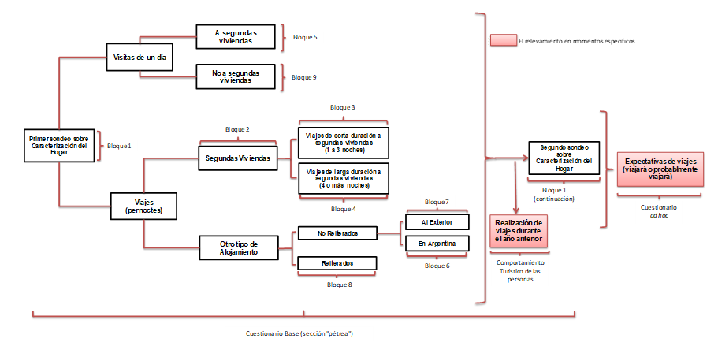
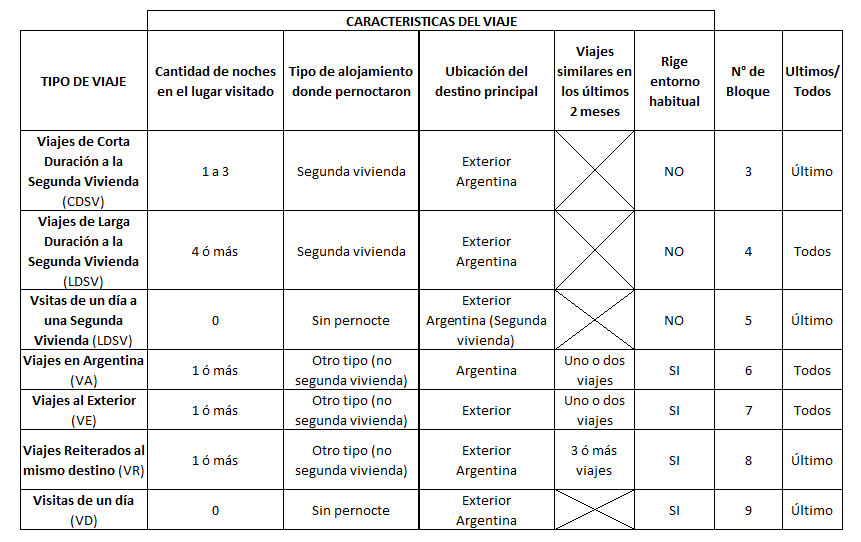

# Cuestionario

A continuación, se expone el Cuestionario que se implementó en la EVyTH.
El mismo consiste en un Cuestionario Base (o sección "pétrea") que, básicamente, pretende relevar los viajes realizados en los últimos dos meses y un Cuestionario "ad-hoc" que tiene la función de captar eventuales viajes futuros para fechas especiales como son los periodos de Verano/Invierno.

## Antecedente de la actual edición de la EVyTH

El Cuestionario implementado en la EVyTH-06, constituyó el modelo sobre el cual se trabajó para llegar al cuestionario aplicado en la Prueba Piloto, en la EVyTH telefónica de los años 2012 en adelante.
Al observarse el Formulario, se puede notar que la estructura conceptual del cuestionario ha perdurado desde su comienzo, sin embargo, seguramente fue preciso realizar algunas modificaciones atendiendo a situaciones de diversa índole [^cuestionario-9] .
Los cambios que ha sufrido el cuestionario se resumen a continuación y resultan en el Formulario Base anexado a este informe [^cuestionario-10].

## Descripción del formulario

En la presente sección, se describe el cuestionario, que se utiliza para la presente edición de la EVyTH.
Este puede ser dividido en dos grandes secciones: un bloque "pétreo" (cuyo contenido solo esporádicamente sufre alguna alteración menor) y otro bloque conformado por preguntas que cambian en función de relevamientos "ad-hoc" que resultan de interés según el período y la ocasión.
Si bien esta sección es utilizada para indagar sobre la expectativa que los encuestados tienen en relación a la posibilidad de realizar algún viaje en un momento futuro (como los períodos de alta estacionalidad turística), puede ser utilizada, también, para llevar adelante encuestas de opinión u de otra índole [^cuestionario-11] (durante la EVyTH-20 se indago sobre los perjuicios que tuvo la pandemia a causa del virus COVID-19 y sobre futuros viajes pos pandemia).

[^cuestionario-9]: Circunstancias a las que se le debe adicionar el hecho de que ahora el relevamiento es telefónico (a diferencia de la EVyTH-06, que se realizó cara a cara).
[^cuestionario-10]: Este Formulario Base ya incorpora la actualización de los tramos de gastos (según tipo de viaje) y de ingreso (así como también los cambios necesarios a las preguntas de comportamiento turístico).
[^cuestionario-11]: Su característica básica es que es completamente flexible permitiendo realizar relevamientos “ad-hoc” de forma fácil.

### Cuestionario base (sección "pétrea")

Como se indicó anteriormente, la sección del cuestionario que se describe a continuación prácticamente no ha sufrido alteraciones desde el comienzo de la primera edición de la EVyTH.
La idea es minimizar los cambios de contenido a esta parte del cuestionario con el fin de lograr la mayor compatibilidad entre los datos relevados en distintos momentos del tiempo y, de esta forma, generar una serie de tiempo lo más extensa posible.

Esta sección se compone de 9 Bloques; a saber:

  - Bloque "Características de los miembros del hogar".

Este bloque está subdivido en tres.
(i) Al inicio de la encuesta, sólo se indaga por la cantidad de personas que integran el hogar y las iniciales (de forma tal de mantener el anonimato) de cada uno de los miembros del hogar.
(ii) Al final del cuestionario, luego de indagar por la realización de viajes y visitas y sus características, se indaga por las características de los miembros del hogar, bajo el supuesto de que, con el devenir de la encuesta, el entrevistado gana confianza y se muestra menos renuente a responder estas preguntas.
En este mismo sub-bloque se indaga por el comportamiento turístico en el año calendario anterior a la encuesta [^cuestionario-12]; (iii) La indagación por los ingresos totales del hogar, que cierra la encuesta, se incluye como otro sub-bloque también al finalizar el Formulario Base.

  - Bloque "Segundas Viviendas".
Se indaga únicamente por las segundas viviendas que el hogar dispuso y utilizó durante el periodo de referencia.

  - Bloque "Viajes de corta duración a segundas viviendas": 1 a 3 noches (VCDS).  
  
  - Bloque "Viajes de larga duración a segundas viviendas": 4 noches o más (LDSV).  
  
  - Bloque "Visitas de un día a segundas viviendas" (VDSV). 
  
  - Bloque "Viajes no reiterados en Argentina" (VA).  
  
  - Bloque "Viajes no reiterados al exterior" (VE). 
  
  - Bloque "Viajes a destinos reiterados" (DR).
    
Este bloque funciona como "reserva", es decir, no se pregunta directamente al entrevistado si realizaron viajes de este tipo, sino que el encuestador lo completa en caso de detectar la existencia de este tipo de viajes en la indagación de los bloques anteriores (VA y VE).

  - Bloque "Visitas de un día".
  
  - Bloque sobre viaje en períodos turísticos especiales.

Este relevamiento complementario indaga por la posibilidad de que alguno de los miembros del hogar haya realizado viajes en la/s fecha/s especiales durante los meses de referencia (por ejemplo, períodos de temporada de verano/invierno). Es un bloque del cuestionario base que se "activa" automáticamente cuando, en los meses de referencia, ha habido un fin de semana largo. En función de ello, se consulta explícitamente si el encuestado ha viajado durante ese momento específico del mes.

  - Comportamiento turístico de las personas.
  
Finalmente, el formulario también incorpora, solo durante los meses de febrero a mayo, una sección donde se indaga por viajes realizados durante al año anterior a modo de conocer el comportamiento turístico de las personas.
Con la información recabada en esta sección se confecciona el informe sobre Comportamiento Turístico de las Personas Sinópticamente, la lógica del Formulario Base puede resumirse a través del siguiente cuadro:

[^cuestionario-12]: Este aspecto se indaga durante los meses de febrero hasta mayo inclusive.

**Cuadro 5: Esquematización del Cuestionario utilizado durante la EVyTH**

El cuestionario base contiene su propia terminología para caracterizar a los viajes (en sentido amplio).

Así, por ejemplo, cuando el visitante pernocta al menos una noche en el lugar de destino, se especifica como "viajes" y "viajeros" propiamente dichos. Cuando la persona no pernocta en el lugar de destino, se hace referencia a "visitas de un día" y "visitantes" o "excursionistas". Por lo tanto, en función de una serie de variables, se han definido diferentes tipos de viajes.

Estas variables son:

  1. **Cantidad de noches en el lugar visitado.** Se consideran las noches pasadas en alojamientos del lugar visitado.
  
  1. **Tipos de Alojamiento donde pernoctaron.** Se clasifican en dos grupos:

    - "Segundas viviendas" 
    
    - "Otros tipos de alojamientos": aquí se incluyen todos los tipos de alojamiento diferentes a las segundas viviendas (hoteles de todas las categorías, camping, casas de familiares o amigos, viviendas alquiladas por temporadas, etc.).

  1. **Ubicación del Destino Principal**, según sea:

    - En Argentina (ciudad/localidad).
    
    - En otro país.

  1. Viajes Similares en los últimos 2 meses. De acuerdo a la cantidad de viajes realizados a un mismo destino con características similares (miembros participantes, cantidad de noches, tipo de alojamiento, motivo principal, etc.) los viajes se clasifican en:

    - "Reiterados": cuando hayan realizado 3 o más viajes en los últimos 2 meses.
    
    - "No reiterados": cuando se hayan realizado uno o dos viajes en los últimos 2 meses.

La información que se solicita depende del tipo de viaje que se trate y se registra en un Bloque específico del Formulario Base. Esta clasificación responde a la estrategia definida para mejorar la indagación y captación de los distintos viajes que las personas pueden realizar. En función de las variables mencionadas, llegamos a la siguiente clasificación:

**Cuadro 6: Caracterización de los viajes a ser relevados y ubicación en el formulario base**

En la última columna del cuadro precedente se señalan dos situaciones: (a) en ciertos tipos de viajes (CDSV, VDSV, VR, VD), dentro de cada bloque, se indaga por la cantidad de viajes o visitas realizadas a cada lugar visitado y luego se realizan algunas preguntas sobre el último de los viajes o visitas a cada lugar; (b) en otros tipos de viajes (LDSV, VA, VE) se consulta directamente por cada uno de los viajes realizados. Esto es así porque por la propia definición de los tipos de viaje que componen el primer grupo se trata de viajes muy parecidos entre sí; en cambio, en el segundo grupo, los viajes englobados dentro de un mismo tipo pueden ser totalmente distintos.

Excepto algún caso particular, existe un núcleo de preguntas que no varía según el tipo de viaje realizado por el hogar. Por ejemplo, se consulta por destino, tipo de alojamiento, actividades, etc.

### **ESTRUCTURA DEL CUESTIONARIO BASE**

Con el fin de brindar una descripción resumida del Formulario Base, se presenta su estructura y las variables relevadas.

**Cuadro 7: Estrucura del Formulario Base según tipo de pregunta para cada viaje**

