# Anexo

## Composición de los aglomerados


A continuación, se describen los 32 aglomerados que se considerarán para estratificar la muestra.

**Cuadro 22: Composición de Aglomerados** 

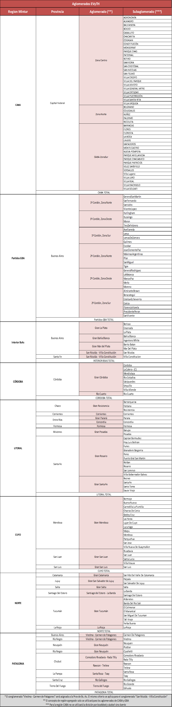

En color rosa se ha marcado la zona geográfica que el Jefe de Campo seguirá para constatar que se ha relevado la cantidad de hogares necesarios para cada una estas áreas (hasta sumar tantos hogares relevados como el tamaño de la muestra exige --incorporando la metodología de reemplazo sugerida anteriormente).


## El formulario base

Se incluye en esta sección el Formulario Base (o Cuestionario) de acuerdo a lo preestablecido en El Pliego. Previo a ello, se brinda una breve descripción de la estructura del Formulario y las principales variables relevadas.


### Estructura del formulario base

Con el fin de brindar una descripción resumida del Formulario Base a aplicar durante la EVyTH-21, a continuación, se presenta su estructura y las variables relevadas.

**Cuadro 24: Estructura del Formulario Base según tipo de Pregunta para cada Viaje**

```{r 151, echo=FALSE, fig.cap="" }
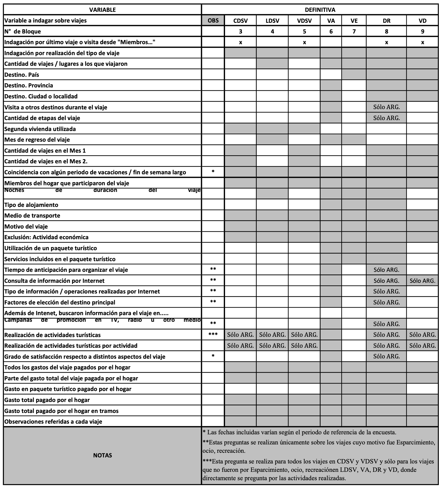
```
Fuente: MacroConsulting


### Cuestionario

Se transcribe a continuación el cuestionario que fue implementado en la EVyTH-13, con las modificaciones mencionadas en la sección 2.7.1.

Año: 201X
N° de Onda:...............
Mes de relevamiento:............................
Mes 1 del periodo de referencia:............................
Mes 2 del periodo de referencia:............................ 
Región ORGANISMO CONTRATANTE:.................................. 
Provincia:............................................ 
Ciudad:................................................
N° de teléfono:....................................
Envío de carta: Si No
Número de llamado: 1° 2° 3°


::: {.note}
**PRESENTACIÓN**
Hola, mi nombre es ........ y hablo de parte del Ministerio de Turismo de la Nación, estamos haciendo la encuesta sobre viajes. ¿Podría hacerle algunas preguntas? Información adicional:
Su hogar fue seleccionado al azar para responder una encuesta sobre si realizaron o no viajes y, en caso de haber hecho viajes, sobre sus características.
Su colaboración es muy importante y la información que nos brinde está protegida por la Ley Nacional de Secreto Estadístico. Sus datos son anónimos y confidenciales y sólo serán utilizados con fines estadísticos.
:::

```{r 152, echo=FALSE, fig.cap="" }
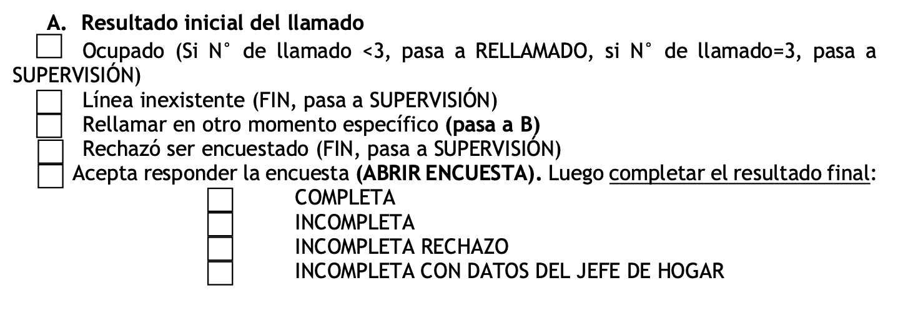
```
```{r 153, echo=FALSE, fig.cap="" }
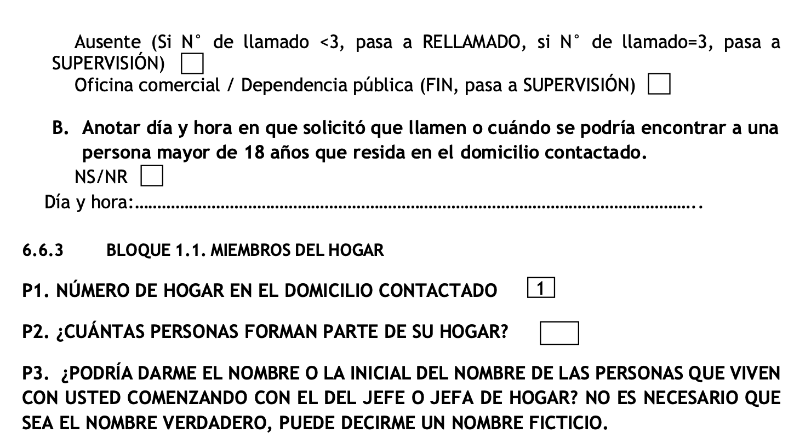
```
```{r 154, echo=FALSE, fig.cap="" }
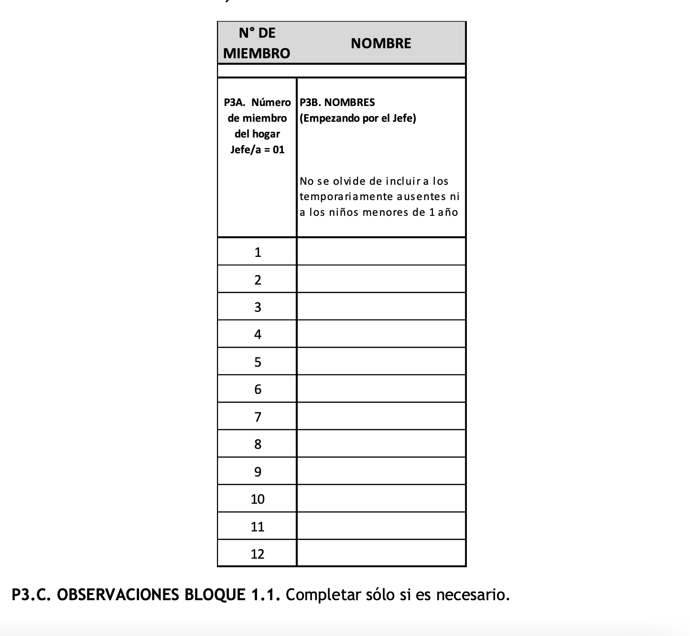
```


### Bloque 2. Segunda vivienda

```{r 155, echo=FALSE, fig.cap="" }
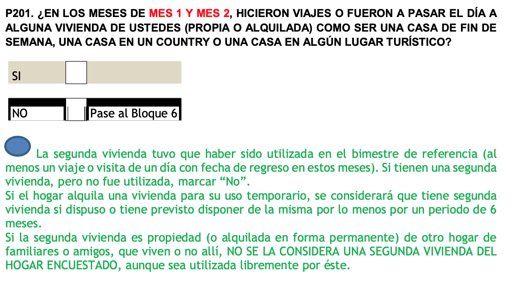
```
```{r 156, echo=FALSE, fig.cap="" }
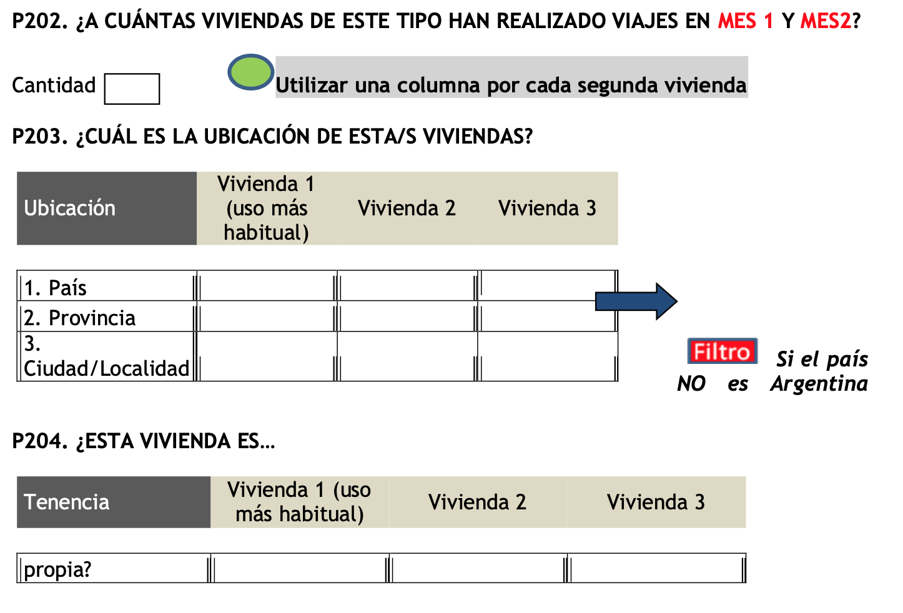
```
```{r 157, echo=FALSE, fig.cap="" }
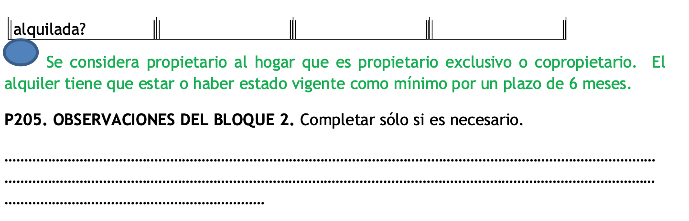
```


### Bloque 3. Viajes de corta duración a segundas viviendas

“AHORA LE VOY A PREGUNTAR POR LOS VIAJES A ESAS VIVIENDAS”

**P301.** ¿EN LOS MESES DE **MES 1 y MES 2**, UD. O ALGÚN INTEGRANTE DEL HOGAR HICIERON VIAJES A ALGUNAS DE ESTA/S VIVIENDA/S, PASANDO ALLÍ 1, 2 O 3 NOCHES?

```{r 158, echo=FALSE, fig.cap="" }
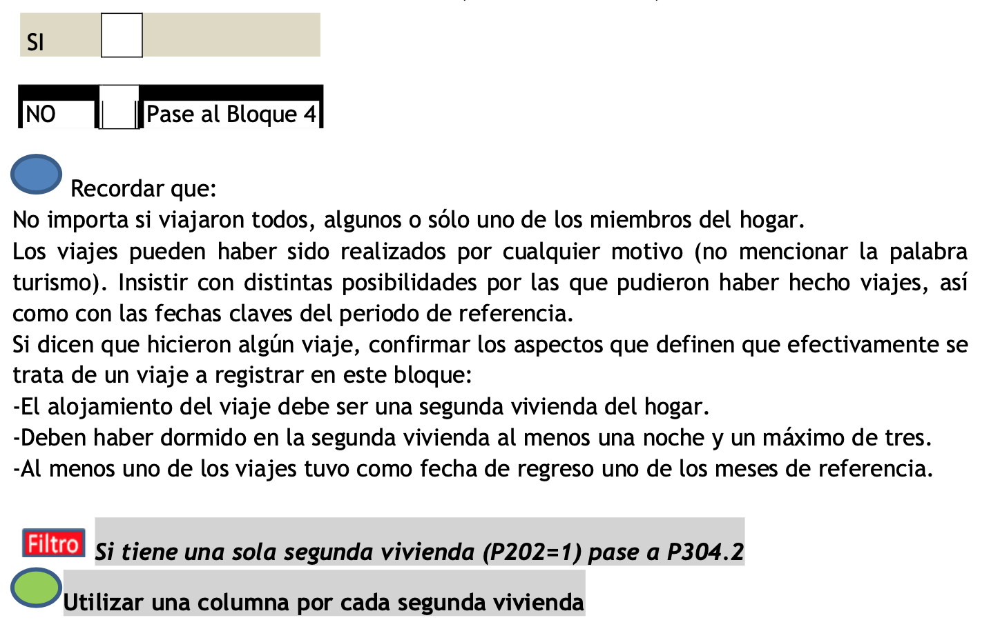
```

**P303.2** ¿REALIZARON VIAJES DE 1 A 3 NOCHES DE DURACIÓN A LA VIVIENDA UBICADA EN
**......**

Indague por cada segunda vivienda de la que dispone el hogar

```{r 159, echo=FALSE, fig.cap="" }
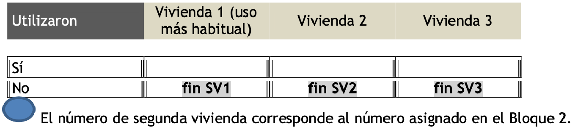
```

**P304.2.** ¿CUÁNTOS VIAJES DE ENTRE 1 Y 3 NOCHES HICIERON EN **MES 1 Y CUÁNTOS EN MES 2?**

Anotar la cantidad. Si en uno de los meses no realizaron viajes registrar 0 (cero). Si tiene más de una segunda vivienda, preguntar cuántos por cada una.

```{r 160, echo=FALSE, fig.cap="" }
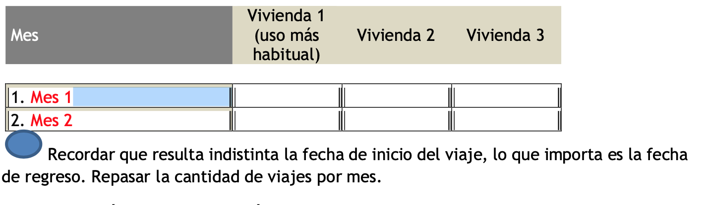
```

**P305.2.** ¿ALGÚN VIAJE COINCIDIÓ CON ....

Leer todas las opciones. Anotar en cada una alguno de los siguientes códigos: Si=1, No=2, NS/NR=9.

```{r 161, echo=FALSE, fig.cap="" }
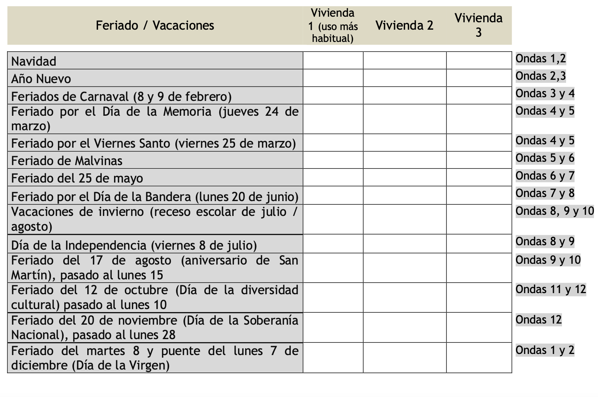
```
**“AHORA LE VOY A HACER ALGUNAS PREGUNTAS REFERIDAS AL ÚLTIMO DE ESTOS VIAJES”**

**P306** ¿QUÉ INTEGRANTES DE SU HOGAR PARTICIPARON DEL VIAJE?
Marcar todas las opciones que correspondan. Dejar en blanco el espacio de los miembros que no viajaron.

```{r 162, echo=FALSE, fig.cap="" }
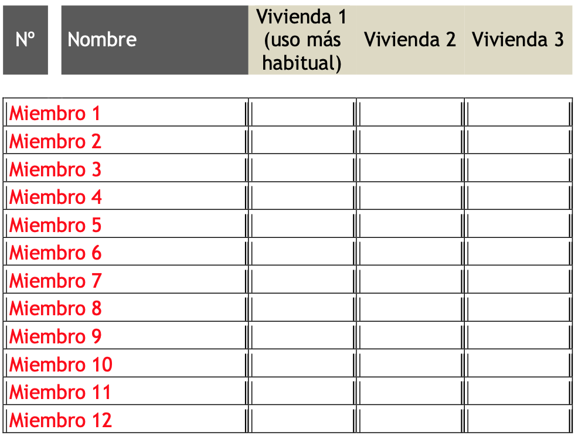
```

**P307.2.** ¿CUÁL FUE LA DURACIÓN DEL VIAJE, DESDE QUE SALIERON HASTA QUE REGRESARON A SU HOGAR?
Anotar la cantidad de NOCHES o marcar el código de NS/NR.

```{r 163, echo=FALSE, fig.cap="" }
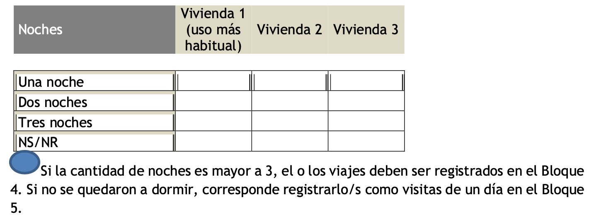
```

**P309** ¿QUÉ MEDIO DE TRANSPORTE UTILIZARON PARA IR HASTA ALLÁ?
Marque una sola opción.

```{r 164, echo=FALSE, fig.cap="" }
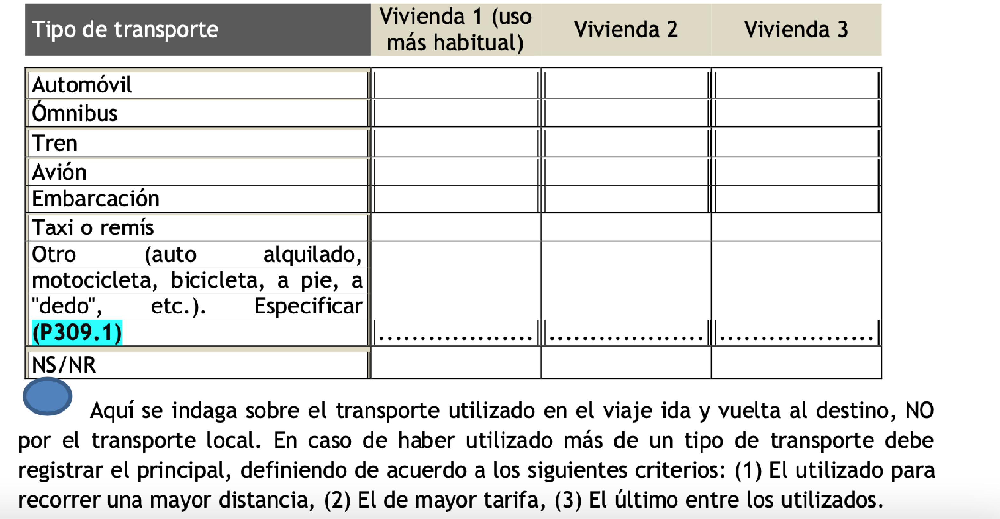
```

**P310.1** ¿CUÁL FUE EL MOTIVO DEL VIAJE?
Marque una sola opción

```{r 165, echo=FALSE, fig.cap="" }
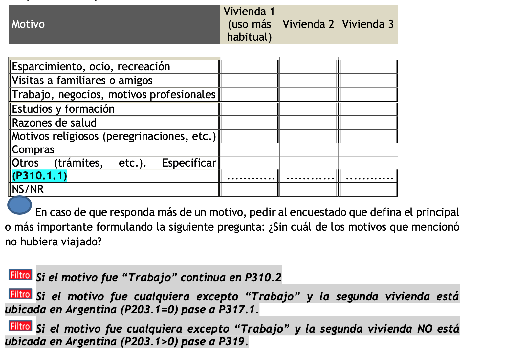
```

**P310.2** ¿EL TRABAJO REALIZADO FUE COMO EMPLEADO DE UNA EMPRESA DEL LUGAR DE DESTINO?

¿EL DESPLAZAMIENTO O TRASLADO AL LUGAR DE DESTINO FORMÓ PARTE DE SU OFICIO (AZAFATA, VIAJANTE, CHOFER, TRANSPORTISTA, ETC.)?

Realizar la primera pregunta, si responde “No” formular la siguiente. Marcar “Sí” cuando responda afirmativamente a cualquiera de las dos preguntas.

```{r 166, echo=FALSE, fig.cap="" }
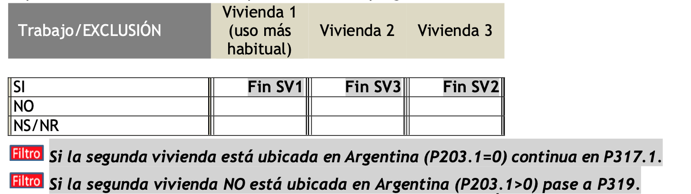
```

**P317.1.** ¿EN ESTE VIAJE REALIZARON ALGUNA ACTIVIDAD TURÍSTICA O RECREATIVA COMO VISITAR ATRACTIVOS NATURALES O HISTÓRICOS, PRACTICAR DEPORTES NO CONVENCIONALES, IR A LA PLAYA, AL CINE, AL CASINO, U OTRAS ACTIVIDADES SIMILARES?

```{r 167, echo=FALSE, fig.cap="" }
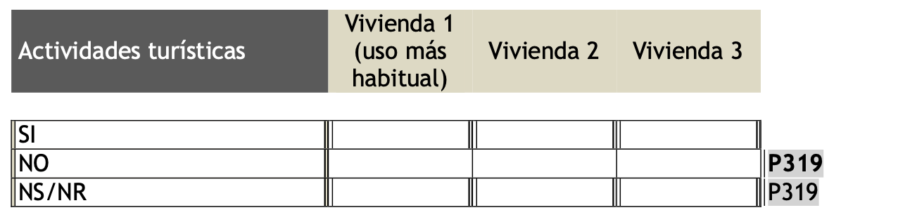
```

**P317.2.** ¿CUÁLES DE LAS SIGUIENTES ACTIVIDADES TURÍSTICAS REALIZARON EN ESTE VIAJE? NO IMPORTA SI EN ELLAS PARTICIPARON TODOS O ALGUNO/S DE USTEDES

Leer una a una las opciones y esperar a que el entrevistado responda antes de pasar a la siguiente. Anotar en cada una alguno de los siguientes códigos: Si=1, No=2, NS/NR=9.

```{r 168, echo=FALSE, fig.cap="" }
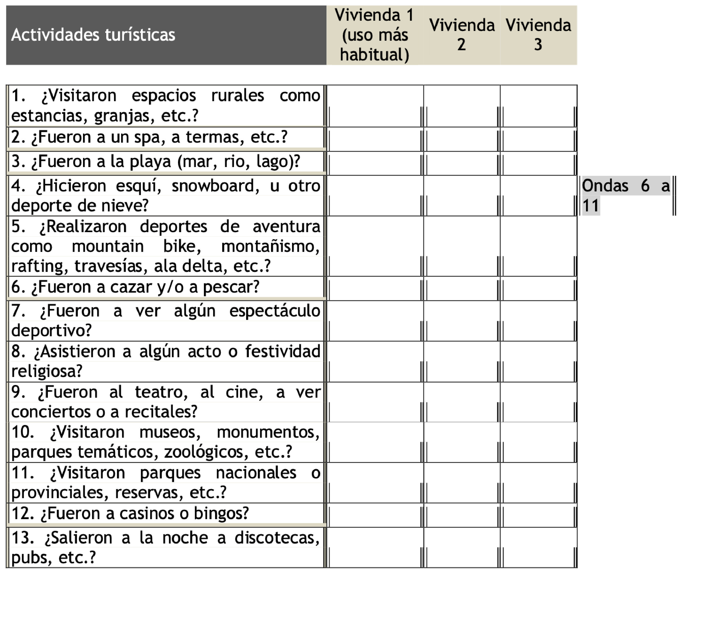
```

**P319** ¿LOS GASTOS DEL VIAJE FUERON PAGADOS TOTALMENTE POR EL HOGAR?

```{r 169, echo=FALSE, fig.cap="" }
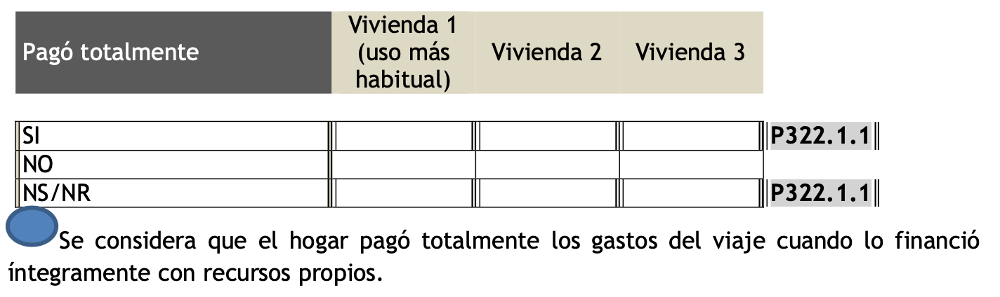
```

**P320** ¿DE QUÉ PARTE DE LOS GASTOS SE HIZO CARGO EL HOGAR?
Marque una sola opción

```{r 170, echo=FALSE, fig.cap="" }
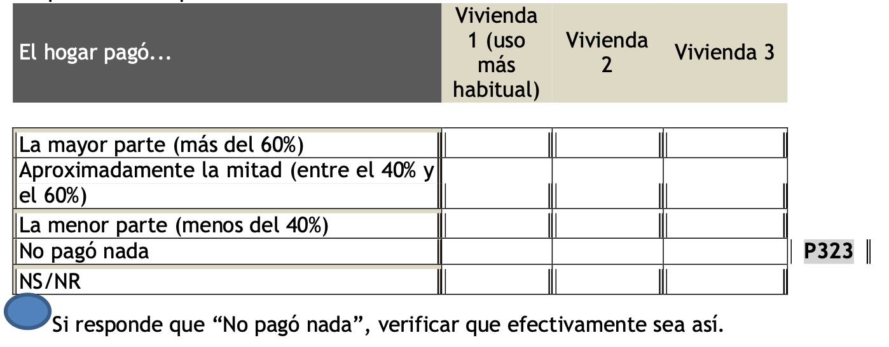
```

**P322.1.1** APROXIMADAMENTE, ¿CUÁNTO GASTARON EN TOTAL EN EL VIAJE, INCLUYENDO
LOS GASTOS DE TODOS LOS MIEMBROS DEL HOGAR EN TRANSPORTE, COMIDAS, ETC.?

```{r 171, echo=FALSE, fig.cap="" }
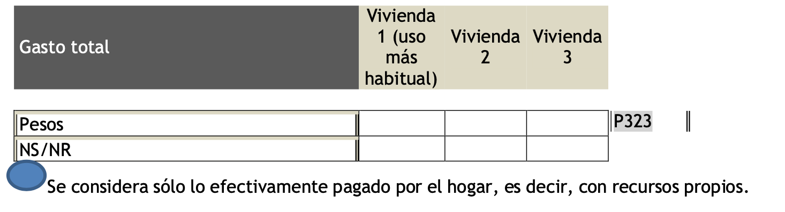
```

**P322.1.2.3.** ¿PODRÍA DECIRME EN CUÁL DE LOS SIGUIENTES TRAMOS CREE QUE SE UBICA EL GASTO TOTAL DEL VIAJE PAGADO POR EL HOGAR?

Leer las opciones listadas y marcar la que señale el entrevistado.

```{r 172, echo=FALSE, fig.cap="" }
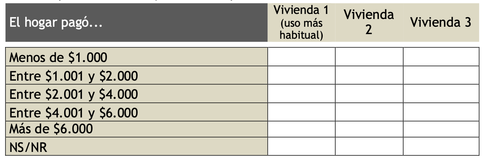
```

**P323.** OBSERVACIONES REFERIDAS AL VIAJE 
Completar sólo en caso de ser necesario.

```{r 173, echo=FALSE, fig.cap="" }
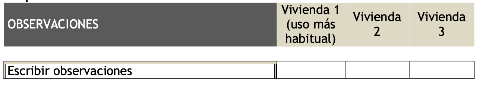
```

### Bloque 4. Viajes de larga duración a segundas viviendas

**P401.** ¿EN LOS MESES DE **MES 1 y MES 2**, UD. O ALGÚN INTEGRANTE DEL HOGAR HICIERON VIAJES A ALGUNAS DE ESTA/S VIVIENDA/S PASANDO ALLÍ 4 NOCHES O MÁS?

```{r 174, echo=FALSE, fig.cap="" }
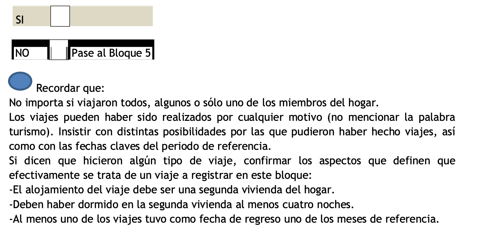
```

**P402.** ¿CUÁNTOS VIAJES DE 4 O MÁS NOCHES HICIERON EN **MES 1 Y MES 2** A LA/S VIVIENDA/S?
Anotar la cantidad de viajes con fecha de regreso en los meses incluidos en el bimestre de referencia.
```{r 175, echo=FALSE, fig.cap="" }
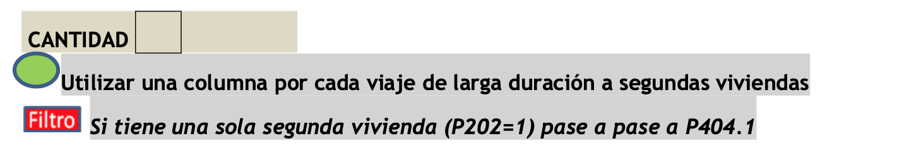
```

**P403.3** ¿QUÉ VIVIENDA UTILIZARON EN EL VIAJE?

```{r 176, echo=FALSE, fig.cap="" }
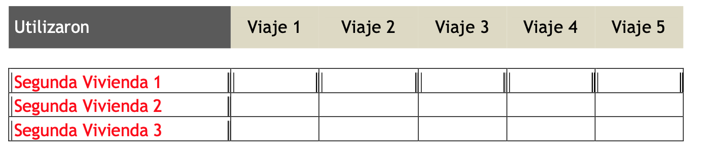
```
**“AHORA LE VOY A HACER ALGUNAS PREGUNTAS REFERIDAS A CADA UNO DE ESTOS VIAJES. EMPECEMOS POR EL MÁS RECIENTE”**


**P404.1.** ¿EL VIAJE FUE REALIZADO EN **MES 1 O MES 2?**

```{r 177, echo=FALSE, fig.cap="" }
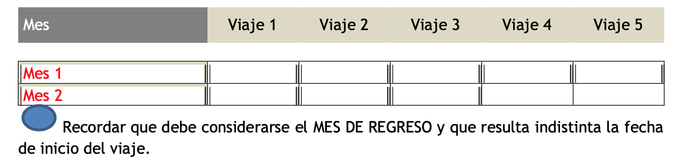
```

**P405.2.** ¿ESTE VIAJE COINCIDIÓ CON....
Leer todas las opciones y marcar una.

```{r 178, echo=FALSE, fig.cap="" }
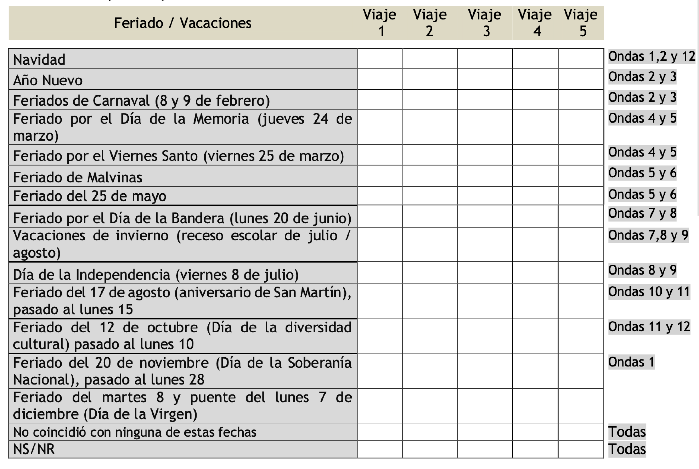
```

**P406** ¿QUÉ INTEGRANTES DE SU HOGAR PARTICIPARON DEL VIAJE?

Marcar todas las opciones que correspondan. Dejar en blanco el espacio de los miembros que no viajaron.

```{r 179, echo=FALSE, fig.cap="" }
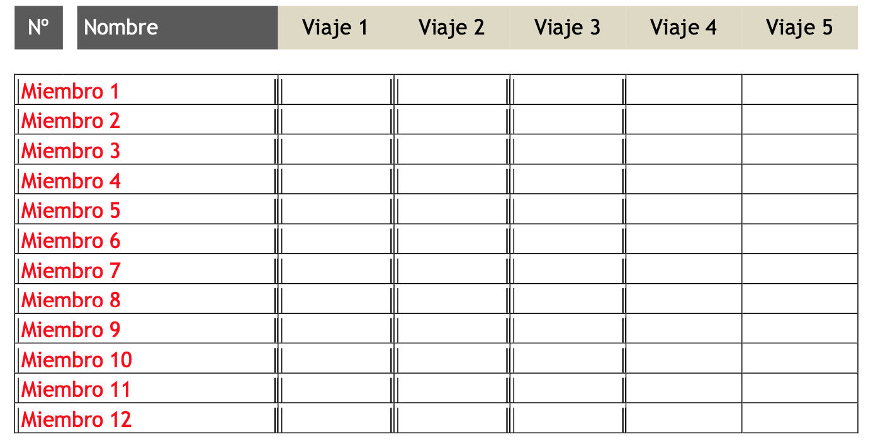
```

**P407.1.** ¿CUÁL FUE LA DURACIÓN DEL VIAJE, DESDE QUE SALIERON HASTA QUE REGRESARON A SU HOGAR?
Anotar la cantidad de NOCHES o marcar el código de NS/NR.

```{r 180, echo=FALSE, fig.cap="" }
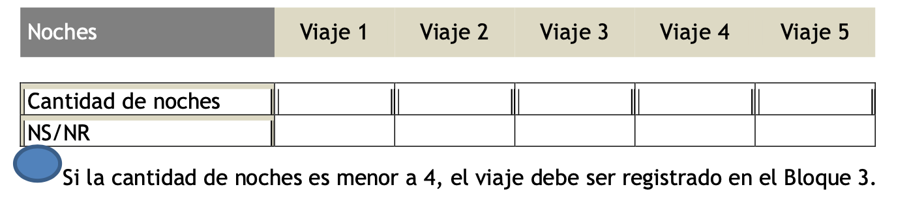
```

**P409** ¿QUÉ MEDIO DE TRANSPORTE UTILIZARON PARA IR HASTA ALLÁ?

Marque una sola opción.

```{r 181, echo=FALSE, fig.cap="" }
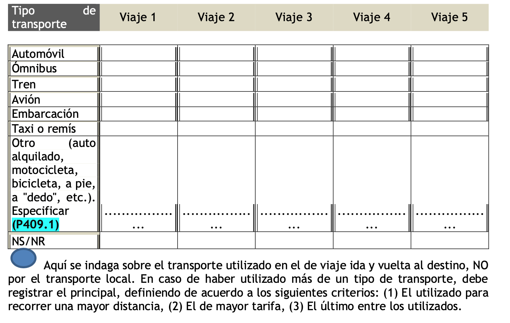
```

**P410.1**¿CUÁL FUE EL MOTIVO DEL VIAJE?

Marque una sola opción

```{r 182, echo=FALSE, fig.cap="" }
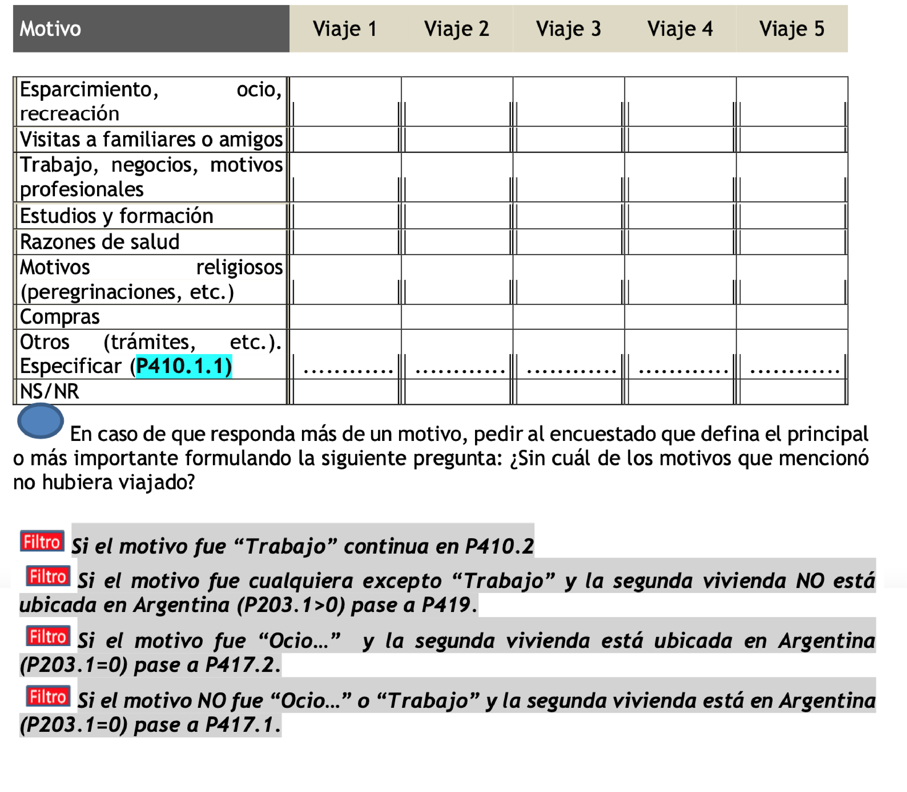
```

**P410.2** ¿EL TRABAJO REALIZADO FUE COMO EMPLEADO DE UNA EMPRESA DEL LUGAR DE DESTINO?

¿EL DESPLAZAMIENTO O TRASLADO AL LUGAR DE DESTINO FORMÓ PARTE DE SU OFICIO (AZAFATA, VIAJANTE, CHOFER, TRANSPORTISTA, ETC.)?

Realizar la primera pregunta, si responde que no formular la siguiente. Marcar “Si” cuando responda afirmativamente a cualquiera de las dos preguntas.

```{r 183, echo=FALSE, fig.cap="" }
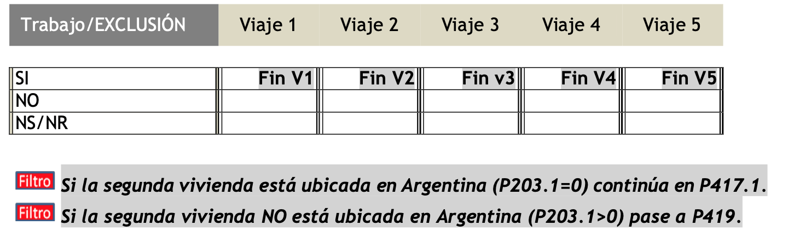
```

**P417.1.** PESE A NO HACER ESTE VIAJE POR ESPARCIMIENTO, ¿EN ESTE VIAJE REALIZARON ALGUNA ACTIVIDAD TURÍSTICA O RECREATIVA COMO VISITAR ATRACTIVOS NATURALES O HISTÓRICOS, PRACTICAR DEPORTES NO CONVENCIONALES, IR A LA PLAYA, AL CINE, AL CASINO, U OTRAS ACTIVIDADES SIMILARES?

```{r 184, echo=FALSE, fig.cap="" }
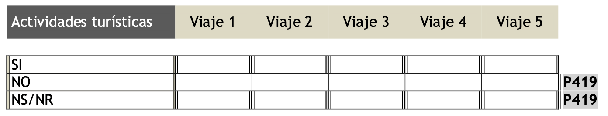
```


**P417.2.** ¿CUÁLES DE LAS SIGUIENTES ACTIVIDADES TURÍSTICAS REALIZARON EN ESTE VIAJE? NO IMPORTA SI EN ELLAS PARTICIPARON TODOS O ALGUNO/S DE USTEDES
Leer una a una las opciones y esperar a que el entrevistado responda antes de pasar a la siguiente. Anotar en cada una alguno de los siguientes códigos: Si=1, No=2, NS/NR=9.

```{r 185, echo=FALSE, fig.cap="" }
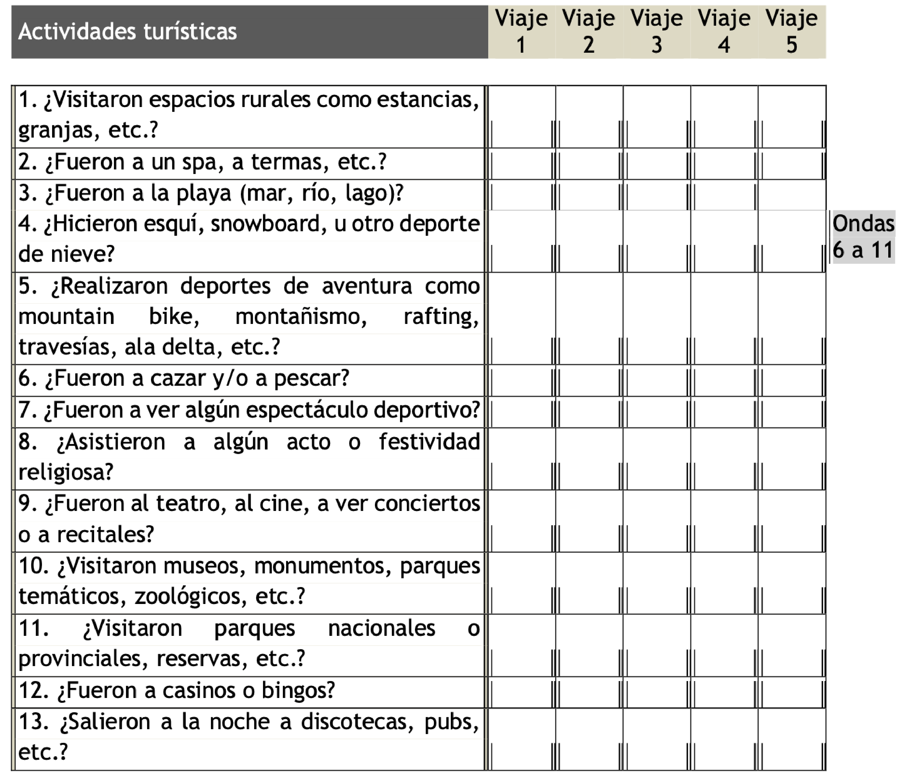
```

**P419** ¿LOS GASTOS DEL VIAJE FUERON PAGADOS TOTALMENTE POR EL HOGAR?

```{r 186, echo=FALSE, fig.cap="" }
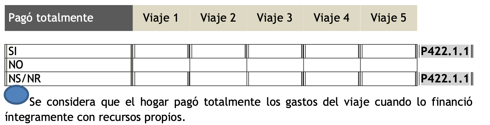
```

**P420** ¿DE QUÉ PARTE DE LOS GASTOS SE HIZO CARGO EL HOGAR?
Marque una sola opción

```{r 187, echo=FALSE, fig.cap="" }
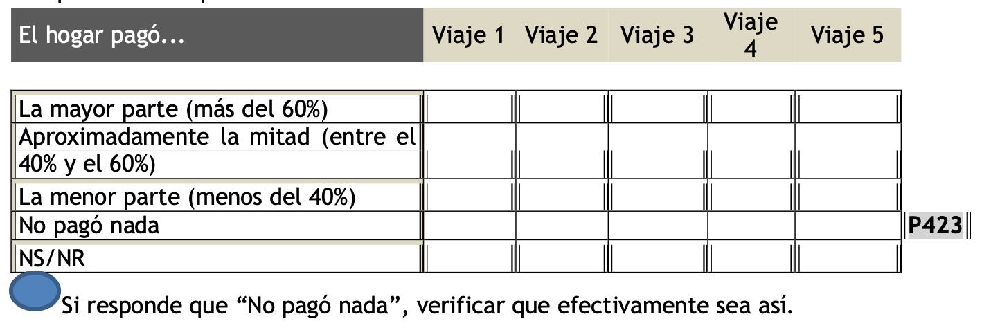
```

**P422.1.1** APROXIMADAMENTE, ¿CUÁNTO GASTARON EN TOTAL EN EL VIAJE, INCLUYENDO
LOS GASTOS DE TODOS LOS MIEMBROS DEL HOGAR EN TRANSPORTE, COMIDAS, ETC.)?

```{r 188, echo=FALSE, fig.cap="" }
knitr::include_graphics('imagenes/figura6-188.png')
```

**P422.2.4.** ¿PODRÍA DECIRME EN CUÁL DE LOS SIGUIENTES TRAMOS CREE QUE SE UBICA EL GASTO TOTAL DEL VIAJE PAGADO POR EL HOGAR?
Leer las opciones listadas y marcar la que señale el entrevistado.

```{r 189, echo=FALSE, fig.cap="" }
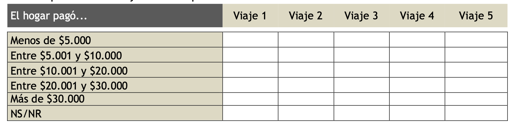
```

**P423.** OBSERVACIONES REFERIDAS AL VIAJE
Completar sólo en caso de ser necesario.

```{r 190, echo=FALSE, fig.cap="" }
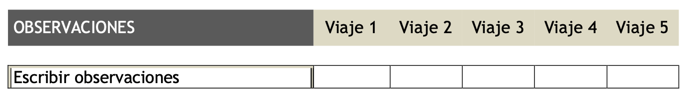
```

### Bloque 5. Visitas de un día a segundas viviendas.

**P501.** ¿EN LOS MESES DE **MES 1 y MES 2**, UD. O ALGÚN INTEGRANTE DEL HOGAR FUERON A PASAR EL DÍA, SIN QUEDARSE A DORMIR, A ESTA / ALGUNAS DE ESTAS VIVIENDA/S?

```{r 191, echo=FALSE, fig.cap="" }
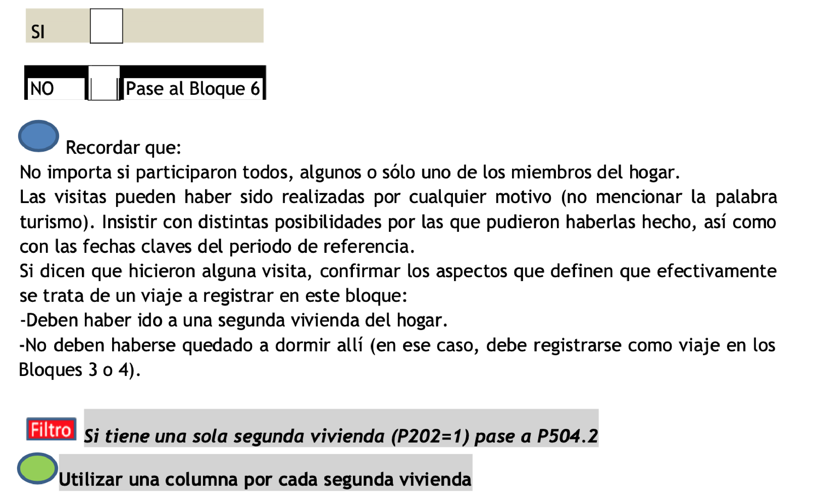
```

**P503.2** ¿FUERON A PASAR ALGÚN DÍA A LA VIVIENDA UBICADA EN ......
Indague por cada segunda vivienda de la que dispone el hogar

```{r 192, echo=FALSE, fig.cap="" }
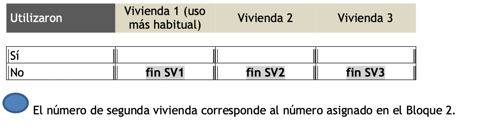
```

**P504.2.** ¿CUÁNTAS VECES FUERON A PASAR EL DÍA EN LA VIVIENDA EN **MES 1 Y CUÁNTAS EN MES 2**?

Anotar la cantidad. Si en uno de los meses no realizaron viajes registrar 0 (cero). Si tiene más de una segunda vivienda, preguntar por cada una de ellas.

```{r 193, echo=FALSE, fig.cap="" }
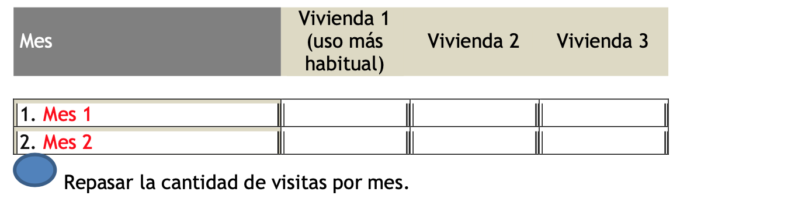
```

**P505.2.** ¿ALGUNO DE ESOS DÍAS COINCIDIÓ CON....

Leer todas las opciones. Anotar en cada una alguno de los siguientes códigos: Si=1, No=2, NS/NR=9.

```{r 194, echo=FALSE, fig.cap="" }
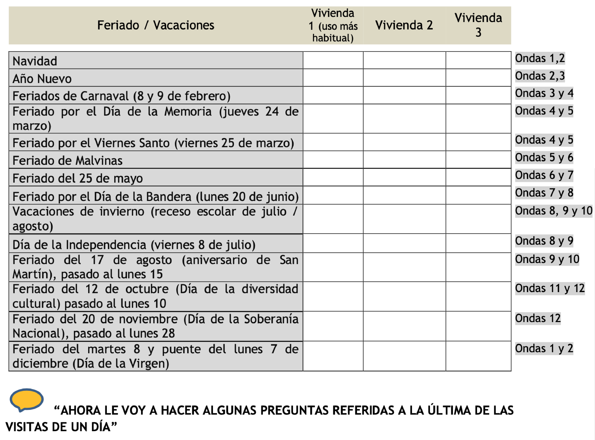
```

**P506** ¿QUÉ INTEGRANTES DE SU HOGAR FUERON ESE DÍA?

Marcar todas las opciones que correspondan. Dejar en blanco el espacio de los miembros que no viajaron.

```{r 195, echo=FALSE, fig.cap="" }
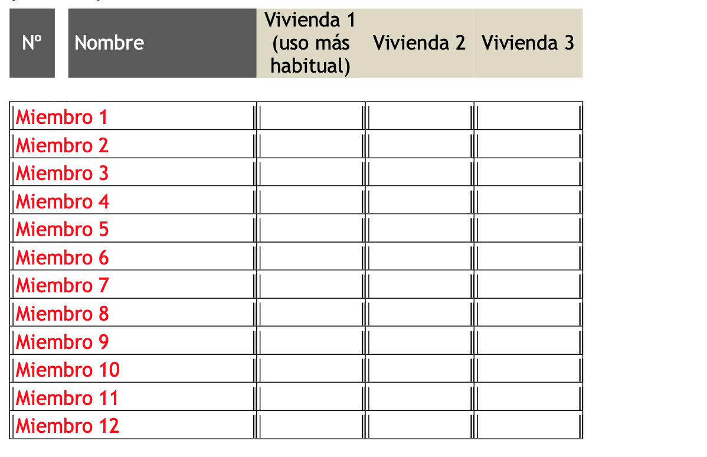
```

**P509** ¿QUÉ MEDIO DE TRANSPORTE UTILIZARON PARA IR HASTA ALLÁ?

Marque una sola opción.

```{r 196, echo=FALSE, fig.cap="" }
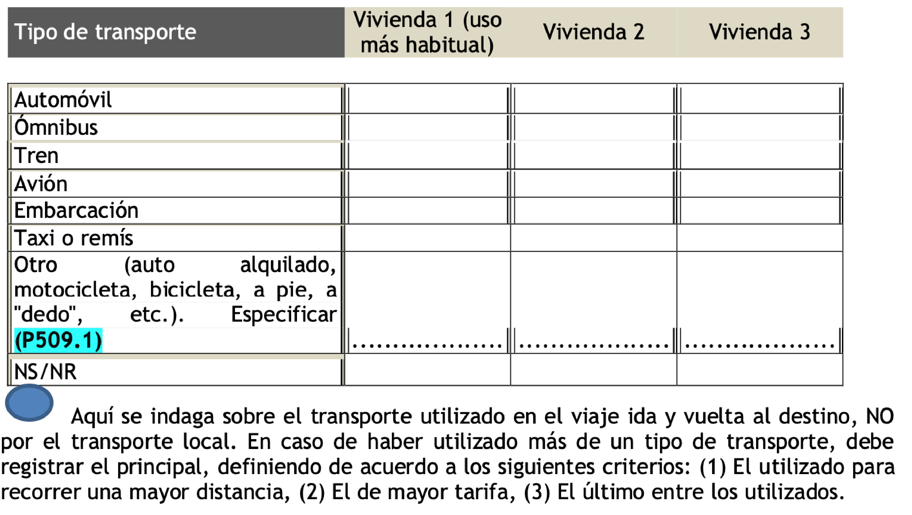
```

**P510.1** ¿CUÁL FUE EL MOTIVO POR EL QUE FUERON A PASAR EL DÍA A ESTA VIVIENDA?

Marque una sola opción.

```{r 197, echo=FALSE, fig.cap="" }
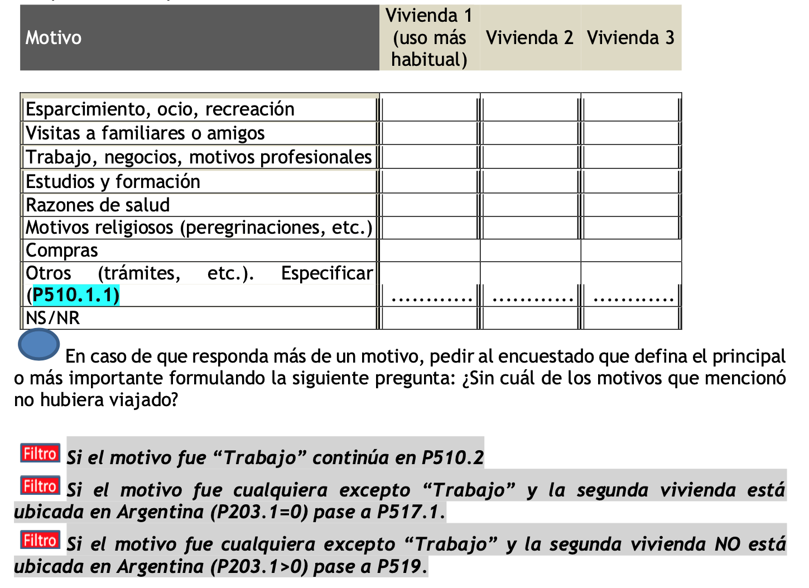
```

**P510.2** ¿EL TRABAJO REALIZADO FUE COMO EMPLEADO DE UNA EMPRESA DEL LUGAR DE DESTINO?
¿EL DESPLAZAMIENTO O TRASLADO AL LUGAR DE DESTINO FORMÓ PARTE DE SU OFICIO (AZAFATA, VIAJANTE, CHOFER, TRANSPORTISTA, ETC.)?

Realizar la primera pregunta, si responde “No” formular la siguiente. Marcar “Si” cuando responda afirmativamente a cualquiera de las dos preguntas.

```{r 198, echo=FALSE, fig.cap="" }
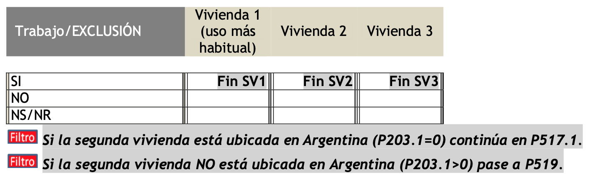
```


**P517.1.** ¿EN ESTA VISITA REALIZARON ALGUNA ACTIVIDAD TURÍSTICA O RECREATIVA COMO VISITAR ATRACTIVOS NATURALES O HISTÓRICOS, PRACTICAR DEPORTES NO CONVENCIONALES, IR A LA PLAYA, AL CINE, AL CASINO, U OTRAS ACTIVIDADES SIMILARES?


```{r 199, echo=FALSE, fig.cap="" }
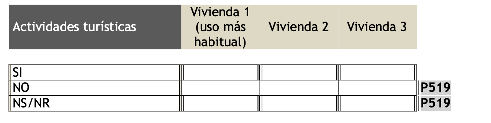
```

**P517.2.** ¿CUÁLES DE LAS SIGUIENTES ACTIVIDADES TURÍSTICAS REALIZARON EN ESTA VISITA DE UN DÍA? NO IMPORTA SI EN ELLAS PARTICIPARON TODOS O ALGUNO/S DE USTEDES

Leer una a una las opciones y esperar a que el entrevistado responda antes de pasar a la siguiente. Anotar en cada una alguno de los siguientes códigos: Si=1, No=2, NS/NR=9.

```{r 200, echo=FALSE, fig.cap="" }
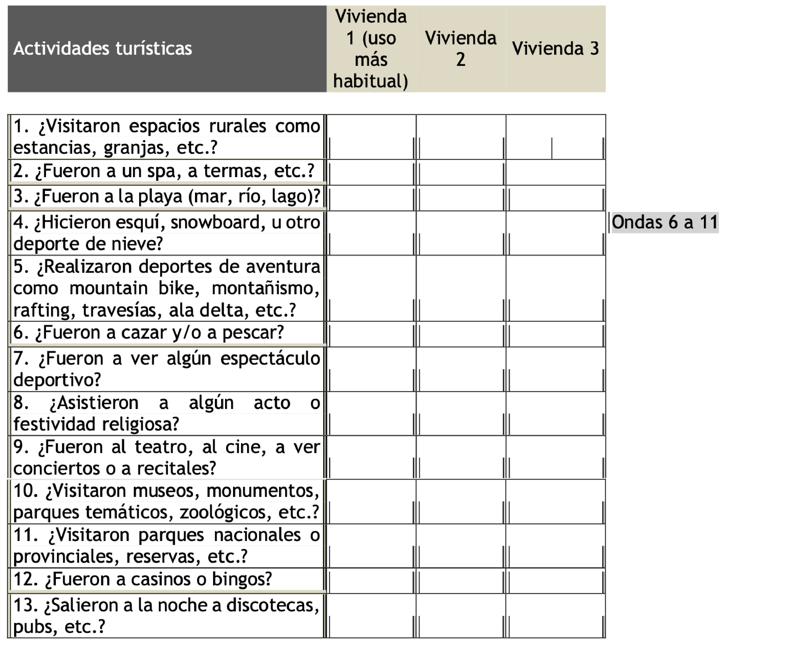
```

**P519** ¿LOS GASTOS QUE TUVIERON ESE DÍA FUERON PAGADOS TOTALMENTE POR EL HOGAR?

```{r 201, echo=FALSE, fig.cap="" }
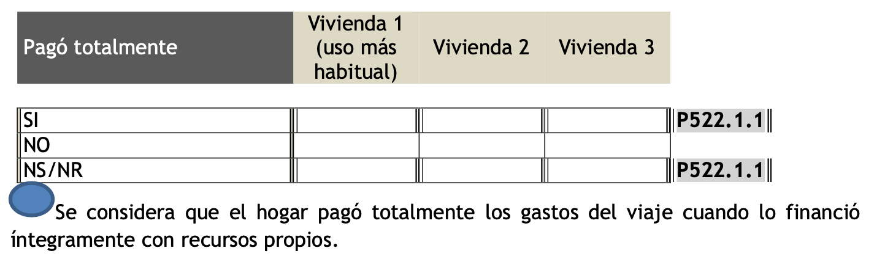
```

**P520** ¿DE QUÉ PARTE DE LOS GASTOS SE HIZO CARGO EL HOGAR?

Marque una sola opción.

```{r 202, echo=FALSE, fig.cap="" }
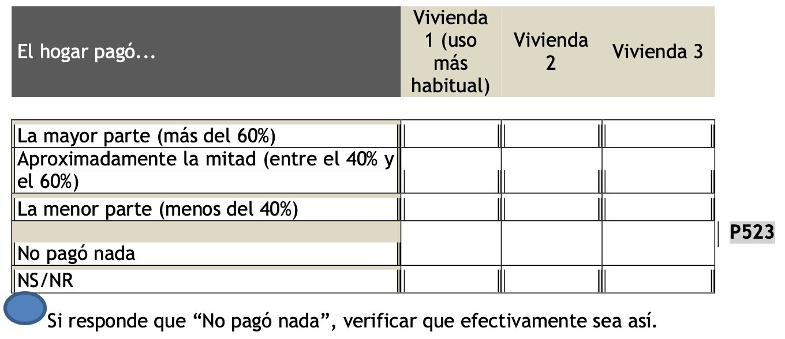
```

**P522.1.1** APROXIMADAMENTE, ¿CUÁNTO GASTARON EN TOTAL POR IR A PASAR EL DÍA, INCLUYENDO LOS GASTOS DE TODOS LOS MIEMBROS DEL HOGAR EN TRANSPORTE, COMIDAS, ETC.?

```{r 203, echo=FALSE, fig.cap="" }
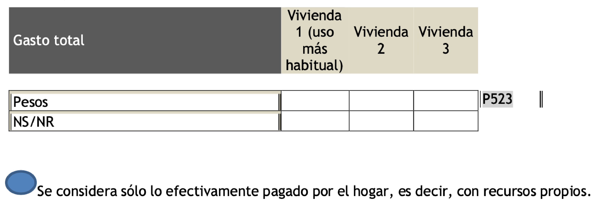
```

**P522.1.2.5.** ¿PODRÍA DECIRME EN CUÁL DE LOS SIGUIENTES TRAMOS CREE QUE SE UBICA EL GASTO TOTAL DE ESE DÍA PAGADO POR EL HOGAR?

Leer las opciones listadas y marcar la que señale el entrevistado.

```{r 204, echo=FALSE, fig.cap="" }
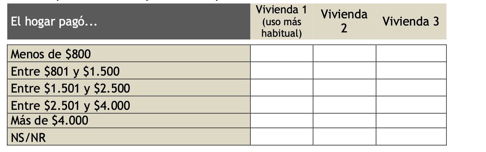
```

**P523.** OBSERVACIONES REFERIDAS A LA VISITA DE UN DÍA 

Completar sólo en caso de ser necesario.

```{r 205, echo=FALSE, fig.cap="" }
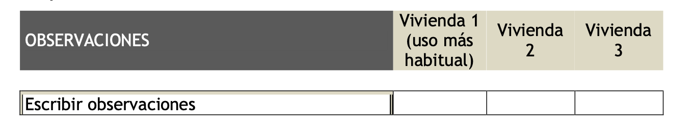
```

### Bloque 6. Viajes no reiterados en argentina.

**“AHORA LE VOY A PREGUNTAR POR VIAJES O EXCURSIONES QUE HAYAN REALIZADO EN LOS MESES DE MES 1 Y MES 2 POR CUALQUIER MOTIVO (OCIO, VACACIONES, VISITAS A FAMILIARES O AMIGOS, TRABAJO O CUALQUIER OTRO)”**

**P601.** ¿EN **MES 1 y MES 2** VIAJARON A ALGUN LUGAR DE ARGENTINA UBICADO A MÁS DE 20/40 KM, DE DONDE VIVEN PASANDO ALLÍ AL MENOS UNA NOCHE?

```{r 206, echo=FALSE, fig.cap="" }
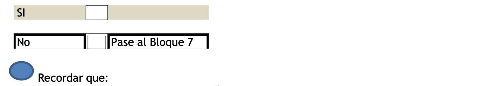
```


No importa si viajaron todos, algunos o sólo uno de los miembros del hogar.
Los viajes pueden haber sido realizados por cualquier motivo (no mencionar la palabra turismo). Insistir con distintas posibilidades por las que pudieron haber hecho viajes, así como con las fechas claves del periodo de referencia.
Si dicen que hicieron algún viaje, confirmar los aspectos que definen que efectivamente se trata de un viaje a registrar en este bloque:
-La ciudad o localidad a la que fueron debe estar a más de 20/40 KM de donde reside el hogar contactado y estar en Argentina.
-Deben haber dormido al menos una noche en cualquier tipo de alojamiento.
-Al menos uno de los viajes tiene que tener como fecha de regreso uno de los meses de referencia.
-Si viajaron a un mismo destino con frecuencia semanal, no debe considerarse como viaje porque el destino forma parte del entorno habitual del hogar.
-Si se detecta que hicieron 3 o más viajes similares a un mismo destino (sin llegar a hacerlo con frecuencia semanal), ellos no deben ser registrados aquí sino en el bloque 8. Si además de esos viajes hicieron otros viajes no reiterados marcar sí y continuar (sin olvidar de registrar los viajes reiterados en el bloque 8). Si solo hicieron viajes reiterados, marcar no y pasar al bloque siguiente.

**P602** ¿CUÁNTOS VIAJES EN ARGENTINA HICIERON EN **MES 1 Y MES 2**?

Anotar la cantidad de viajes con fecha de regreso en los meses incluidos en el bimestre de referencia.

```{r 207, echo=FALSE, fig.cap="" }

```


**P603.1** ¿CUÁL FUE LA PROVINCIA Y LA CIUDAD QUE VISITARON EN CADA VIAJE?
Anotar el nombre en el espacio en blanco correspondiente. Si no sabe o no recuerda, escribir NS/NR.

```{r 208, echo=FALSE, fig.cap="" }
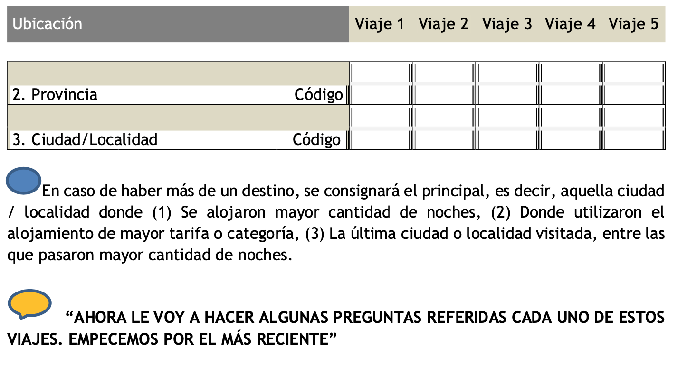
```

**P603.1.4** EN ESTE VIAJE, ADEMÁS DE CIUDAD/LOCALIDAD ¿PASARON AL MENOS UNA NOCHE EN OTRA CIUDAD?

```{r 209, echo=FALSE, fig.cap="" }
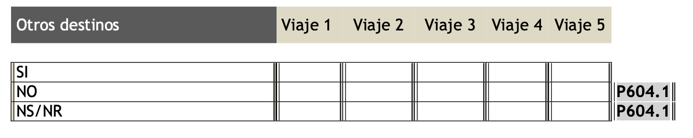
```

**P603.1.5** ¿EN CUÁNTAS OTRAS CIUDADES SE ALOJARON AL MENOS UNA NOCHE?

Si NS/NR anotar 99.

```{r 210, echo=FALSE, fig.cap="" }
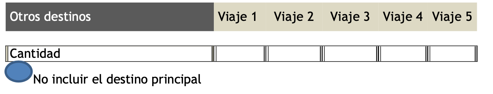
```

**P604.1.** ¿EL VIAJE FUE REALIZADO EN **MES 1 O MES 2**?

```{r 211, echo=FALSE, fig.cap="" }
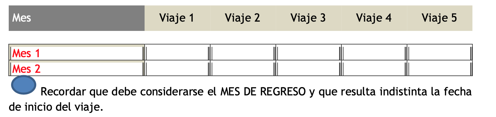
```

**P605.1.** ¿ESTE VIAJE COINCIDIÓ CON...

Leer todas las opciones y marcar una.

```{r 212, echo=FALSE, fig.cap="" }
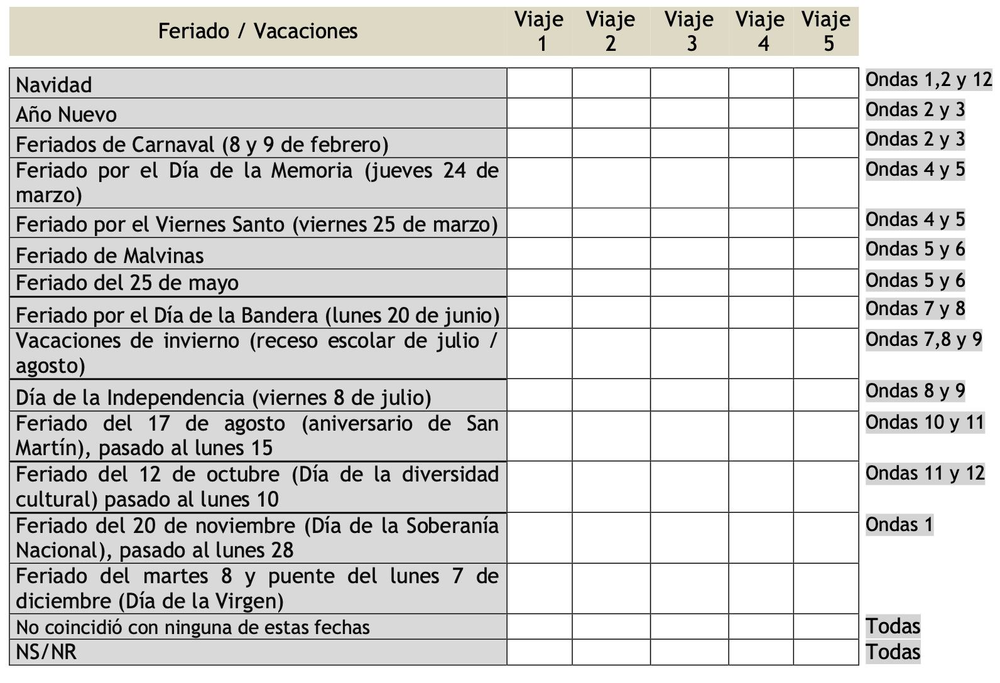
```

**P606** ¿QUÉ INTEGRANTES DEL HOGAR PARTICIPARON DE ESTE VIAJE?

Marque todas las opciones que correspondan. Dejar en blanco el espacio de los miembros que no viajaron.

```{r 213, echo=FALSE, fig.cap="" }
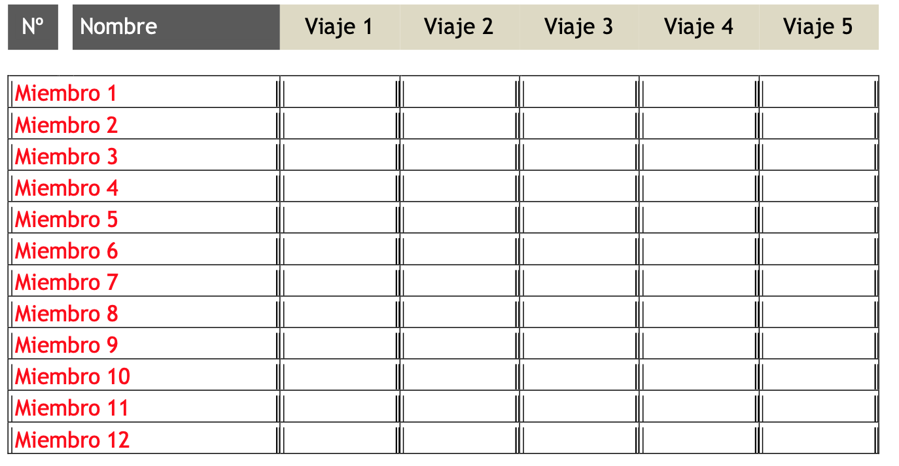
```

**P607.1** ¿CUÁL FUE LA DURACIÓN DEL VIAJE, DESDE QUE SALIERON HASTA QUE REGRESARON A SU HOGAR?

Anotar la cantidad de NOCHES o marcar el código de NS/NR.

```{r 214, echo=FALSE, fig.cap="" }
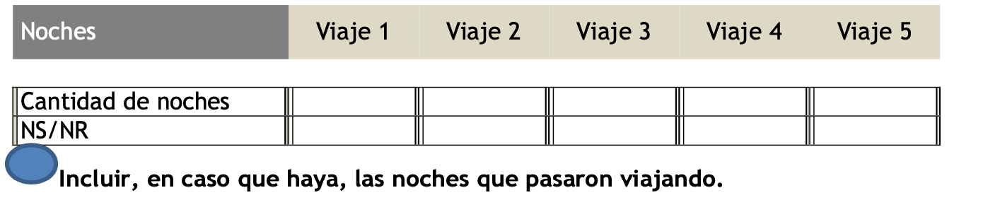
```

**P608** ¿DÓNDE SE ALOJARON?

Marcar una sola opción.

```{r 215, echo=FALSE, fig.cap="" }
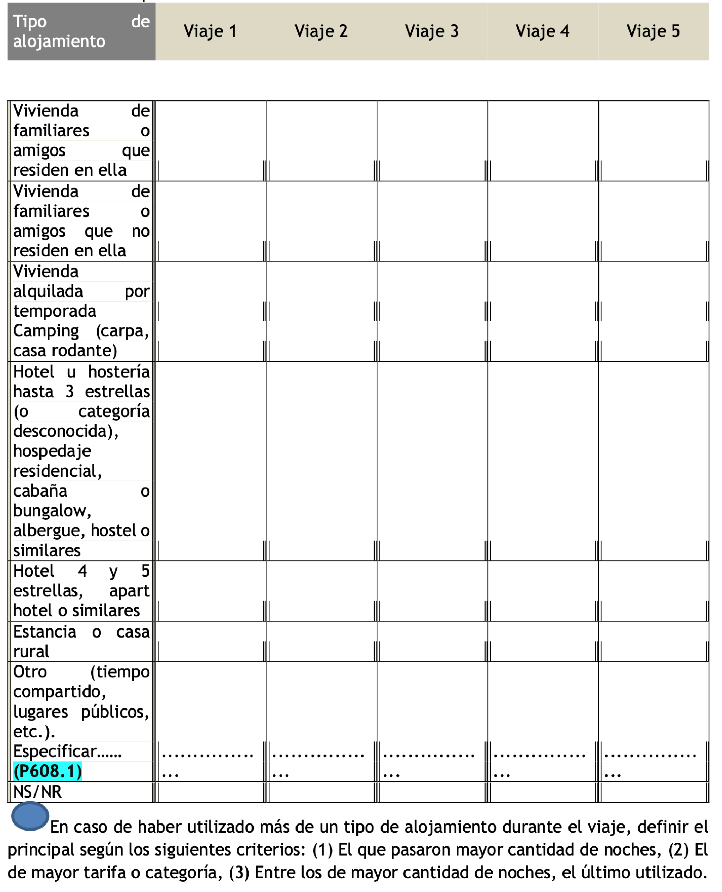
```

**P609** ¿QUÉ MEDIO DE TRANSPORTE UTILIZARON PARA IR HASTA ALLÁ?

Marque una sola opción.

```{r 216, echo=FALSE, fig.cap="" }
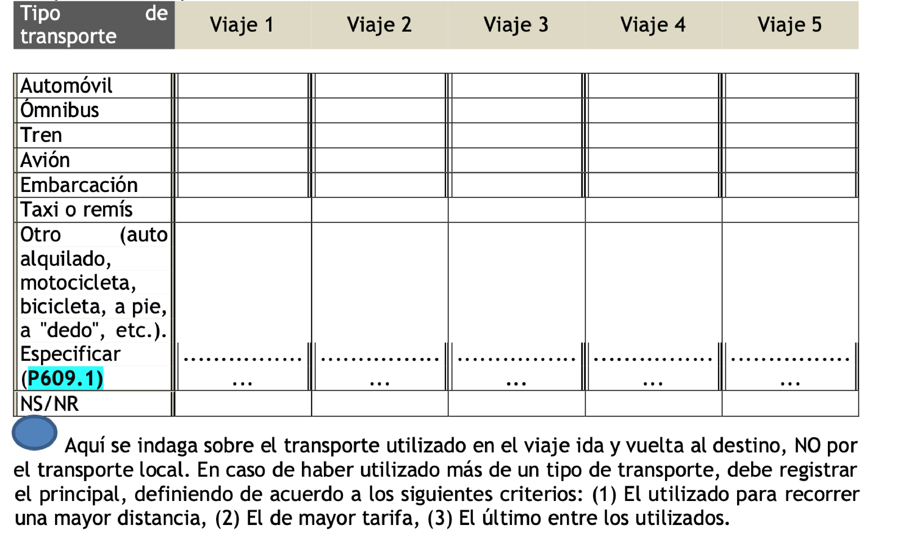
```


**P610.1** ¿CUÁL FUE EL MOTIVO DEL VIAJE?

Marque una sola opción

```{r 217, echo=FALSE, fig.cap="" }
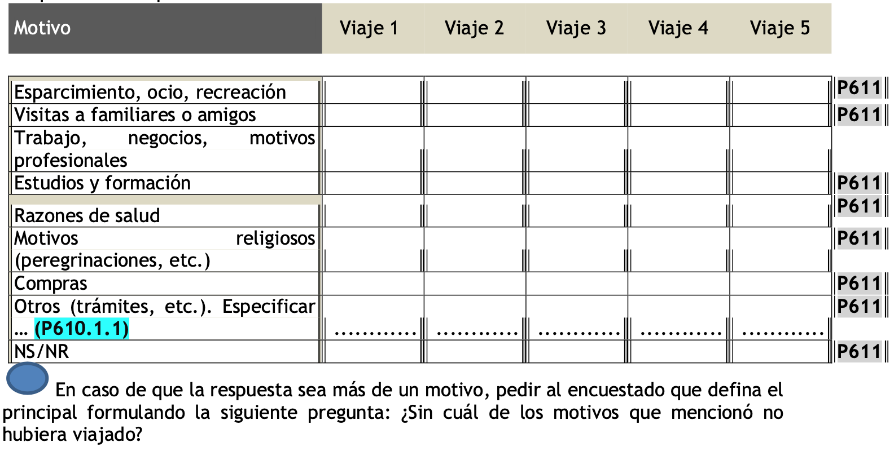
```

**P610.2** ¿EL TRABAJO REALIZADO FUE COMO EMPLEADO DE UNA EMPRESA DEL LUGAR DE DESTINO?

¿EL DESPLAZAMIENTO O TRASLADO AL LUGAR DE DESTINO FORMÓ PARTE DE SU OFICIO (AZAFATA, VIAJANTE, CHOFER, TRANSPORTISTA, ETC.)?

Realizar la primera pregunta, si responde “No” formular la siguiente. Marcar “Si” cuando responda afirmativamente a cualquiera de las dos preguntas.

```{r 218, echo=FALSE, fig.cap="" }
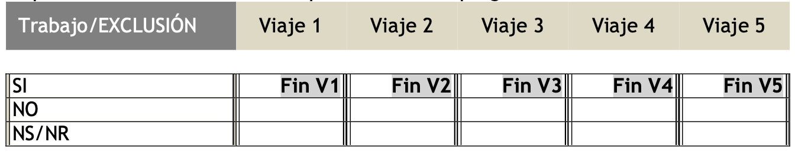
```

**P611** ¿CONTRATARON UN PAQUETE TURÍSTICO PARA REALIZAR EL VIAJE?

```{r 219, echo=FALSE, fig.cap="" }
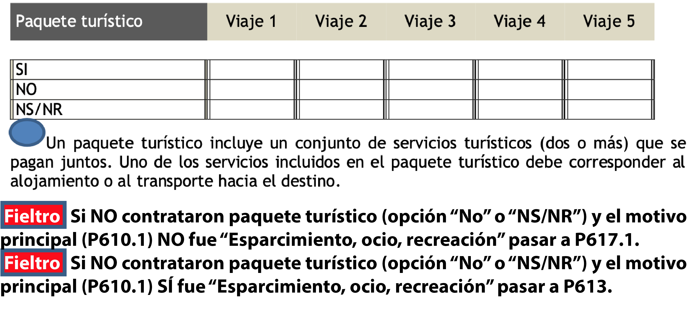
```

**P612** ¿QUÉ SERVICIOS INCLUYÓ EL PAQUETE TURÍSTICO?

Leer todas las opciones. Anotar en cada una alguno de los siguientes códigos: Si=1, No=2, NS/NR=9.

```{r 220, echo=FALSE, fig.cap="" }
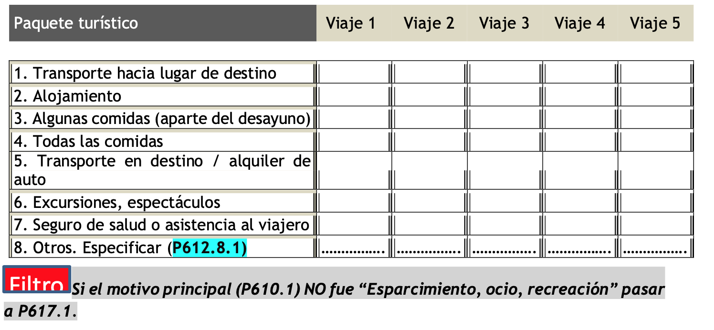
```

**P613** ¿CON CUÁNTO TIEMPO DE ANTICIPACIÓN DECIDIERON REALIZAR EL VIAJE?

Esperar a que el encuestado responda. Si no lo hace, leer las opciones. Marcar una sola opción.

```{r 221, echo=FALSE, fig.cap="" }
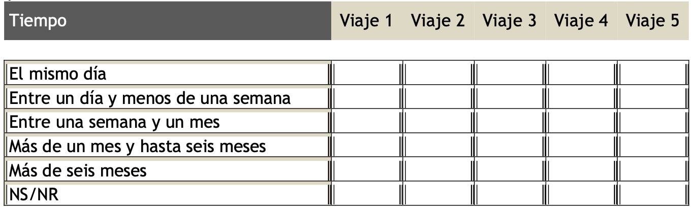
```


**P614**¿UTILIZARON INTERNET PARA CONSULTAR INFORMACIÓN O CONTRATAR SERVICIOS PARA SU VIAJE (SOBRE TRANSPORTE, ALOJAMIENTOS, ATRACTIVOS TURÍSTICOS DEL DESTINO, ETC.)?

```{r 222, echo=FALSE, fig.cap="" }
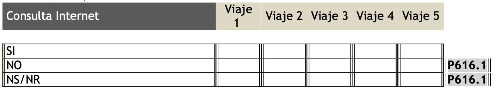
```

**P615.** POR FAVOR, DÍGAME SI PARA ESTE VIAJE, POR MEDIO DE INTERNET...

Leer todas las opciones. Anotar en cada una alguno de los siguientes códigos: Si=1, No=2, NS/NR=9.

```{r 223, echo=FALSE, fig.cap="" }
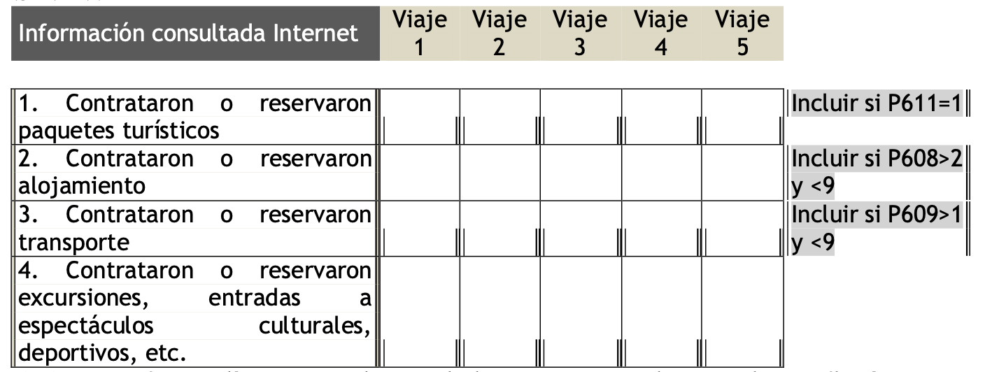
```

**P616.1.** Por favor, dígame si cada una de las razones que le voy a leer influyó o no en su decisión de visitar Ciudad/Localidad:

Cada fila es una pregunta independiente que debe ser respondida por sí o no. Si la respuesta es SI se marca, si es NO o NS/NR se deja vacío

```{r 224, echo=FALSE, fig.cap="" }
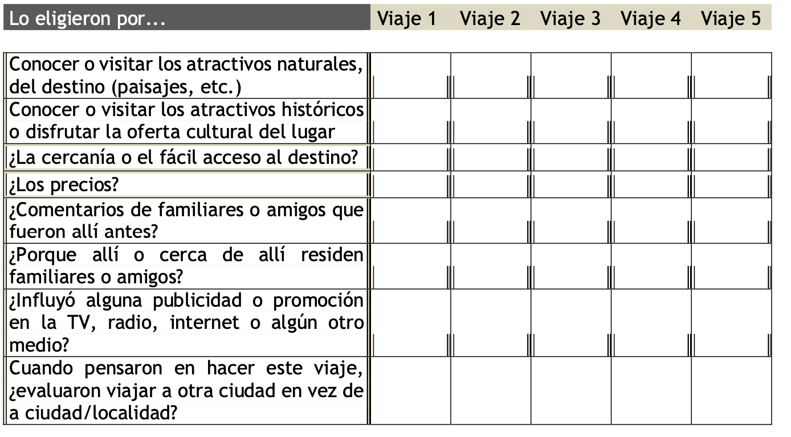
```

**P616.2.** Algún integrante del hogar que participó de este viaje a Ciudad/Localidad, ¿había viajado allí antes? ¿Cuándo fue la última vez que viajó/viajaron allí?

```{r 225, echo=FALSE, fig.cap="" }
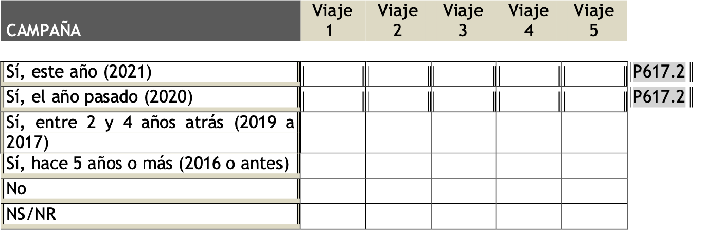
```

**P617.1.** PESE A NO SER UN VIAJE QUE HICIERON POR ESPARCIMIENTO ¿EN ESTE VIAJE REALIZARON ALGUNA ACTIVIDAD TURÍSTICA O RECREATIVA COMO VISITAR ATRACTIVOS NATURALES O HISTÓRICOS, PRACTICAR DEPORTES NO CONVENCIONALES, IR A LA PLAYA, AL CINE, AL CASINO, U OTRAS ACTIVIDADES SIMILARES?

```{r 226, echo=FALSE, fig.cap="" }
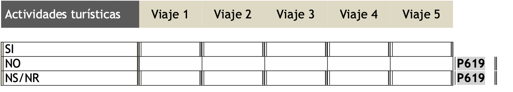
```

**P617.2** ¿CUÁLES DE LAS SIGUIENTES ACTIVIDADES TURÍSTICAS REALIZARON EN ESTE VIAJE? NO IMPORTA SI EN ELLAS PARTICIPARON TODOS O ALGUNO/S DE USTEDES.

Leer una a una las opciones y esperar a que el entrevistado responda antes de pasar a la siguiente. Anotar en cada una alguno de los siguientes códigos: Si=1, No=2, NS/NR=9.

```{r 227, echo=FALSE, fig.cap="" }
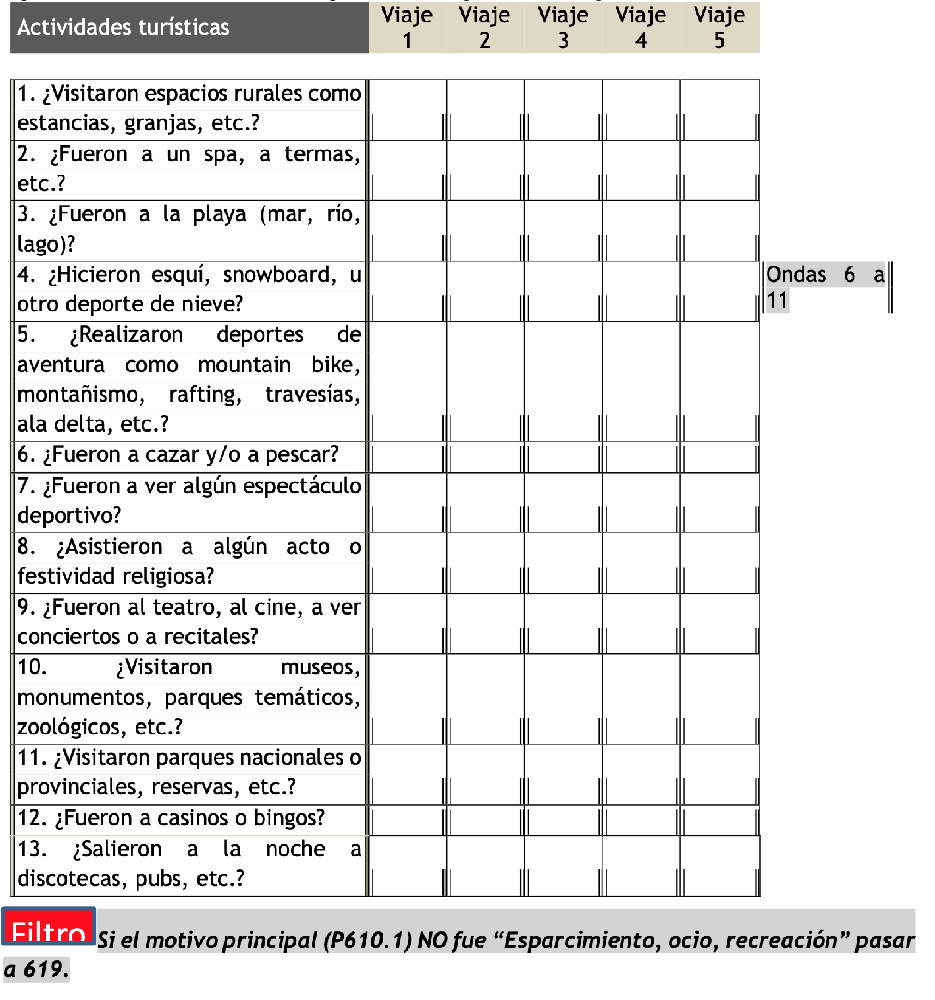
```

**P618.** DE ACUERDO A LO QUE USTED ESPERABA, POR FAVOR, CALIFIQUE DE 1 A 10 PUNTOS LOS SIGUIENTES ASPECTOS DE SU VIAJE:

Leer cada uno de los aspectos y esperar a que el encuestado otorgue una calificación, luego pasar al siguiente. Registrar valor de 1 (pésimo) a 10 (excelente). Si no utilizó, anotar 88; si NS/NR, anotar 99.

```{r 228, echo=FALSE, fig.cap="" }
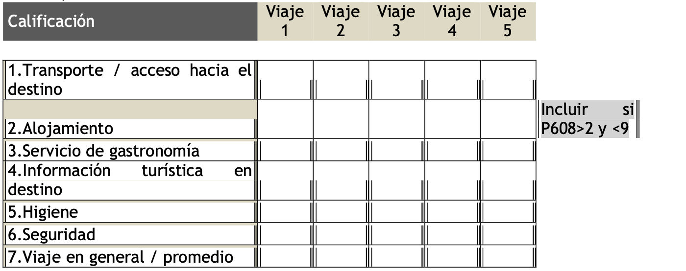
```

**P619** ¿LOS GASTOS DEL VIAJE FUERON PAGADOS TOTALMENTE POR EL HOGAR?

```{r 229, echo=FALSE, fig.cap="" }
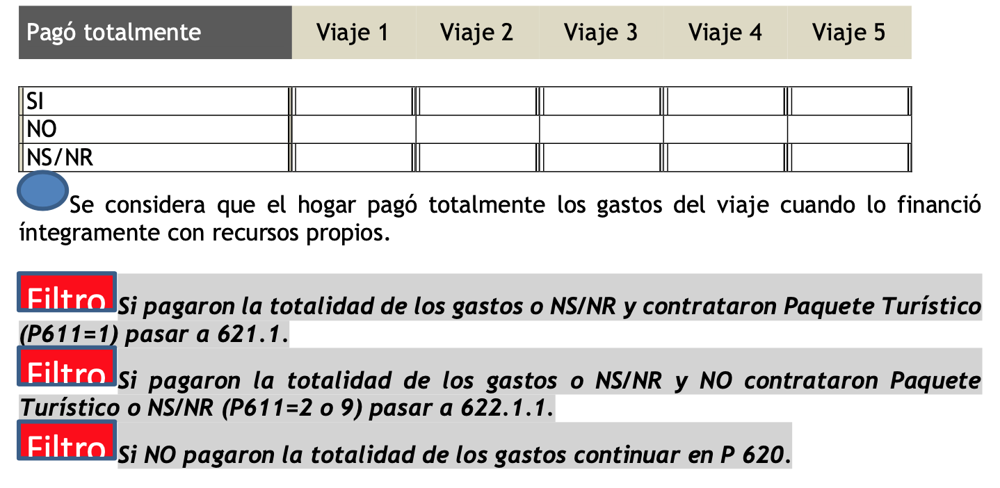
```

**P620** ¿DE QUÉ PARTE DE LOS GASTOS SE HIZO CARGO EL HOGAR?

Marque una sola opción

```{r 230, echo=FALSE, fig.cap="" }
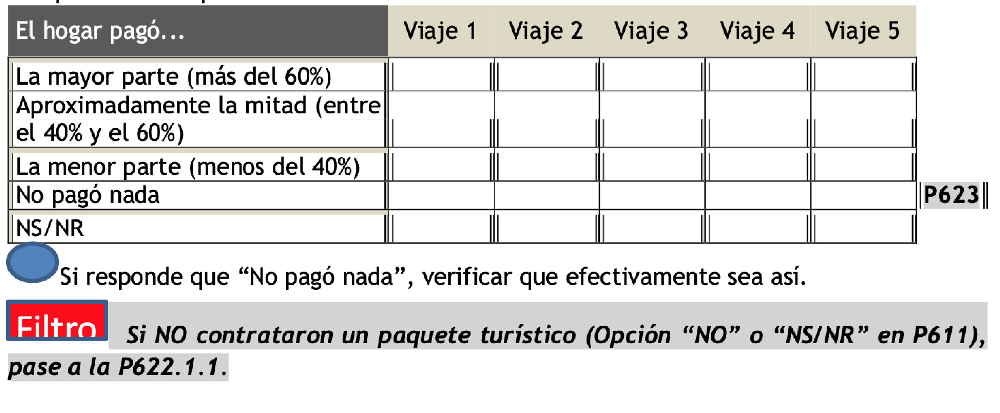
```

**P621.1** ¿CUÁNTO GASTARON EN EL PAQUETE TURÍSTICO?

Si NS/NR marcar el código. Si el hogar no pagó el PT, anotar 0 (sólo válido en los casos que el hogar haya pagado sólo una parte de los gastos del viaje).

```{r 231, echo=FALSE, fig.cap="" }
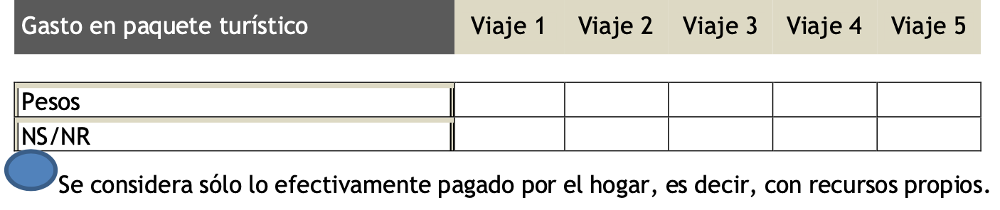
```

**P622.1.1** APROXIMADAMENTE, ¿CUÁNTO GASTARON EN TOTAL EN EL VIAJE, INCLUYENDO LOS GASTOS DE TODOS LOS MIEMBROS DEL HOGAR EN TRANSPORTE, ALOJAMIENTO, COMIDAS, EXCURSIONES, ETC.?

Si utilizaron Paquete, incluirlo como ejemplo dentro de la pregunta. Si NS/NR marque el código.

```{r 232, echo=FALSE, fig.cap="" }
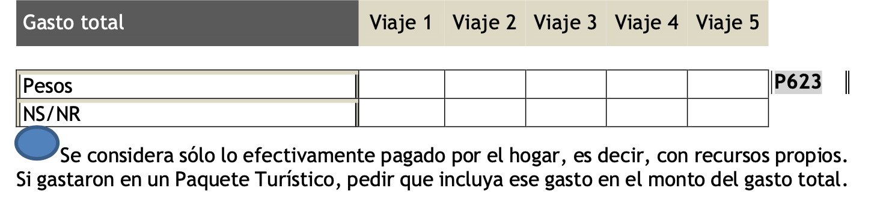
```

**P622.1.2.6.** ¿PODRÍA DECIRME EN CUÁL DE LOS SIGUIENTES TRAMOS CREE QUE SE UBICA EL GASTO TOTAL DEL VIAJE PAGADO POR EL HOGAR?

Leer las opciones listadas y marcar la que señale el entrevistado.

```{r 233, echo=FALSE, fig.cap="" }
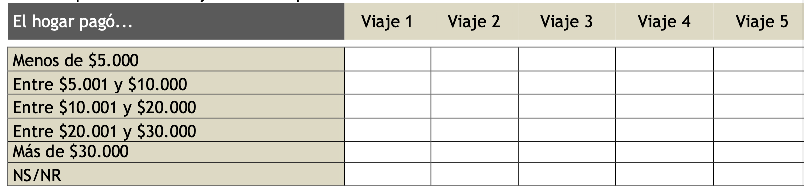
```

**P623.** OBSERVACIONES REFERIDAS AL VIAJE

Completar sólo en caso de ser necesario.

```{r 234, echo=FALSE, fig.cap="" }
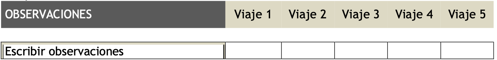
```


### Bloque 7. Viajes no reiterados al extranjero.

**P701.** ¿EN MES 1 y MES 2 VIAJARON A ALGUN PAÍS EXTRANJERO?

```{r 235, echo=FALSE, fig.cap="" }
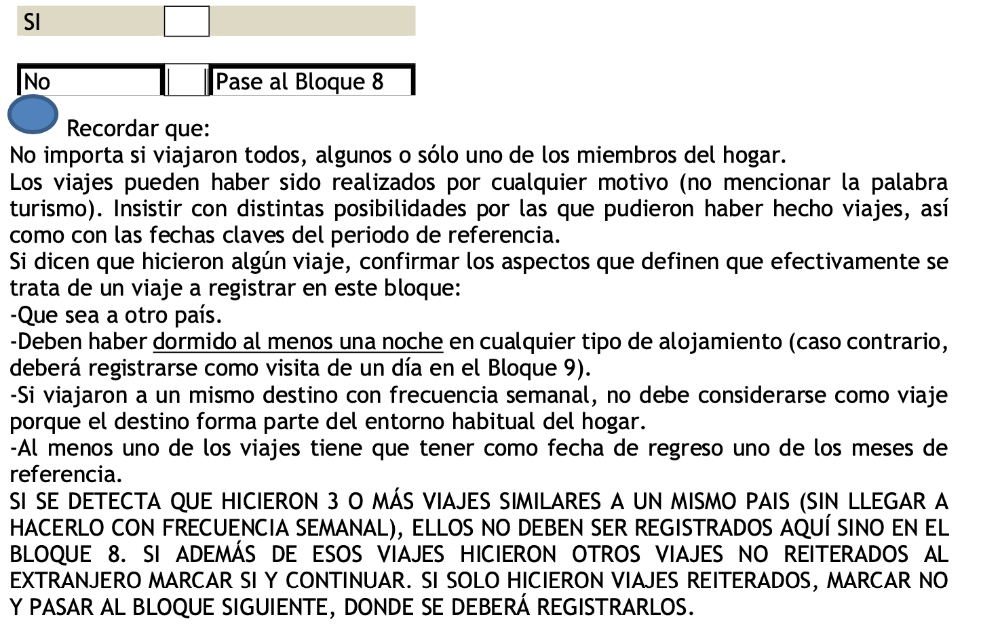
```

**P702** ¿CUÁNTOS VIAJES AL EXTERIOR HICIERON EN MES 1 Y MES 2?

Anotar la cantidad de viajes con fecha de regreso en los meses incluidos en el bimestre de referencia.

```{r 236, echo=FALSE, fig.cap="" }

```

**P703.1** POR FAVOR DÍGAME EL PAÍS AL QUE FUE EN CADA VIAJE?

Anotar el nombre en el espacio en blanco correspondiente. Si no sabe o no recuerda, escribir NS/NR.

```{r 237, echo=FALSE, fig.cap="" }
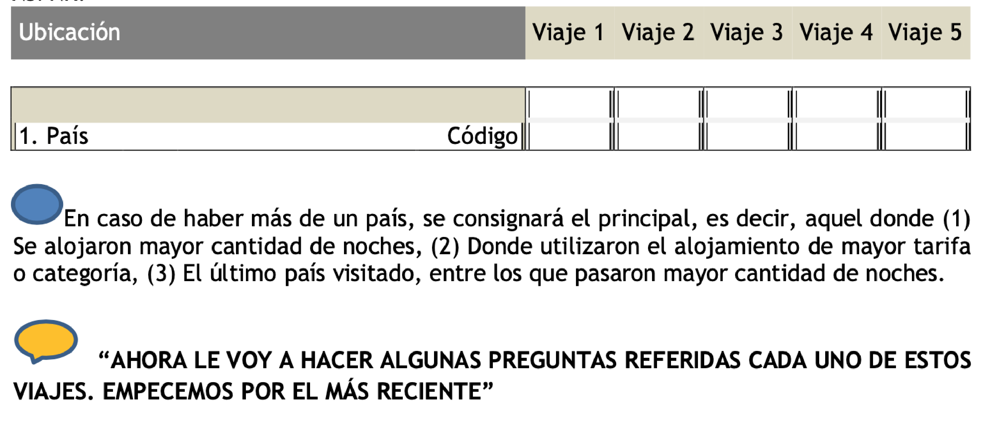
```

**P704.1.** ¿EL VIAJE A PAÍS FUE REALIZADO EN **MES 1 O MES 2**?

```{r 238, echo=FALSE, fig.cap="" }
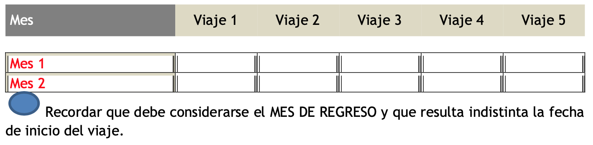
```

**P705.2.** ¿ESTE VIAJE COINCIDIÓ CON...

Leer todas las opciones y marcar una.

```{r 239, echo=FALSE, fig.cap="" }
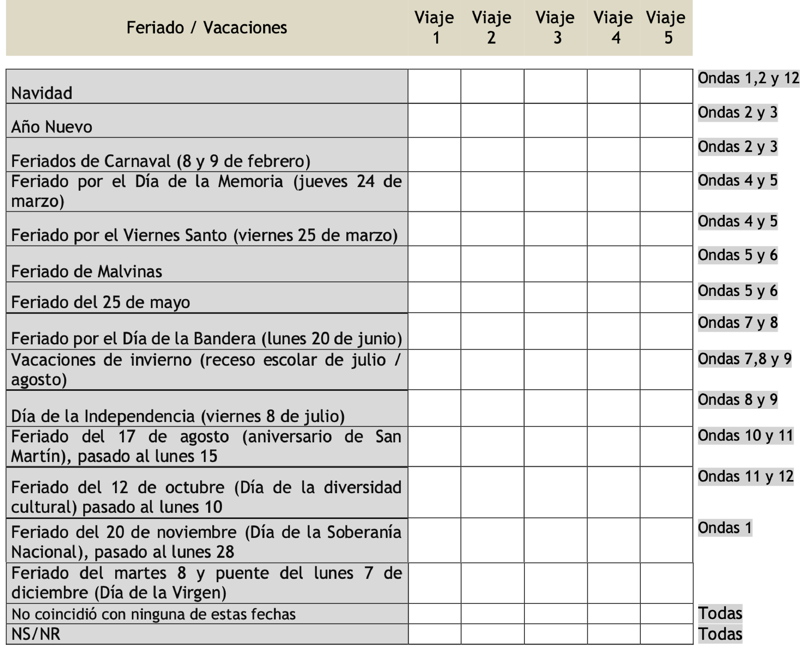
```

**P706.** ¿QUÉ INTEGRANTES DE SU HOGAR PARTICIPARON DEL VIAJE?

Marque todas las opciones que correspondan. Dejar en blanco el espacio de los miembros que no viajaron.

```{r 240, echo=FALSE, fig.cap="" }
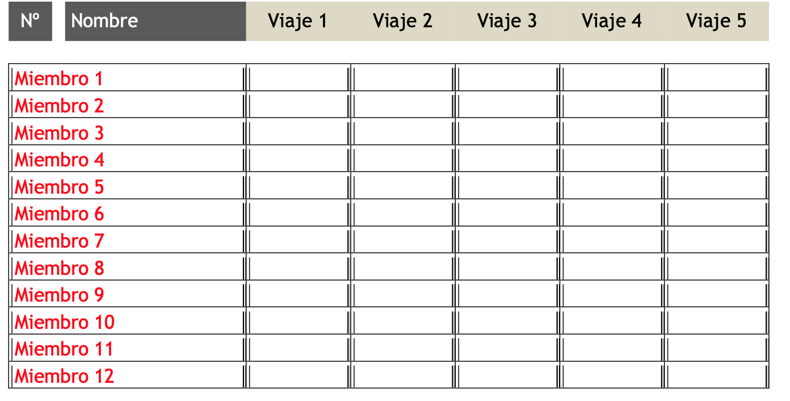
```

**P707.1** ¿CUÁL FUE LA DURACIÓN DEL VIAJE, DESDE QUE SALIERON HASTA QUE REGRESARON A SU HOGAR?

Anotar la cantidad de NOCHES o marcar el código de NS/NR.

```{r 241, echo=FALSE, fig.cap="" }
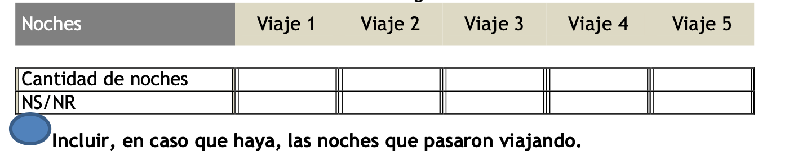
```

**P708** ¿DÓNDE SE ALOJARON?

Marcar una sola opción.

```{r 242, echo=FALSE, fig.cap="" }
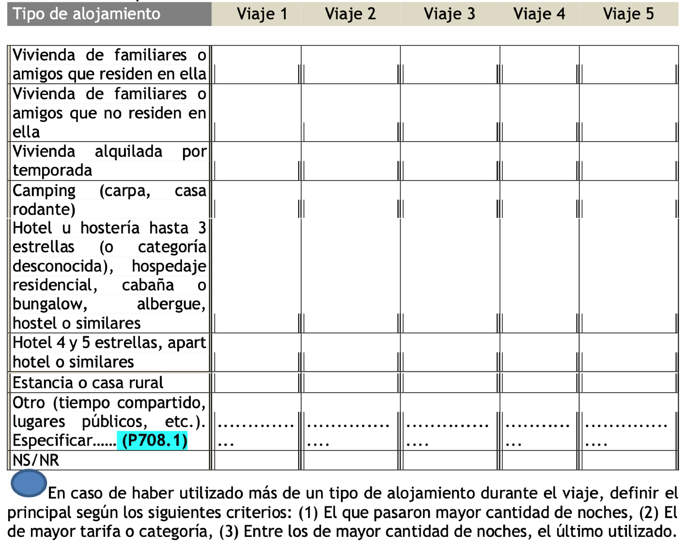
```


**P709** ¿QUÉ MEDIO DE TRANSPORTE UTILIZARON PARA IR HASTA ALLÍ?

Marque una sola opción.

```{r 243, echo=FALSE, fig.cap="" }
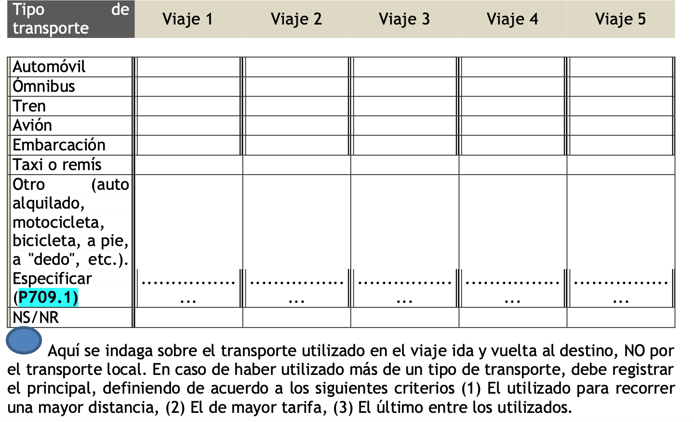
```

**P710.1** ¿CUÁL FUE EL MOTIVO DEL VIAJE?

Marque una sola opción

```{r 244, echo=FALSE, fig.cap="" }
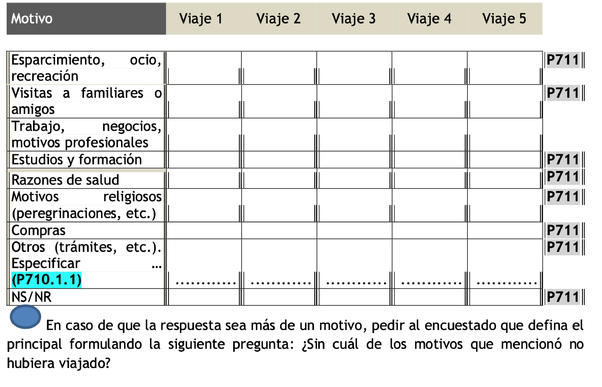
```


**P710.2** ¿EL TRABAJO REALIZADO FUE COMO EMPLEADO DE UNA EMPRESA DEL LUGAR DE DESTINO?

¿EL DESPLAZAMIENTO O TRASLADO AL LUGAR DE DESTINO FORMÓ PARTE DE SU OFICIO (AZAFATA, VIAJANTE, CHOFER, TRANSPORTISTA, ETC.)?

Realizar la primera pregunta, si responde “No” formular la siguiente. Marcar “Si” cuando responda afirmativamente a cualquiera de las dos preguntas.

```{r 245, echo=FALSE, fig.cap="" }
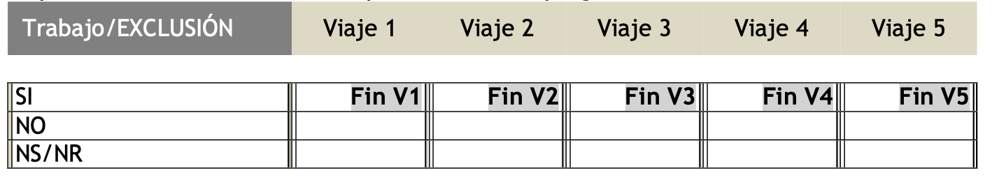
```

**P711** ¿CONTRATARON UN PAQUETE TURÍSTICO PARA REALIZAR EL VIAJE?

```{r 246, echo=FALSE, fig.cap="" }
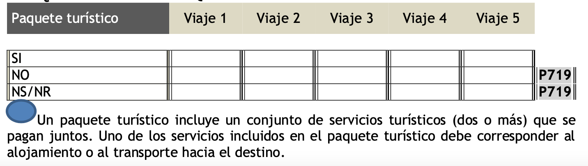
```


**P712** ¿QUÉ SERVICIOS INCLUYÓ EL PAQUETE TURÍSTICO?

Leer todas las opciones. Anotar en cada una alguno de los siguientes códigos: Si=1, No=2, NS/NR=9.

```{r 247, echo=FALSE, fig.cap="" }
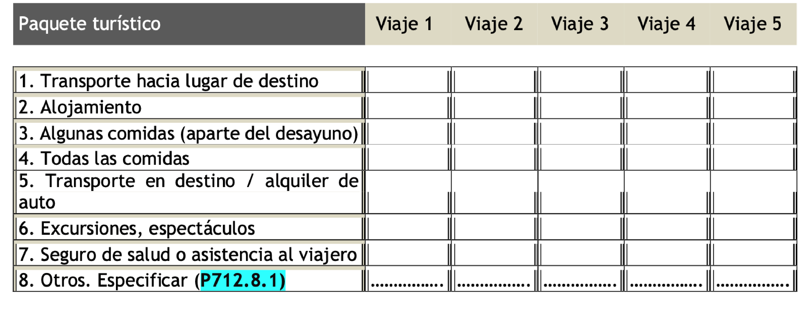
```

**P719** ¿LOS GASTOS DEL VIAJE FUERON PAGADOS TOTALMENTE POR EL HOGAR?

```{r 248, echo=FALSE, fig.cap="" }
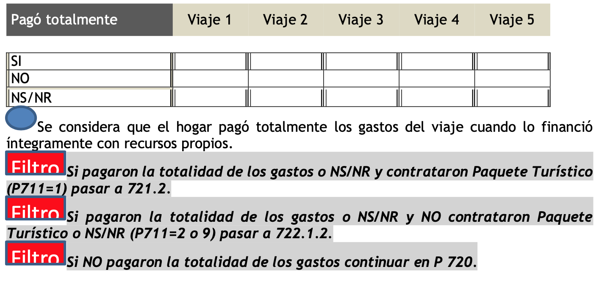
```

**P720** ¿DE QUÉ PARTE DE LOS GASTOS SE HIZO CARGO EL HOGAR?

Marque una sola opción

```{r 249, echo=FALSE, fig.cap="" }
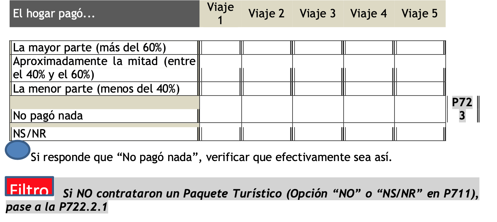
```


**P721.2** ¿CUÁNTO GASTARON EN EL PAQUETE TURÍSTICO?

En las monedas en que no hubo gasto, deje el espacio en blanco. Si el hogar no pagó el PT, anotar 0 en todos los campos (sólo válido en los casos que el hogar haya pagado sólo una parte de los gastos del viaje). Si hay marca en NS/NR no puede haber cantidad en ninguna otra moneda y viceversa.

```{r 250, echo=FALSE, fig.cap="" }
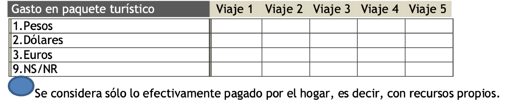
```


**P722.2.2.7.** ¿PODRÍA DECIRME EN CUÁL DE LOS SIGUIENTES TRAMOS CREE QUE SE UBICA EL GASTO TOTAL DEL VIAJE PAGADO POR EL HOGAR?

Leer las opciones listadas y marcar la que señale el entrevistado.

```{r 251, echo=FALSE, fig.cap="" }
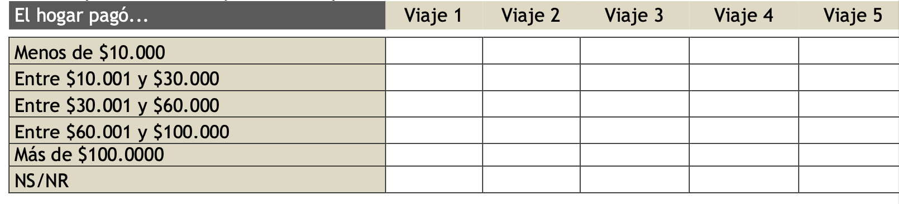
```

**P723.** OBSERVACIONES REFERIDAS AL VIAJE

Completar sólo en caso de ser necesario.

```{r 252, echo=FALSE, fig.cap="" }
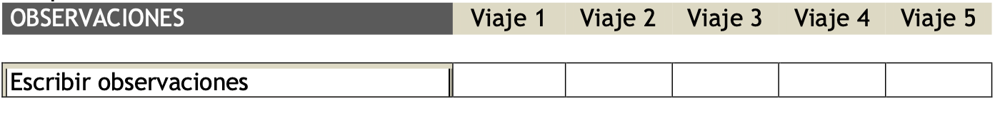
```


### Bloque 8. Viajes a destinos reiterados

**P801.** ¿EN LOS MESES DE **MES 1 Y MES 2**, VIAJARON TRES O MÁS VECES A UN MISMO LUGAR UBICADO A MÁS DE 20/40 KM DE SU CIUDAD, ¿POR EL MISMO MOTIVO Y PERMANECIENDO SIEMPRE UNA CANTIDAD SIMILAR DE NOCHES?

Esta pregunta no debe realizarse. La responderá el encuestador si en la indagación de los bloques previos surgió esta situación. Caso contrario, marcará “No” y continuará en el bloque siguiente.

```{r 253, echo=FALSE, fig.cap="" }
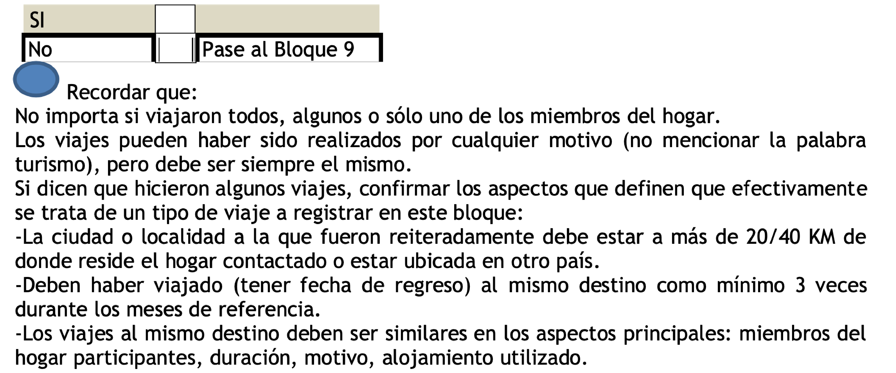
```

**P802** ¿CUÁNTOS LUGARES VISITARON 3 O MÁS VECES (REALIZANDO VIAJES DE CARACTERÍSTICAS SIMILARES) EN LOS MESES **MES 1 Y MES 2**?

Anotar la cantidad de destinos con 3 o más viajes con fecha de regreso en el bimestre de referencia.

```{r 254, echo=FALSE, fig.cap="" }

```

**P803.1** POR FAVOR DÍGAME EL/LOS PAÍSES, LA/S PROVINCIA/S Y LA/S CIUDAD/ES O LOCALIDAD/ES A DONDE VIAJARON DE MANERA REITERADA

Anotar el nombre en el espacio en blanco correspondiente. Si no sabe o no recuerda, escribir NS/NR.

```{r 255, echo=FALSE, fig.cap="" }
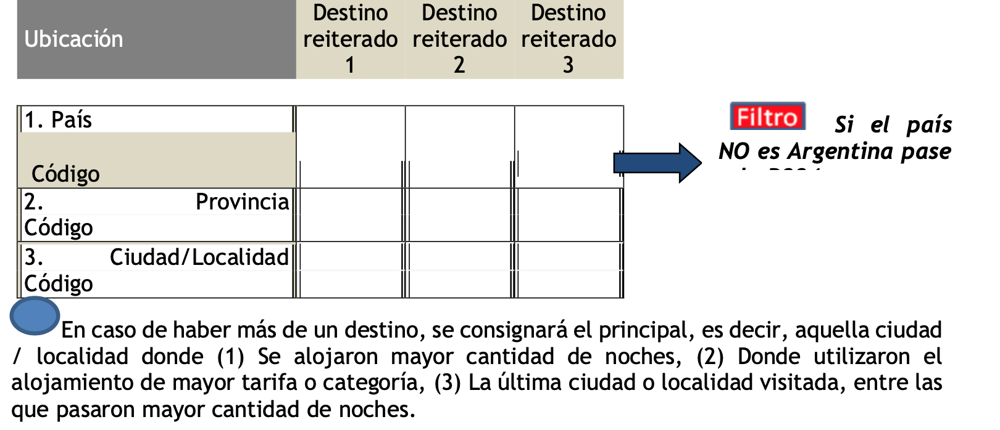
```

**P803.1.4** EN EL ÚLTIMO DE ESTOS VIAJES, ADEMÁS DE **PAÍS/CIUDAD/LOCALIDAD** ¿PASARON AL MENOS UNA NOCHE EN OTRA CIUDAD?

```{r 256, echo=FALSE, fig.cap="" }
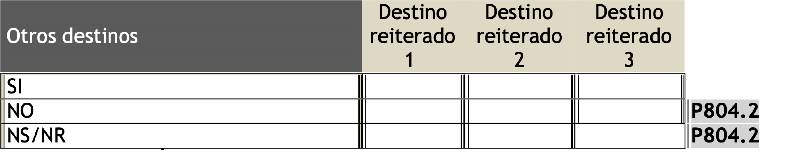
```

**P803.1.5** ¿EN CUÁNTAS OTRAS CIUDADES SE ALOJARON AL MENOS UNA NOCHE?
Si NS/NR anotar 99.

```{r 257, echo=FALSE, fig.cap="" }
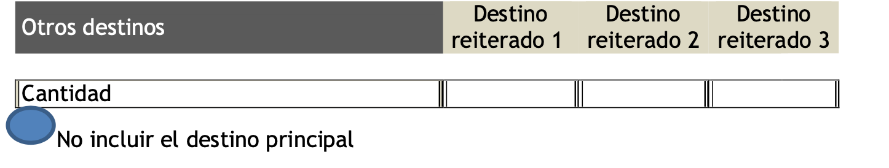
```

**P804.2.** ¿CUÁNTAS VECES FUERON A **PAÍS/CIUDAD/LOCALIDAD** EN **MES 1 Y CUÁNTAS EN MES 2**?

Anotar la cantidad. Si en uno de los meses no realizaron viajes registrar 0 (cero).

```{r 258, echo=FALSE, fig.cap="" }
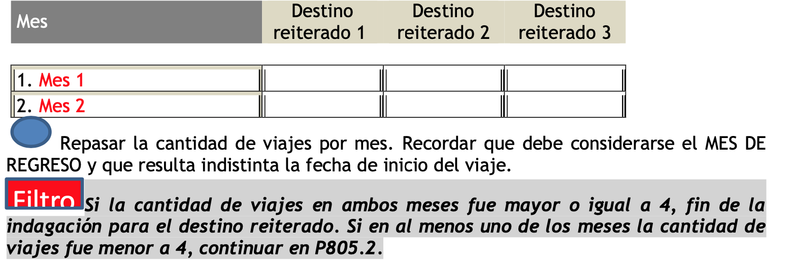
```

**P805.2.** ¿ALGUNO DE LOS VIAJES A PAÍS/CIUDAD/LOCALIDAD COINCIDIÓ CON....

Leer todas las opciones. Anotar en cada una alguno de los siguientes códigos: Si=1, No=2, NS/NR=9.

```{r 259, echo=FALSE, fig.cap="" }
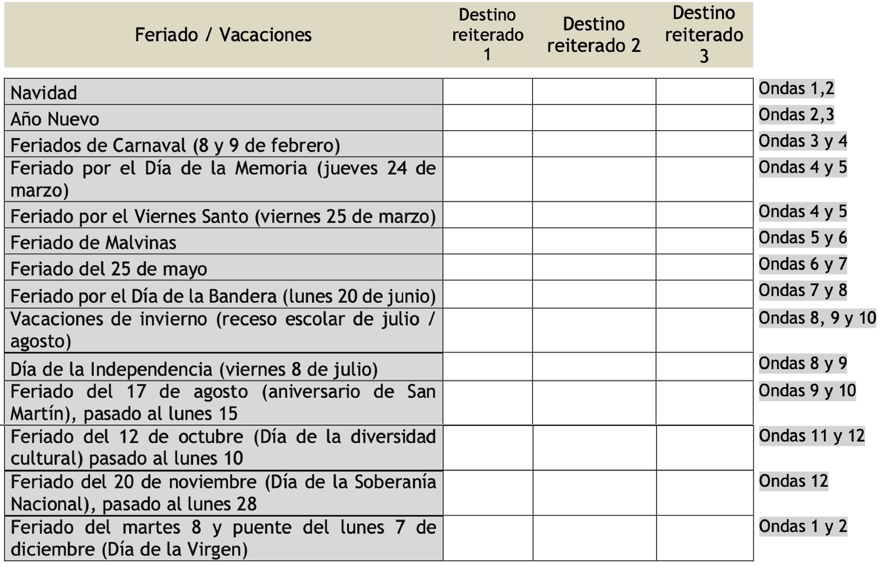
```

**“AHORA LE VOY A PREGUNTAR POR EL ÚLTIMO DE LOS VIAJES QUE REALIZARON A ESTE LUGAR”**

**P806** ¿QUÉ INTEGRANTES DE SU HOGAR PARTICIPARON DEL VIAJE?

Marque todas las opciones que correspondan. Dejar en blanco el espacio de los miembros que no viajaron.

```{r 260, echo=FALSE, fig.cap="" }
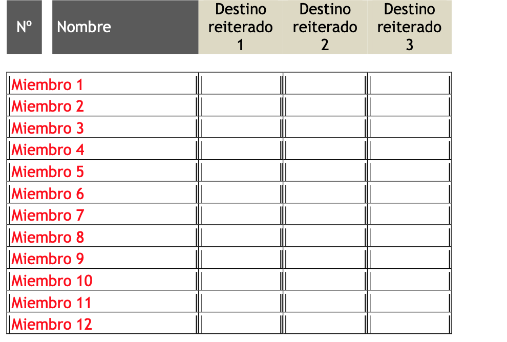
```


**P807.1** ¿CUÁL FUE LA DURACIÓN DEL VIAJE, DESDE QUE SALIERON HASTA QUE REGRESARON A SU HOGAR?

Anotar la cantidad de NOCHES o marcar el código de NS/NR.

```{r 261, echo=FALSE, fig.cap="" }
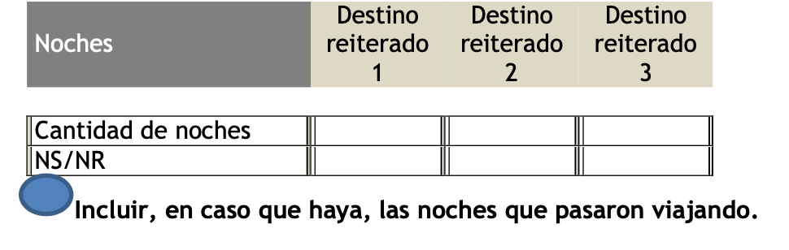
```

**P808** ¿DÓNDE SE ALOJARON?

Marcar una sola opción.

```{r 262, echo=FALSE, fig.cap="" }
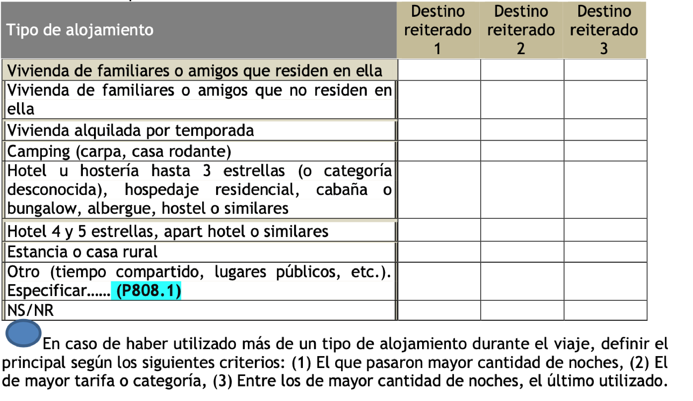
```

**P809** ¿QUÉ MEDIO DE TRANSPORTE USARON PARA IR HASTA ALLÁ?

Marque una sola opción.

```{r 263, echo=FALSE, fig.cap="" }
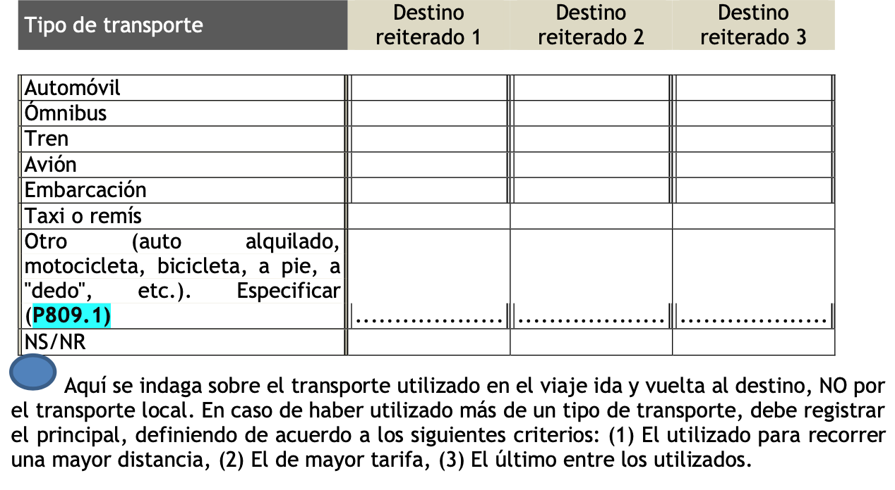
```

**P810.1** ¿CUÁL FUE EL MOTIVO DEL VIAJE?

Marque una sola opción

```{r 264, echo=FALSE, fig.cap="" }
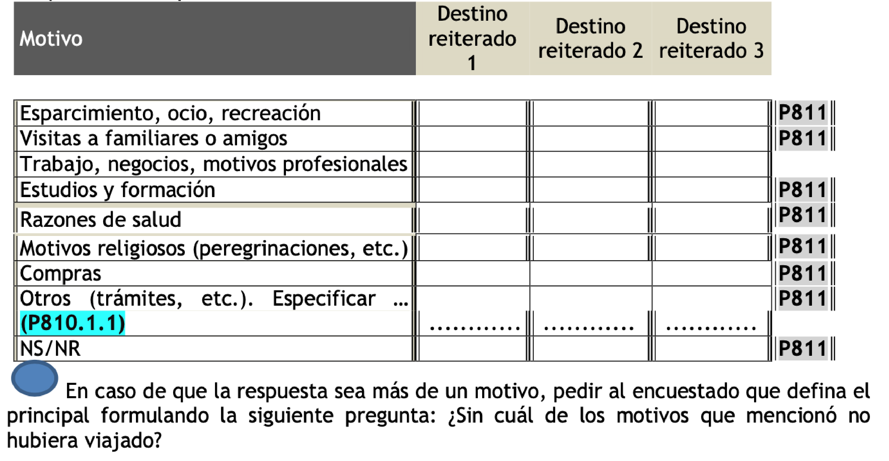
```

**P810.2** ¿EL TRABAJO REALIZADO FUE COMO EMPLEADO DE UNA EMPRESA DEL LUGAR DE DESTINO?

¿EL DESPLAZAMIENTO O TRASLADO AL LUGAR DE DESTINO FORMÓ PARTE DE SU OFICIO (AZAFATA, VIAJANTE, CHOFER, TRANSPORTISTA, ETC.)?

Realizar la primera pregunta, si responde “No” formular la siguiente. Marcar “Si” cuando responda afirmativamente a cualquiera de las dos preguntas.

```{r 265, echo=FALSE, fig.cap="" }
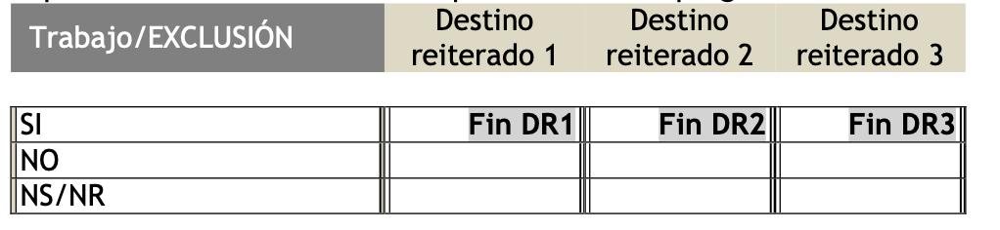
```

**P811** ¿CONTRATARON UN PAQUETE TURÍSTICO PARA REALIZAR EL VIAJE?

```{r 266, echo=FALSE, fig.cap="" }
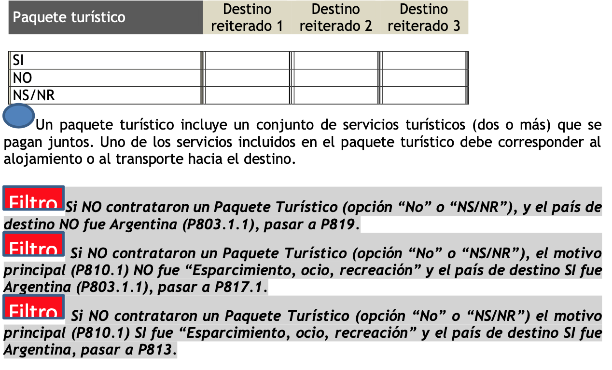
```

**P812** ¿QUÉ SERVICIOS INCLUYÓ EL PAQUETE TURÍSTICO?

Leer todas las opciones. Anotar en cada una alguno de los siguientes códigos: Si=1, No=2, NS/NR=9.

```{r 267, echo=FALSE, fig.cap="" }
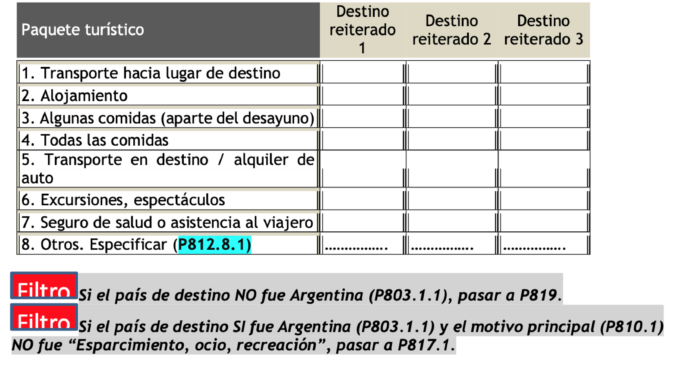
```

**P813** ¿CON CUÁNTO TIEMPO DE ANTICIPACIÓN DECIDIERON REALIZAR EL VIAJE?

Esperar a que el encuestado responda. Si no lo hace, leer las opciones. Marcar una sola opción.

```{r 268, echo=FALSE, fig.cap="" }
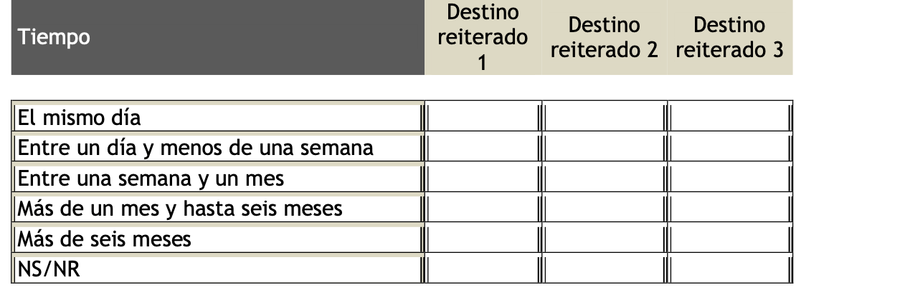
```

**P814** ¿UTILIZARON INTERNET PARA CONSULTAR INFORMACIÓN O CONTRATAR SERVICIOS PARA SU VIAJE (SOBRE TRANSPORTE, ALOJAMIENTOS, ATRACTIVOS TURÍSTICOS DEL DESTINO, ¿ETC.)?

```{r 269, echo=FALSE, fig.cap="" }
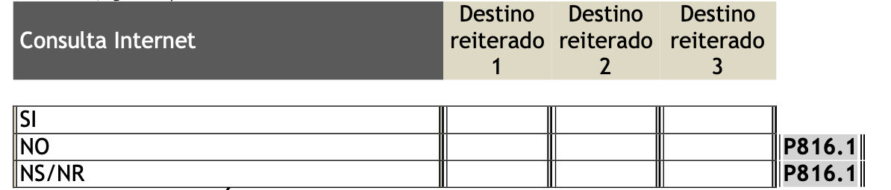
```

**P815.** POR FAVOR, DÍGAME SI PARA ESTE VIAJE, POR MEDIO DE INTERNET...

Leer todas las opciones. Anotar en cada una alguno de los siguientes códigos: Si=1, No=2, NS/NR=9.

```{r 270, echo=FALSE, fig.cap="" }
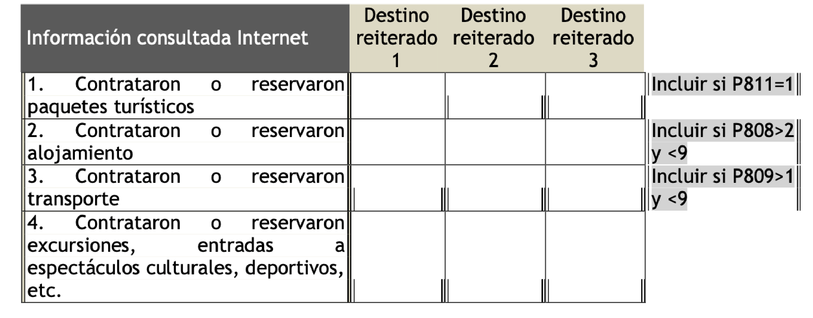
```

**P816.1.** ¿POR QUÉ RAZONES ELIGEN VISITAR **CIUDAD/LOCALIDAD?**

No leer las opciones y esperar a que el entrevistado responda. Sólo en caso de que no lo haga, leer las opciones.

Marcar sólo las opciones señaladas por el entrevistado y dejar en blanco las restantes. Si hay marca en NS/NR no puede haber marca en ninguna otra opción, y viceversa, si marca cualquier otra opción no puede haber marca en NS/NR.

```{r 271, echo=FALSE, fig.cap="" }
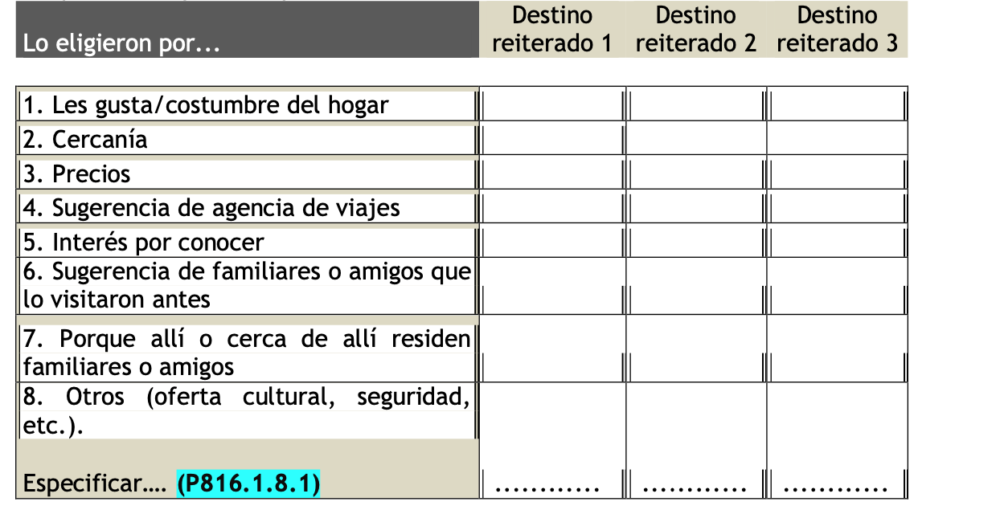
```

**P816.2.** EN SU DESICIÓN DE VIAJAR A CIUDAD/**LOCALIDAD**, ¿INFLUYÓ ALGUNA PROPAGANDA O PROMOCIÓN DE LA TELEVISIÓN, LA RADIO O ALGÚN OTRO MEDIO?

```{r 272, echo=FALSE, fig.cap="" }
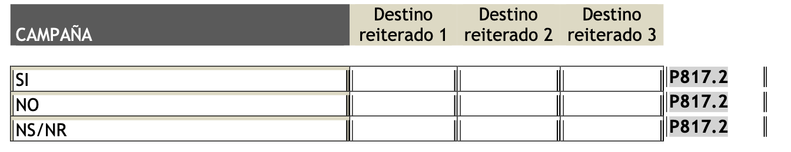
```

**P817.1.** PESE A NO SER UN VIAJE QUE HICIERON POR ESPARCIMIENTO ¿EN ESTE VIAJE REALIZARON ALGUNA ACTIVIDAD TURÍSTICA O RECREATIVA COMO VISITAR ATRACTIVOS NATURALES O HISTÓRICOS, PRACTICAR DEPORTES NO CONVENCIONALES, IR A LA PLAYA, AL CINE, AL CASINO, U OTRAS ACTIVIDADES SIMILARES?

```{r 273, echo=FALSE, fig.cap="" }
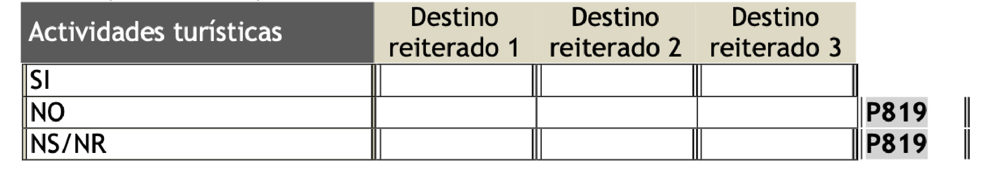
```

**P817.2.** ¿CUÁLES DE LAS SIGUIENTES ACTIVIDADES TURÍSTICAS REALIZARON EN ESTE VIAJE? NO IMPORTA SI EN ELLAS PARTICIPARON TODOS O ALGUNO/S DE USTEDES

Leer una a una las opciones y esperar a que el entrevistado responda antes de pasar a la siguiente. Anotar en cada una alguno de los siguientes códigos: Si=1, No=2, NS/NR=9.

```{r 274, echo=FALSE, fig.cap="" }
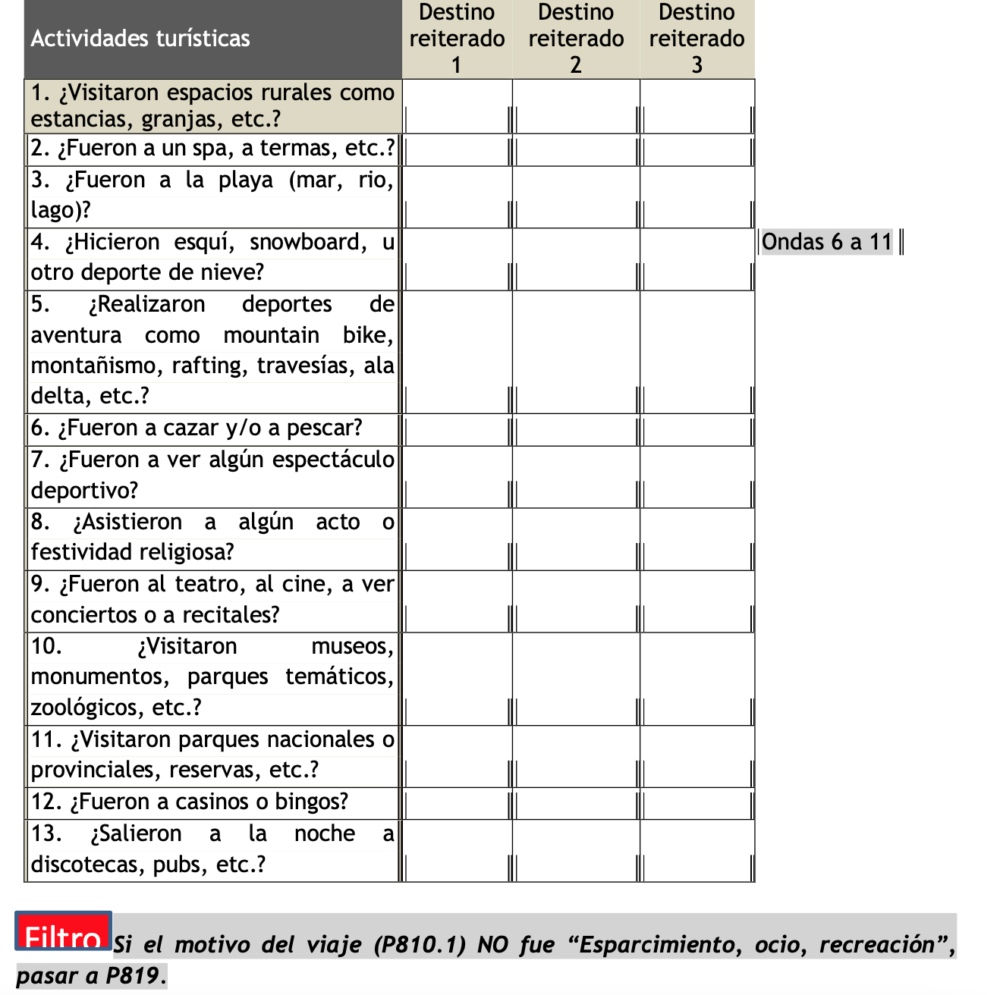
```

**P818.** DE ACUERDO A LO QUE USTED ESPERABA, POR FAVOR, CALIFIQUE DE 1 A 10 PUNTOS LOS SIGUIENTES ASPECTOS DE SU VIAJE:

Leer cada uno de los aspectos y esperar a que el encuestado otorgue una calificación, luego pasar al siguiente. Registrar valor de 1 (pésimo) a 10 (excelente). Si no utilizó, anotar 88; si NS/NR, anotar 99.

```{r 275, echo=FALSE, fig.cap="" }
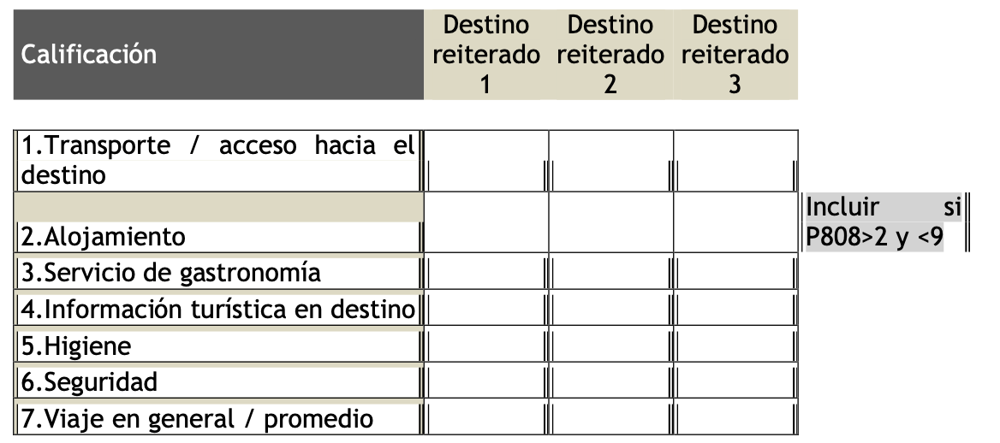
```

**P819** ¿LOS GASTOS DEL VIAJE FUERON PAGADOS TOTALMENTE POR EL HOGAR?

```{r 276, echo=FALSE, fig.cap="" }
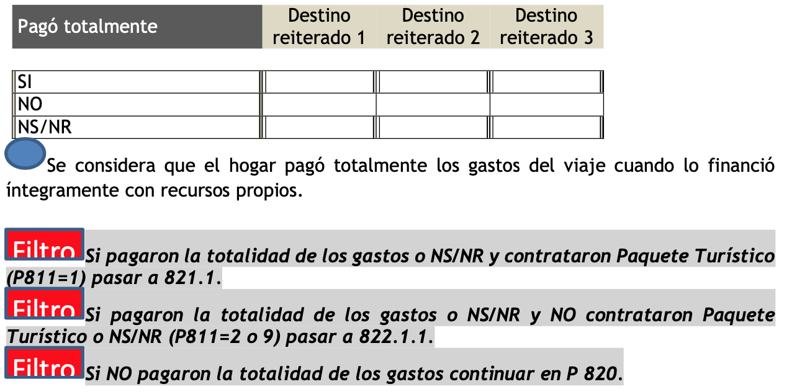
```

**P820** ¿DE QUÉ PARTE DE LOS GASTOS SE HIZO CARGO EL HOGAR?

Marque una sola opción

```{r 277, echo=FALSE, fig.cap="" }
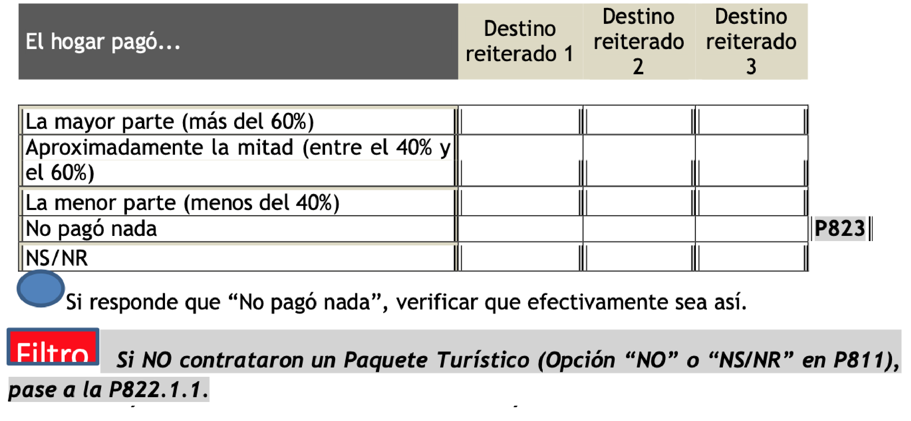
```

**P821.1** ¿CUÁNTO GASTARON EN EL PAQUETE TURÍSTICO?

Si NS/NR marcar el código. Si el hogar no pagó el PT, anotar 0 (sólo válido en los casos que el hogar haya pagado sólo una parte de los gastos del viaje).

```{r 278, echo=FALSE, fig.cap="" }
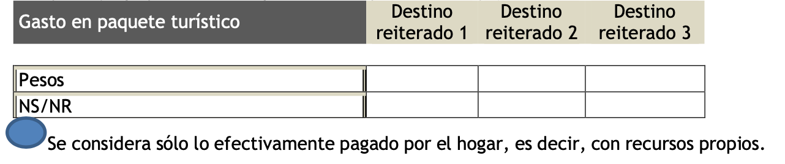
```

**P822.1.1.** APROXIMADAMENTE, ¿CUÁNTO GASTARON EN TOTAL EN EL VIAJE, INCLUYENDO LOS GASTOS DE TODOS LOS MIEMBROS DEL HOGAR EN TRANSPORTE, ALOJAMIENTO, COMIDAS, EXCURSIONES, ETC.?

Si utilizaron paquete, incluirlo como ejemplo dentro de la pregunta. Si NS/NR marque el código.

```{r 279, echo=FALSE, fig.cap="" }
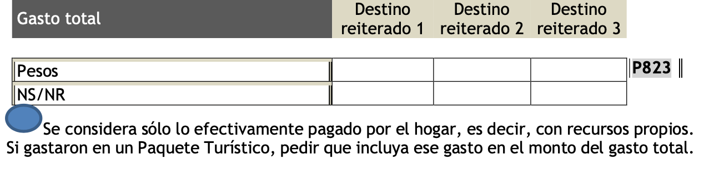
```

**P822.1.2.8.** ¿PODRÍA DECIRME EN CUÁL DE LOS SIGUIENTES TRAMOS CREE QUE SE UBICA EL GASTO TOTAL DEL VIAJE PAGADO POR EL HOGAR?

Leer las opciones listadas y marcar la que señale el entrevistado.

```{r 280, echo=FALSE, fig.cap="" }
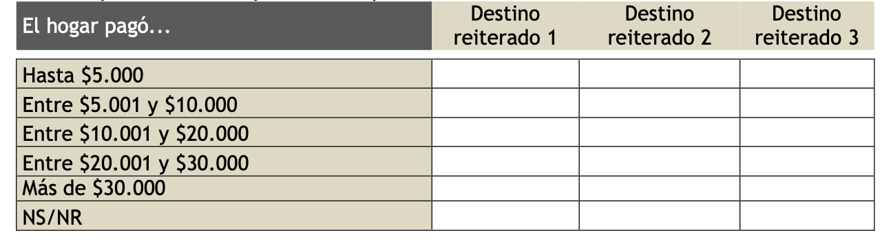
```

**P823.** OBSERVACIONES REFERIDAS AL VIAJE

Completar sólo en caso de ser necesario.

```{r 281, echo=FALSE, fig.cap="" }
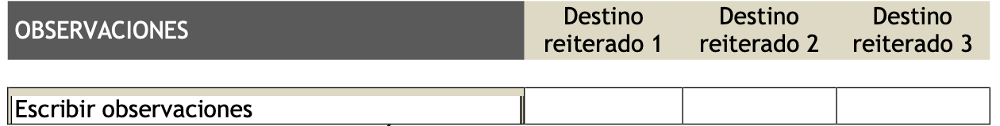
```


### Bloque 9. Visitas de un día

**P901.** ¿EN MES 1 y MES 2, UD O ALGÚN INTEGRANTE DE SU HOGAR FUERON A PASAR EL DÍA A ALGÚN LUGAR UBICADO A MAS DE 20/40 KM, PERO SIN QUEDARSE A DORMIR? POR EJEMPLO, A PASAR UN DÍA DE PASEO O CAMPING SIN QUEDARSE A DORMIR, A VISITAR ALGÚN FAMILIAR, POR TRABAJO O PARA HACER TRÁMITES YENDO Y VIVIENDO EN EL DÍA, ETC?

```{r 282, echo=FALSE, fig.cap="" }
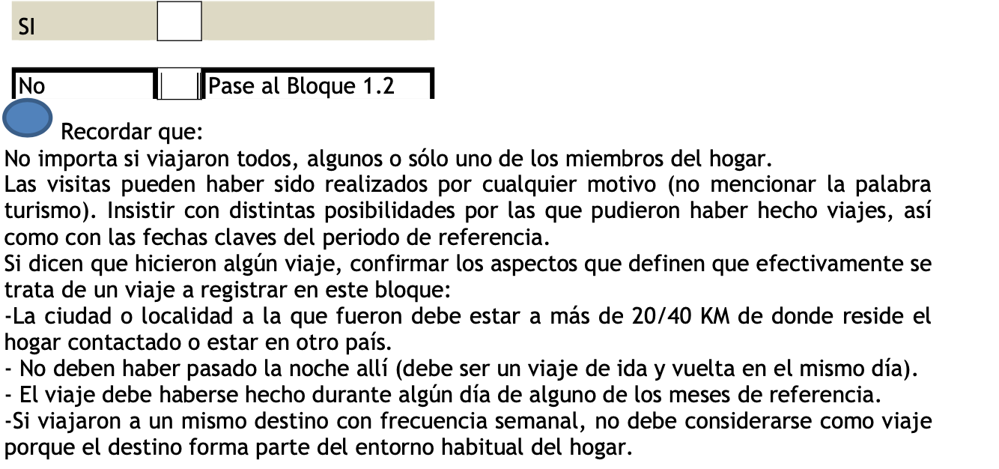
```

**P902** ¿CUÁNTOS LUGARES VISITARON EN MES 1 Y MES 2 SIN QUEDARSE A DORMIR ALLÍ? 

Anotar la cantidad de viajes con fecha en los meses incluidos en el bimestre de referencia.

```{r 283, echo=FALSE, fig.cap="" }

```

**P903.1** POR FAVOR DÍGAME LA/S PROVINCIA/S Y LA/S CIUDAD/ES A DONDE VIAJARON, O EL NOMBRE DEL PAÍS SI EL LUGAR NO ESTÁ EN ARGENTINA.

Anotar el nombre en el espacio en blanco correspondiente. Si no sabe o no recuerda, escribir NS/NR.

```{r 284, echo=FALSE, fig.cap="" }
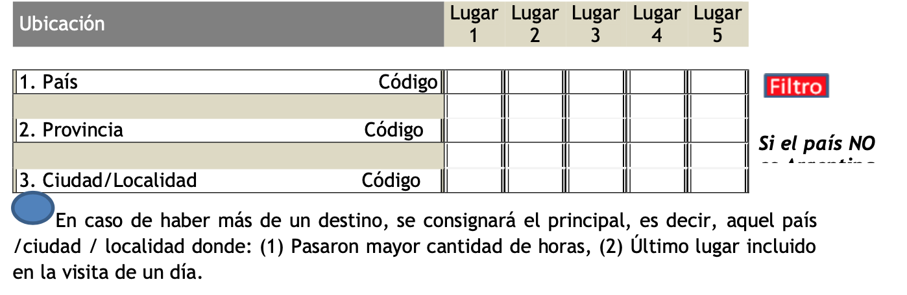
```

**P904.2.** ¿CUÁNTAS VECES FUERON A PASAR EL DÍA A **PAÍS/CIUDAD/LOCALIDAD** EN **MES 1 Y CUÁNTAS EN MES 2**?

Anotar la cantidad. Si en uno de los meses no realizaron viajes registrar 0 (cero).

```{r 285, echo=FALSE, fig.cap="" }
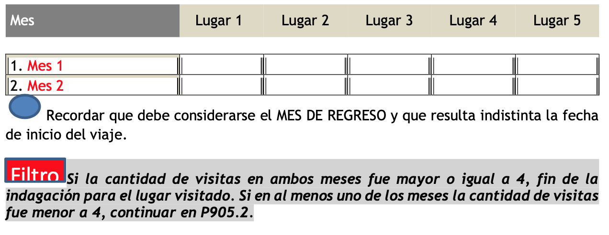
```

**P905.2** ¿ALGUNA DE ESTAS VISITAS DE UN DÍA COINCIDIÓ CON....

Leer todas las opciones. Anotar en cada una alguno de los siguientes códigos: Si=1, No=2, NS/NR=9.

```{r 286, echo=FALSE, fig.cap="" }
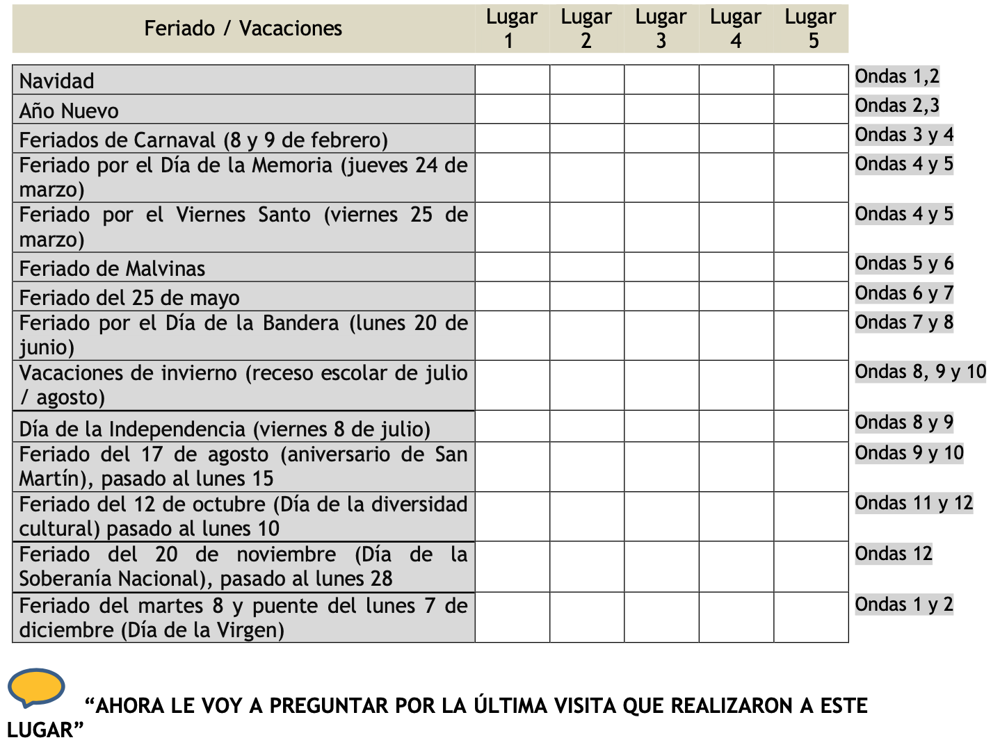
```

**P906** ¿QUÉ INTEGRANTES DE SU HOGAR PARTICIPARON DEL VIAJE?

Marque todas las opciones que correspondan. Dejar en blanco el espacio de los miembros que no viajaron.

```{r 287, echo=FALSE, fig.cap="" }
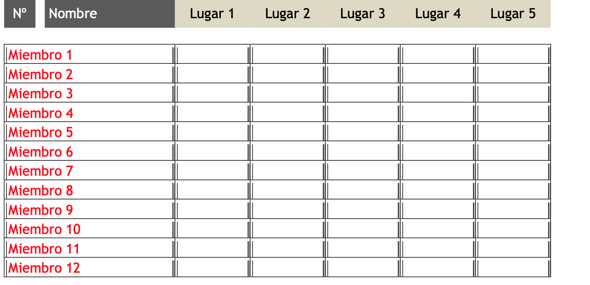
```

**P909** ¿QUÉ MEDIO DE TRANSPORTE UTILIZARON PARA IR HASTA ALLÁ?

Marque una sola opción.

```{r 288, echo=FALSE, fig.cap="" }
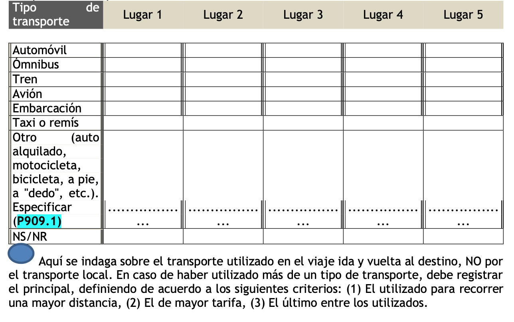
```

**P910.1** ¿CUÁL FUE EL MOTIVO DEL VIAJE?

Marque una sola opción

```{r 289, echo=FALSE, fig.cap="" }
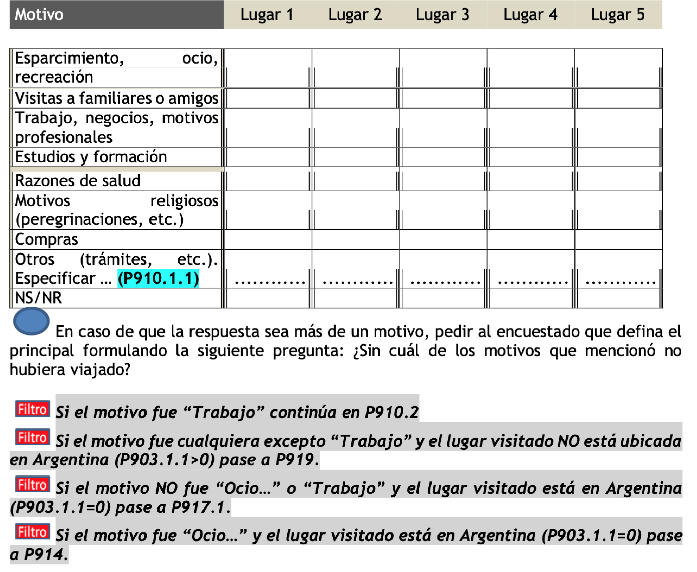
```

**P910.2** ¿EL TRABAJO REALIZADO FUE COMO EMPLEADO DE UNA EMPRESA DEL LUGAR DE DESTINO?

¿EL DESPLAZAMIENTO O TRASLADO AL LUGAR DE DESTINO FORMÓ PARTE DE SU OFICIO (AZAFATA, VIAJANTE, CHOFER, TRANSPORTISTA, ETC.)?

Realizar la primera pregunta, si responde “No” formular la siguiente. Marcar “Si” cuando responda afirmativamente a cualquiera de las dos preguntas.

```{r 290, echo=FALSE, fig.cap="" }
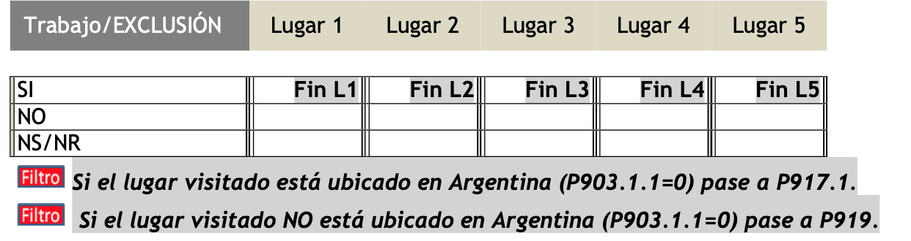
```

**P914** ¿UTILIZARON INTERNET PARA CONSULTAR INFORMACIÓN O CONTRATAR SERVICIOS PARA SU VISITA DE UN DÍA (SOBRE TRANSPORTE, ALOJAMIENTOS, ATRACTIVOS TURÍSTICOS DEL DESTINO, ETC.)?

```{r 291, echo=FALSE, fig.cap="" }
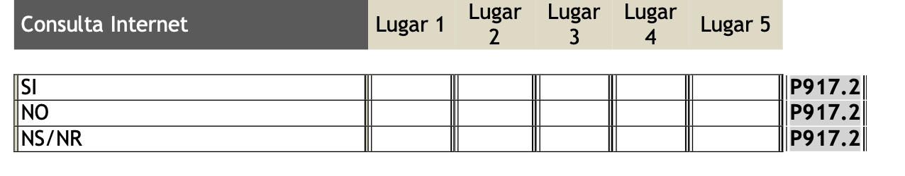
```

**P917.1.** PESE A QUE NO HICIERON ESTA VISITA POR ESPARCIMIENTO, ¿EN ESTA VISITA REALIZARON ALGUNA ACTIVIDAD TURÍSTICA O RECREATIVA COMO VISITAR ATRACTIVOS NATURALES O HISTÓRICOS, PRACTICAR DEPORTES NO CONVENCIONALES, IR A LA PLAYA, AL CINE, AL CASINO, U OTRAS ACTIVIDADES SIMILARES?

```{r 292, echo=FALSE, fig.cap="" }
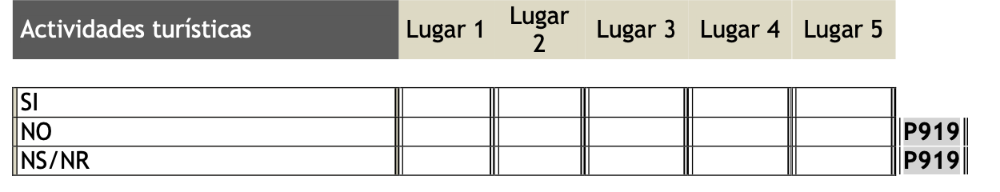
```

**P917.2** ¿CUÁLES DE LAS SIGUIENTES ACTIVIDADES TURÍSTICAS REALIZARON DURANTE LA VISITA? NO IMPORTA SI EN ELLAS PARTICIPARON TODOS O ALGUNO/S DE USTEDES.

Leer una a una las opciones y esperar a que el entrevistado responda antes de pasar a la siguiente. Anotar en cada una alguno de los siguientes códigos: Si=1, No=2, NS/NR=9.

```{r 293, echo=FALSE, fig.cap="" }
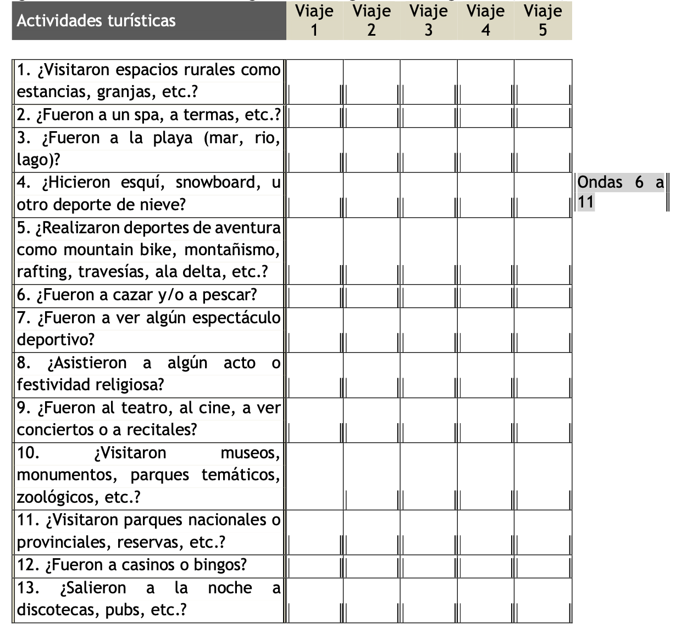
```

**P919** ¿LOS GASTOS DEL VIAJE FUERON PAGADOS TOTALMENTE POR EL HOGAR?

```{r 294, echo=FALSE, fig.cap="" }
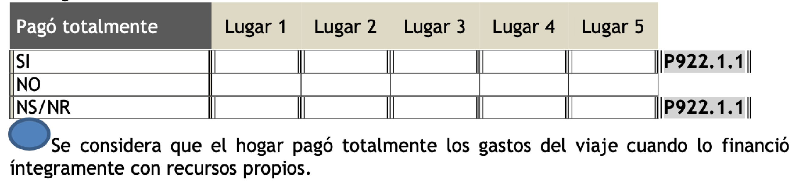
```

**P920** ¿DE QUÉ PARTE DE LOS GASTOS SE HIZO CARGO EL HOGAR?

Marque una sola opción

```{r 295, echo=FALSE, fig.cap="" }
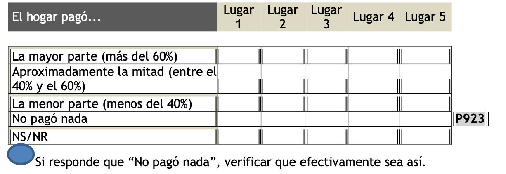
```

**P922.1.1** APROXIMADAMENTE, ¿CUÁNTO GASTARON EN TOTAL EN LA VISITA DE UN DÍA, INCLUYENDO LOS GASTOS DE TODOS LOS MIEMBROS DEL HOGAR EN TRANSPORTE, COMIDAS, EXCURSIONES, ETC.?

Si NS/NR marque el código.

```{r 296, echo=FALSE, fig.cap="" }
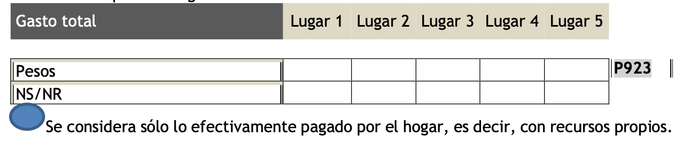
```

**P922.1.2.9.** ¿PODRÍA DECIRME EN CUÁL DE LOS SIGUIENTES TRAMOS CREE QUE SE UBICA EL GASTO TOTAL DEL VIAJE PAGADO POR EL HOGAR?

Leer las opciones listadas y marcar la que señale el entrevistado.

```{r 297, echo=FALSE, fig.cap="" }
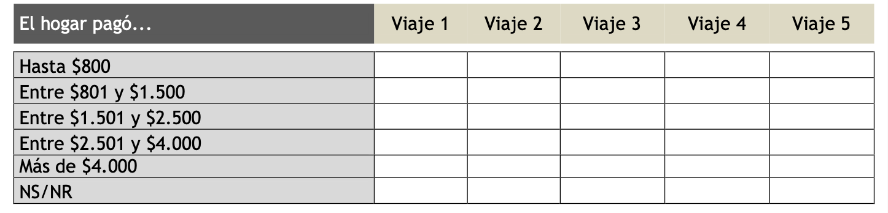
```

**P923.** OBSERVACIONES REFERIDAS A LA VISITA DE UN DÍA

Completar sólo en caso de ser necesario.

```{r 298, echo=FALSE, fig.cap="" }
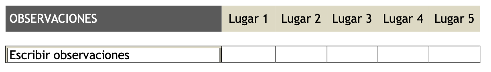
```

### Bloque 1.2. Características de los miembros del hogar

```{r 299, echo=FALSE, fig.cap="" }
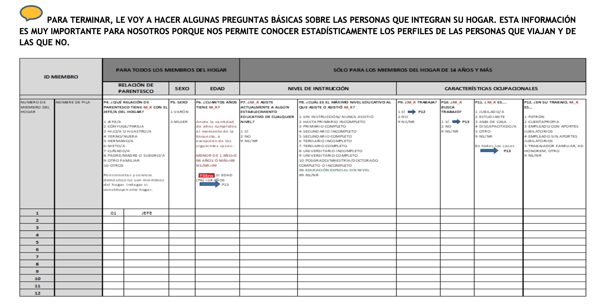
```
```{r 300, echo=FALSE, fig.cap="" }
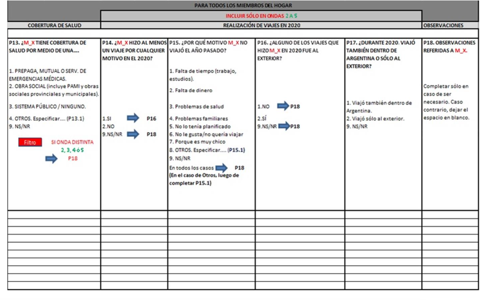
```

### Bloque 1.3. Ingreso total del hogar en el último mes

**P20.1.** ¿PODRÍA DECIRME APROXIMADAMENTE CUÁL FUE LA SUMA DE LOS INGRESOS, LABORALES O DE CUALQUIER TIPO, DE TODOS LOS MIEMBROS DEL HOGAR EN EL **MES DE MES 2**?

```{r 301, echo=FALSE, fig.cap="" }

```

**P20.2.** ¿SI LE DIJERA UN TRAMO, PODRÍA DECIRME EN CUÁL SE UBICA LA SUMA DE LOS INGRESOS DEL HOGAR? ¿SUS INGRESOS SON...

Rápidamente y sin esperar la respuesta del encuestado, leer los tramos y pedirle que se ubique en uno de acuerdo a los ingresos totales de su hogar.

```{r 302, echo=FALSE, fig.cap="" }
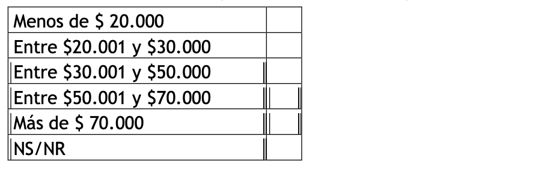
```

**P20.3. OBSERVACIONES BLOQUE 1.3.** Completar sólo si es necesario.

**A. INDICAR QUE MIEMBRO DEL HOGAR RESPONDIÓ LA ENCUESTA.**
Marcar una sola opción

```{r 303, echo=FALSE, fig.cap="" }
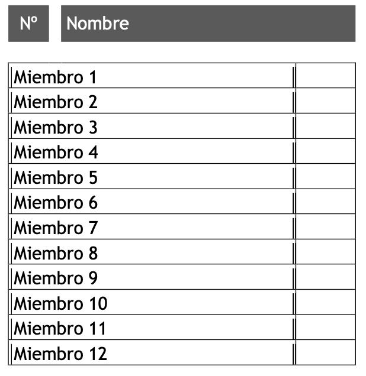
```

**B. OBSERVACIONES GENERALES DE LA ENCUESTA.**
Completar sólo si es necesario (por ejemplo, si la encuesta no fue respondida en su totalidad indique hasta que bloque y pregunta llegó y el motivo por el que el entrevistado rechazó continuar con la Encuesta)

## Anexo al formulario base: Expectativas invierno-verano

A continuación, se transcribe el Bloque “ad hoc” a seguir durante el relevamiento de expectativas de viajes durante fechas relevantes turísticamente (temporadas estival e invernal). El cuestionario a continuación sigue lo pautado por El Pliego.

### Expectativas de viajes para la temporada de invierno del año 2021

```{r 304, echo=FALSE, fig.cap="" }
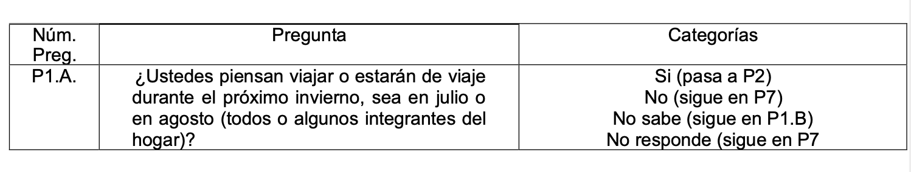
```

Debe anotar que viajará si algún miembro del hogar pernoctará en algún tipo de alojamiento del lugar de destino al menos una de las noches comprendidas **entre el 1ro de julio y el 31 de agosto**. El viaje puede ser realizado por cualquier motivo (ocio, visita a familiares, trabajo, etc.) e incluso debe ser registrado si no ha sido motivado por dicho periodo. También debe ser registrado si algún miembro del hogar comenzó su viaje con anterioridad y/o si permanecerá con posterioridad a la conclusión del feriado.

```{r 305, echo=FALSE, fig.cap="" }
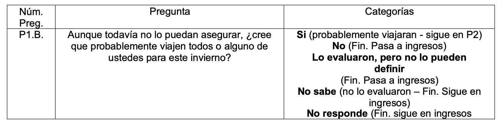
```

El encuestador debe intentar que el encuestado logre dar una respuesta con **la mayor certeza posible**. Esto es muy importante porque va a definir la cantidad de posibles viajeros. Por eso, cuando se presente una situación de dudas para el entrevistado, debe repreguntar diciendo “que es lo más probable, que viaje o que no viaje” o “es remota la posibilidad de viajar o es concreta”.

```{r 306, echo=FALSE, fig.cap="" }
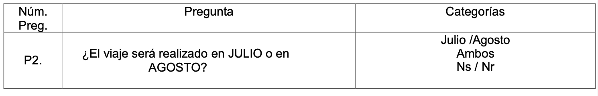
```

Si alguno de los integrantes del hogar encuestado va a viajar debe definir **si el viaje se va a iniciar en julio o en agosto**. En el caso en que el viaje comience en un mes y finalice en otro deberá marcar la opción ambos.

Si alguno de los integrantes del hogar encuestado va a viajar debe definir si el viaje se va a iniciar en julio o en agosto. En el caso en que el viaje comience en un mes y finalice en otro deberá marcar la opción ambos.


```{r 307, echo=FALSE, fig.cap="" }
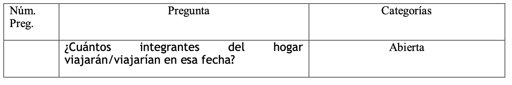
```

Si hay miembros que van a realizar viajes a diferentes lugares debe sumar la cantidad de integrantes que realizaran viajes, independientemente de que el lugar de destino que debe marcar es aquel con mayor certeza de realización, en el que participaran mayor cantidad de miembros o el más lejano. Esto es así porque solo se puede marcar un solo lugar de destino.

```{r 308, echo=FALSE, fig.cap="" }
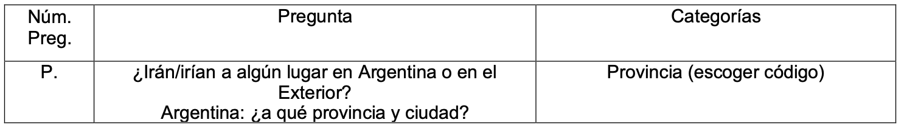
```

En los casos en que los miembros del hogar realicen viajes a diferentes lugares, el encuestador debe definir el lugar de destino de acuerdo a los siguientes criterios: 1) el viaje con mayor grado de certeza de realización; 2) el viaje en el que participen la mayor cantidad de miembros del hogar; 3) el viaje en el que se recorra la mayor distancia desde la vivienda de uso permanente del hogar hasta el lugar de destino.

En los casos en que el hogar nombrara más de una provincia o país se le repreguntara cuál de ellas es la que con mayor probabilidad visitaría. En caso de similar certeza era aquella en la que tendría mayor estadía y por último la que fue nombrada en primera instancia (porque partimos del supuesto de que era la que el hogar tenía principalmente en mente). En estos casos debía abril la solapa y seleccionar la provincia.

```{r 309, echo=FALSE, fig.cap="" }
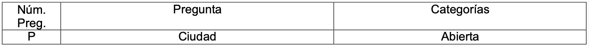
```

El encuestador debía obtener como respuesta una ciudad o localidad. Si no fuera posible, debe obtener una respuesta lo más específica posible. Por ejemplo, si la respuesta era “toda la provincia” entonces debía preguntarse por algún lugar específico dentro de ella: cordillera, sierras, valle, etc. Solo en aquellos casos en que es imposible obtener una respuesta más específica, debe anotarse “a toda la provincia”. Pero nunca debe repetirse el nombre de la provincia en cuestión. Y cuando la ciudad que se menciona sea la capital de provincia, si el nombre de la capital es igual que el de la provincia (Córdoba, Salta, Corrientes, Neuquén, Santa Fe, etc.) debe anotar “CAPITAL”. Si el nombre de la capital no coincide con el de la provincia (Posadas, Paraná, Viedma, etc.) debe anotar el nombre de esa ciudad.

```{r 310, echo=FALSE, fig.cap="" }
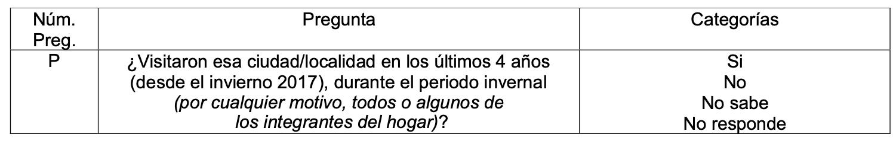
```

Deberá preguntar si alguno de los integrantes del hogar que va a realizar el viaje ya estuvo en esa ciudad en los 4 años anteriores en el periodo invernal (es decir, desde 2017 a 2020). Tenga presente que se refiere **solo miembros que participaran del viaje en cuestión y que si lo visitaron en el periodo estival/invernal**. Si solo lo hicieron en un periodo distinto al invernal.

```{r 311, echo=FALSE, fig.cap="" }
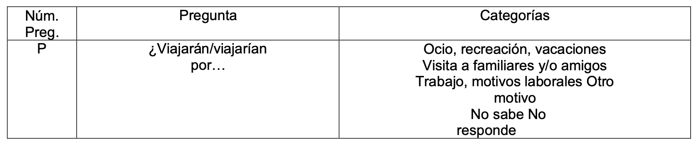
```

Deberá marcar el motivo que el hogar indique como disparador del viaje. Puede haber sido por ocio, visitar a familiares y/o amigos, trabajo, etc. Recuerdo que en caso de existir más de un motivo deberá seleccionar aquel que determino el viaje, es decir, que sin ese motivo el viaje no se producirá.

```{r 312, echo=FALSE, fig.cap="" }
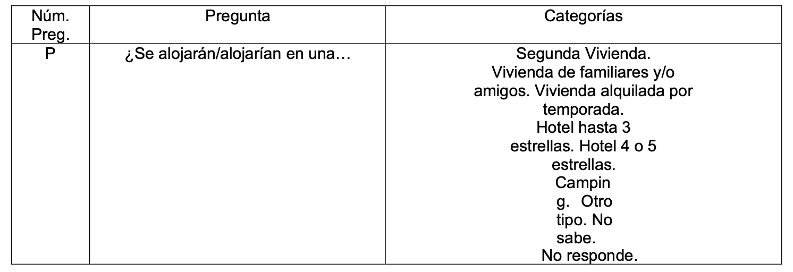
```

El encuestador debía señalar el tipo de alojamiento principal que sería utilizado por los miembros del hogar. En caso de que haya más de un tipo de alojamiento debía señalar aquel: 1) en el que iba a pasar la mayor cantidad de noches; 2) mayor tarifa o nivel; 3) el último que sería utilizado.

```{r 313, echo=FALSE, fig.cap="" }
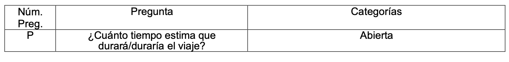
```

Se debieron contabilizar todos los días que duró el viaje, incluso aquellos que pudieran estar por fuera del periodo en cuestión. En caso que el hogar no pudiera determinar la duración, debía colocar el código 99. Pero en cualquier caso la consigna es evitar la no respuesta e intentar que el hogar respondiera, al menos, una duración estimada.

```{r 314, echo=FALSE, fig.cap="" }
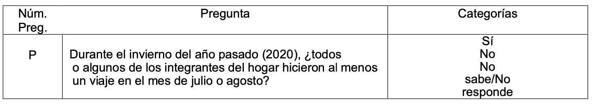
```

Deberá señalar si alguno de los integrantes del hogar (todos, algunos o alguno de ellos) hicieron, al menos, un viaje durante el invierno (julio y/o agosto) del año 2020 (año inmediato anterior).

```{r 315, echo=FALSE, fig.cap="" }
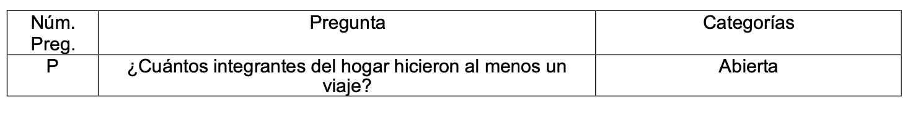
```

Coloque la cantidad de integrantes del hogar que realizaron al menos un viaje durante el periodo invernal del año 2020 (año inmediato anterior).

```{r 316, echo=FALSE, fig.cap="" }
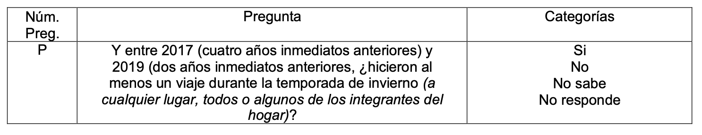
```

Deberá indicar si al menos uno de los integrantes del hogar realizo al menos un viaje durante los inviernos de 2017, 2018 o 2019.

### Expectativas de viajes para la temporada de verano 2021-2022

```{r 317, echo=FALSE, fig.cap="" }
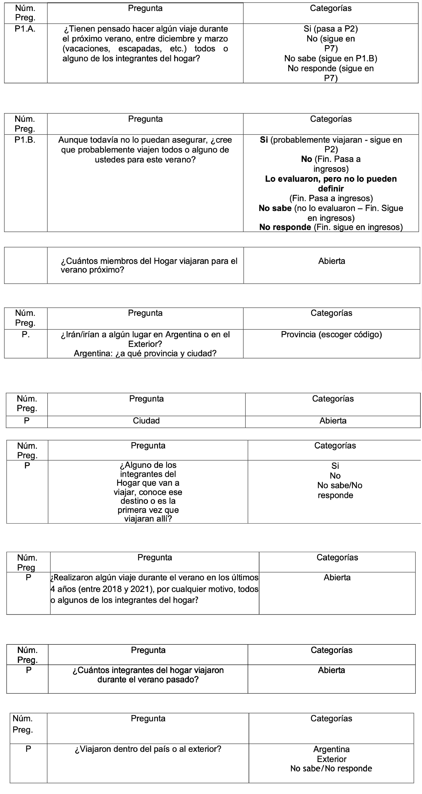
```


