# **ANEXO**

## **COMPOSICIÓNDELOSAGLOMERADOS**

A continuación, se describen los 32 aglomerados que se considerarán para estratificar la muestra.

**Cuadro 22: Composición de Aglomerados** pag 78

En color rosa se ha marcado la zona geográfica que el Jefe de Campo seguirá para constatar que se ha relevado la cantidad de hogares necesarios para cada una estas áreas (hasta sumar tantos hogares relevados como el tamaño de la muestra exige --incorporando la metodología de reemplazo sugerida anteriormente).

## **METODOLOGÍADEIMPUTACIÓN**

### **IMPUTACIÓN DE DATOS FALTANTES**

En estudios mediante encuestas es muy común encontrarse con la situación en la que algunos individuos no responden a ciertas preguntas. Ignorar este hecho puede llevar aparejado estimaciones sesgadas debido a que las observaciones que no responden pueden diferir de las que sí lo hacen.

Es por ello que al sustituir valores perdidos es importante comprobar que la imputación no haya modificado las características de la variable en estudio. Por este motivo es recomendable demostrar, luego de la imputación, que no se han generado cambios relevantes en la distribución de la variable imputada. En el presente apartado se desarrolla la metodología a utilizar para imputar las siguientes variables:

-   Ingreso total del hogar

-   Gastos del viaje

La metodología que se detalla a continuación ha sido utilizada durante la Prueba Piloto y las ediciones de la EVyTH correspondientes a los años 2011, 2012, 2013, 2014, 2015, 2016, 2017, 2018, 2019 y 2020.

### **MECANISMOS DE PÉRDIDA**

Hay tres tipos de mecanismos de No-Respuesta que pueden estar presentes:

-   Completamente aleatorio: la probabilidad de observar un valor en la variable Xj, en el individuo i, no depende del valor en esa variable para ese individuo, xij, ni de las restantes variables consideradas, xik kj.

-   Aleatorio: este tipo de mecanismo implica que la probabilidad de observar un valor en la variable Xj en el individuo i no depende del valor de dicha variable, xij, pero sí quizás del valor que tome otra variable en ese individuo, xik kj.

-   No Aleatorio: este mecanismo se da cuando la probabilidad de que un valor xij sea observado depende del propio valor el cual es desconocido.

### **MÉTODOS DE IMPUTACIÓN**

Si bien existen diversos métodos de imputación, en este anexo se describen únicamente las características generales de aquellos que se utilizaron para imputar algún registro de la EVyTH y que reciben el nombre de Métodos de imputación mediante registro donante.

#### **IMPUTACIÓN MEDIANTE REGISTRO DONANTE**

Los métodos de imputación mediante registro donante son procedimientos que asignan a los campos a imputar de un registro el valor que en tales campos tiene otro registro de la encuesta. Los registros "donantes" son aquellos registros completos de la encuesta mientras que los registros "receptores o candidatos" son los que tienen campos a imputar. Entre las ventajas de estos métodos se destaca que se imputa un valor "observado" y que es sencillo de implementar. Existen varios procedimientos entre los que se resalta el método de Hot Deck.

En este tipo de procesos, cuando falta información en un registro, se duplica un valor ya existente en la muestra para reemplazarlo. Todas las unidades muestrales se clasifican en grupos disjuntos de forma que sean lo más homogéneas posible dentro de los grupos. A cada valor que falte, se le asigna un valor del mismo grupo. Se está suponiendo que dentro de cada grupo la no-respuesta sigue la misma distribución que los que responden. Este supuesto incorpora una fuerte restricción al modelo, si esta hipótesis no es cierta se reducirá sólo en parte el sesgo debido a la no-respuesta.

El método Hot-Deck tiene ciertas características interesantes a destacar:

-   Los procedimientos conducen a una post-estratificación sencilla.

-   No presentan problemas a la hora de encajar conjuntos de datos.

-   No se necesitan supuestos fuertes para estimar los valores individuales de las respuestas que falten.

-   Mantiene la conservación de la distribución de la variable.

Sin embargo, este método tiene algunas desventajas, ya que distorsiona la relación con el resto de las variables, carece de un mecanismo de probabilidad y requieren tomar decisiones subjetivas que afectan a la calidad de los datos, lo que imposibilita calcular su confianza. Otros inconvenientes son, que las clases han de ser definidas en base a un número reducido de variables (con la finalidad de asegurar que habrá suficientes observaciones completas en todas las clases), y que existe la posibilidad de usar varias veces a una misma unidad que ha respondido.

Existen diversas variantes de dicho método. A continuación, se resumen cada uno de ellos.

##### **PROCEDIMIENTO HOT-DECK SECUENCIAL**

El registro donante es el registro sin valor missing, perteneciente al mismo estrato e inmediatamente anterior al registro candidato. Para aplicar esta imputación previamente se debe clasificar el fichero de tal forma que produzca una autocorrelación positiva entre los campos sujetos a imputación, de esta forma se asegura una mayor similitud entre registro donante y candidato.

Las desventajas de este método son considerables:

1.  Hayquefacilitarvaloresinicialesparaelcasodetenervaloresmissingenelprimer registro.

2.  Ante una racha de registros a imputar, se emplea el mismo registro donante.

3.  Es difícil de estudiar la precisión de las estimaciones.

##### **PROCEDIMIENTO HOT-DECK CON DONANTE ALEATORIO:**

Consiste en elegir aleatoriamente a uno o varios registros donantes para cada registro candidato. Hay diferentes modificaciones de este método. El caso más simple es elegir aleatoriamente un registro donante e imputar el registro candidato con dicha información. Se puede elegir una muestra de registros donantes mediante distintos tipos de muestreo e imputar al valor medio obtenido con todos ellos. Este último tipo tiene un elemento de variabilidad añadida debido al diseño de elección de la muestra que incorporan.

##### **PROCEDIMIENTO HOT-DECK MODIFICADO**

Consiste en clasificar y encajar los donantes potenciales y receptores utilizando un considerable número de variables. El encaje se hace sobre bases jerárquicas del siguiente modo: si no se encuentra un donante para encajar con un receptor en todas las variables de control, se eliminan algunas variables consideradas como menos importantes y de esta forma conseguir el encaje a un nivel superior.

##### **PROCEDIMIENTO DONOR**

En este método se emplea una función distancia definida entre las variables para que se mida el grado de proximidad entre cada posible registro donante y el registro candidato. En este caso se imputa en bloque los valores del registro donante en los campos sin respuesta del candidato. Es necesaria una modificación previa de los datos para anular los efectos de escala en la función distancia.

#### **MÉTODO DE IMPUTACIÓN A UTILIZAR EN LA EVYTH: MÉTODO DE DOS ETAPAS**

Lograr una buena imputación de datos faltantes depende en gran medida de cómo se agrupan los registros, de modo que las unidades incluidas en un mismo grupo tengan características similares respecto de la variable a imputar. Es por esta razón, el método de imputación a utilizar en la EVyTH se compone de dos etapas. En la primera etapa, se clasifica a los registros con no respuesta en algunos de los grupos, en función de variables observadas, que se encuentran asociadas a la variable a imputar. Para ello, se construye un modelo de Regresión Logística politómica, con variable respuesta ordinal. Este modelo brinda una "regla de asignación" a cada una de las categorías de la variable a imputar, para los registros con no-respuesta. Es decir, se estima la probabilidad de pertenecer a cada una de las categorías y se asigna el registro a aquella categoría con mayor probabilidad. Por lo tanto, en esta etapa logramos ubicar los valores faltantes en la distribución observada.

En la segunda etapa, una vez asignados los valores missing a una de las categorías, se aplica alguno de los procedimientos Hot-Deck anteriormente explicados para realizar la imputación correspondiente.

Este procedimiento de dos etapas será, principalmente, aplicado a dos variables fundamentales de la EVyTH: al gasto de los viajes y al ingreso del hogar. A continuación, se presenta la explicación de la implementación de este método de imputación en dos etapas aplicado al caso de las dos variables antes mencionadas.

#### **ETAPA DE IMPUTACIÓN**

##### **IMPUTACIÓN DE GASTOS DE VIAJES**

En la base de las bases correspondientes a los viajes realizados por los miembros del hogar (BaseViajes) se encontrarán las variables que contienen la información referida a los gastos efectuados en cada uno de los tipos de viajes realizados por el hogar. Debido a la coexistencia de dos tipos de no-respuesta para la variable GASTO TOTAL DEL VIAJE (GSTTTL), se optará por un tratamiento distinto para ambos.

Se iniciará el procedimiento realizando la imputación de aquellos viajes en los que no se contesta el monto del mismo, pero que sí lo hicieron en la variable TRAMO. Es decir, hogares que, aunque no respondan el gasto del viaje de manera puntual, son capaces de ubicar el gasto en una clase determinada.

Para aquellos que respondan monto del gasto, dentro de cada tipo de viaje y para los distintos tramos, se calculará la media del gasto total en la combinación de cantidad de miembros participantes en el viaje y la cantidad de noches. En el caso de las visitas de un día, tanto a segunda vivienda como no, y en los viajes cortos a segundas viviendas, no se considerará la variable cantidad de noches.

Luego se realizará la imputación por la media, en cada combinación anteriormente mencionada, en los viajes que respondieron sólo el tramo del gasto total del viaje. Estos casos imputados, luego serán incluidos como posibles donantes en el paso siguiente, junto a aquellos Viajes en los que se había respondido el Gasto Total del mismo. A continuación, se procederá a imputar el Gasto total del viaje para aquellos hogares que no respondieron ni el MONTO ni el TRAMO.

Debido a las particularidades de cada tipo de viaje y al número de casos en cada uno, se realizará la siguiente agrupación:

1.  Viajesasegundasviviendas:incluyelosviajesdecortaylargaduraciónasegundas viviendas (tipos de viaje 3 y 4, respectivamente).

2.  Viajes en Argentina: comprende los viajes no reiterados en Argentina y los viajes reiterados que hayan tenido como destino alguna ciudad del país (tipos de viaje 6 y 8 respectivamente, sin incluir en este último los viajes al exterior).

3.  Viajes en el exterior: alcanza a los viajes no reiterados al exterior y a los viajes reiterados que hayan tenido un destino fuera del país (tipos de viaje 7 y 8 respectivamente, sin incluir en este último los viajes dentro del país).

4.  Visitas de un día: abarca a las visitas de un día, tanto a segundas viviendas como no (tipos de viajes 5 y 9, respectivamente)

Por lo tanto, el procedimiento de imputación se efectuará por separado para cada grupo, pero siguiendo las mismas pautas de trabajo.

Como primera medida, se realizará una transformación de la variable GASTO TOTAL DEL VIAJE (GSTTTL). Para ello, se tomará en cuenta la variable, que resulta ser una variable categórica ordinal y cuyas categorías indican porcentajes de Gastos afrontados por el hogar (0-40%, 40-60%, 60-100%, 100%).

Se modificará el monto original dividiéndolo por el punto medio del intervalo respondido y de esa forma obtendrá una mejor aproximación del Gasto Total del Viaje. Una vez finalizada la imputación de los valores faltantes con la variable modificada, se le quitará a dicho valor el porcentaje del Gasto no afrontado por el hogar. Por lo tanto, se tomará como Gasto Total del Viaje al importe resultante de multiplicar a la nueva variable por el porcentaje afrontado por ese hogar.

Luego, se observará la distribución de la variable GASTO TOTAL DEL VIAJE MODIFICADA (GSTTTL_NEW), a fin de excluir los valores extremos. La eliminación de viajes del universo de potenciales donantes, se realizará en base a los respectivos diagramas de caja (Box- Plots). En consecuencia, dichos casos no participarán en el proceso de imputación, ya sea en la conformación de grupos como en el momento de la imputación propiamente dicha.

Una vez eliminados tales valores, comenzarán las tareas de imputación de la falta de respuesta en la variable de interés, utilizando una técnica de imputación en 2 etapas.

En la primera etapa se "colocará" el valor del gasto en una categoría de GASTO (que se define por la mediana de la distribución del monto del GASTO para cada grupo), en función de los valores observados en las variables explicativas. Para realizar esta tarea se utilizará un modelo de regresión logística binaria, en el que se evalúa la inclusión de las siguientes variables explicativas:

1.  Cantidad de miembros del hogar

2.  Tipo de alojamiento utilizado

3.  Medio de transporte utilizado

4.  Motivoprincipaldelviaje

5.  Utilización de paquete turístico

6.  Distanciarecorrida

7.  Cantidad de noches

8.  Tipodeviaje

Vale aclarar que depende del grupo con el que estemos trabajando, la inclusión o no de la totalidad de tales variables en el análisis. La variable Distancia Recorrida es categórica ordinal y será diseñada teniendo en cuenta el lugar de residencia del hogar y el lugar de destino del viaje. Su codificación es la siguiente:

1.  11: En Argentina, menos de 300 km.

2.  12: En Argentina, entre 300 y 499 km.

3.  13: En Argentina, entre 500 y 699 km.

4.  14: En Argentina, 700 km. o más.

5.  21: Al exterior, país limítrofe desde provincia lindera.

6.  22: Al exterior, país limítrofe desde provincia no lindera.

7.  23:Alexterior,paísamericanonolimítrofe.

8.  24:Alexterior,paísesdelrestodelmundo.

En la segunda etapa se seleccionará un valor de dicha categoría de GASTO mediante un procedimiento Hot-Deck aleatorio para "asignar" al registro faltante un valor de GASTO puntual.

##### **IMPUTACIÓN DE INGRESO TOTAL DEL HOGAR**

En la base correspondiente a los hogares seleccionados en la muestra (Base hogares) se determinarán las variables que poseen la información referida a los Ingresos de los hogares encuestados. Al igual que en el caso de la imputación de la variable GSTTTL, el procedimiento para imputar la variable Ingreso del Hogar (Monto) se iniciará con aquellos hogares que no responden el MONTO pero que sí pudieron localizar al ingreso en un TRAMO determinado.

Para aquellos hogares que declararon el Ingreso, se calculará la media del Ingreso del hogar total en cada combinación de TRAMO y cantidad de "preceptores de ingreso". Esta última variable se obtendrá de la base de Personas y estará conformada por los ocupados y jubilados de cada hogar que participó en la encuesta.

Luego, dichos valores serán imputados en las combinaciones referidas en el párrafo anterior, para los hogares que sólo respondieron el TRAMO del Ingreso del Hogar.

A continuación, se procederá a imputar el Ingreso del hogar para aquellos hogares que no respondieron ni el MONTO ni el TRAMO.

Como primer paso, se incorporará al conjunto de respondentes, a aquellos hogares imputados en el paso previo; es decir, hogares que habían respondido sólo el TRAMO del Ingreso del Hogar.

Se observará la distribución de la variable INGRESO DEL HOGAR: MONTO (P020_1), a fin de excluir los valores extremos. La eliminación de hogares del universo de potenciales donantes, se realizará en base al diagrama de caja (Box-Plot). En consecuencia, dichos casos no participarán en el proceso de imputación, ya sea en la conformación de grupos como en el momento de la imputación propiamente dicha.

La variable INGRESO DEL HOGAR: MONTO (P020_1) es cuantitativa continua. Se utilizará como técnica de imputación una Regresión logística politómica con variable respuesta ordinal. Una vez más para la imputación del ingreso se "colocará" el valor del ingreso en una categoría (ya no definidas exclusivamente por la mediana, pudiendo formar las clases a partir de la asignación del ingreso en otros percentiles), en función de los valores observados en las variables explicativas.

Para realizar esta tarea se utilizará un modelo de regresión logística, en el que se evalúa la inclusión de las siguientes variables explicativas:

1.  Cantidad de miembros del hogar

2.  Cantidad de miembros del hogar que trabajan

3.  Comportamientoturísticodelhogarenelbimestre

4.  Región de residencia del hogar (según INDEC)

5.  NivelEducativodeljefedelhogar

6.  Categoríaocupacionaldeljefedelhogar

7.  Cantidad de Jubilados en el hogar

Las variables Cantidad de miembros del hogar que trabajan, Nivel Educativo del jefe del hogar, Categoría ocupacional del jefe del hogar y Cantidad de Jubilados en el hogar, se construirán a partir de la base de Personas (Base Personas). Para la variable Región de residencia del Hogar, se considerará la definición que realiza INDEC, ya que la misma tiene en cuenta las características socio-económicas de los hogares y es utilizada por dicho Instituto para sus estudios. Las regiones se definen de la siguiente manera:

1.  Noroeste Argentino: Salta, Jujuy, Santiago del Estero, Tucumán, Catamarca.

2.  Noreste Argentino: Formosa, Chaco, Corrientes, Misiones.

3.  Cuyo: Mendoza, San Juan, San Luis, La Rioja.

4.  Área Metropolitana de Buenos Aires: Ciudad Autónoma de Buenos Aires y Partidos del Gran Bs. As.

5.  Patagonia:RíoNegro,Neuquén,Chubut,SantaCruz,TierradelFuego.

A partir del modelo elegido, se seleccionará un valor de dicha categoría de INGRESO, mediante un procedimiento Hot-Deck aleatorio para "asignar" al registro faltante un valor de INGRESO puntual.

## **METODOLOGÍADEESTIMACIÓNDELGASTOPORPERNOCTEENELRELEVAMIENTODE EXPECTATIVAS DE VIAJE EN FECHAS ESPECIALES**

Los informes de resultados correspondientes a los relevamientos de expectativas contendrán una estimación del gasto por pernocte resultante de los viajes en fechas claves (verano e invierno). Debido a la imposibilidad de obtener esta información directamente de los hogares encuestados (la tasa de no respuesta sería considerablemente alta y el dato relevado sería poco robusto, debido a que se le estaría consultando al hogar sobre un gasto que aún no ha realizado), la estimación del gasto por pernocte seguirá la siguiente metodología:

**Estimación del Gasto Base:** se estimará un gasto base a partir del gasto promedio por pernocte en los viajes de 1 a 6 noches de duración del mismo mes del año anterior relevados en la EVyTH.

**Gasto Base Final:** Gasto base ajustado por inflación, entre el periodo sobre el que se releva y el periodo del cual se obtiene el gasto base. El ajuste por inflación se propone realizar a partir de las siguientes consideraciones:

-   Dado que la información secundaria a utilizar presenta cierto retraso respecto al relevamiento, la variación se calculará entre el último dato disponible y la extensión del periodo entre el periodo de relevamiento y el gasto base considerado. Por ejemplo, para las estimaciones de febrero de 2013, con gasto base febrero de 2012, se calculará la variación de inflación entre enero de 2013 (último dato disponible) y enero de 2012.

-   Entre distintas opciones disponibles, se utilizará la variación del IPC GBA -- División Turismo calculado por el INDEC.

**Gasto Estimado del Viaje por pernocte:** Gasto Base Final ajustado por un coeficiente que contempla las características del viaje.

-   Se contemplan características de los viajes (distancia recorrida, alojamiento utilizado, motivo, duración e integrantes del hogar que participaron del viaje) y de las personas que realizan los viajes (región de residencia, máximo nivel educativo del jefe del hogar).

-   El cálculo del coeficiente se realiza sobre la base de la totalidad de los viajes con una duración de entre 1 y 6 noches relevados durante la EVyTH.

-   Los coeficientes que de aquí surgen son fijos y se aplican para los relevamientos de expectativas de viaje de las diversas fechas clave consideradas.

## **DESCRIPCIÓNDELSISTEMAINFORMÁTICOUTILIZADOPARAELRELEVAMIENTO**

### **DESCRIPCIÓN GENERAL DEL SISTEMA CATI**

El sistema implementado para las distintas ediciones de la EVyTH, dispone de dos tipos de usuarios del sistema CATI, el Administrador y el Operador.

El Administrador es el usuario que puede administrar la gestión del campo. Por ejemplo, administra la base de números de teléfonos, asigna regiones a los operadores. El Operador es el usuario que recaba los datos.

En el campo se dispone de PC's que están en red. No todas las PC's sirven a todos los fines porque no todas tienen los mismos softwares. Algunas de éstas son utilizadas por el Operador (en sentido plural) para hacer llamadas y recabar datos, otras son usadas por el Administrador (en sentido plural) para gestionar el campo y desde las que no se realizan llamadas, una es el servidor[^anexo-1] y otra es el servidor de back up que también sirve para recabar datos en caso que falle alguna de las PC's. El servidor no se encuentra habilitado para realizar llamados ni administrar el campo, en tanto que desde el servidor back up sí es posible hacerlo (a la vez que sirve de back up del servido principal). En las PC's del Operador es viable realizar llamados, cargar los datos y administrar el campo, mientras que en las PC ́s de supervisión no es posible realizar llamados.

[^anexo-1]: El servidor ha sido actualizado en mayo de 2013 para aumentar la capacidad de procesamiento.

Todas las PC's tienen instalado el sistema operativo LINUX y disponen de los dispositivos necesarios para realizar llamadas (auriculares y micrófonos).

Además, el sistema prevé el acceso remoto, con lo que es posible realizar el relevamiento y la supervisión estando fuera de la red a través de una VPN.

Hay tres softwares que gestionan el capo, el Sistema de llamadas, el Lime Survey y el Elastix, y un sistema de almacenamiento de datos. El Administrador y el Operador tienen distintos usos de cada uno de estos programas. El Administrador accede a través de diferentes direcciones a cada uno de estos programas. El Operador accede con una dirección a una ventana que vincula estos tres programas y en la que sólo puede cargar datos.

Es importante destacar que el sistema prevé generar copias de seguridad (back up) diarias en una de las PCs dispuestas en el campo y en un servidor externo. Además, semanalmente se copian las respuestas de la encuesta en otra PC y mensualmente se genera un DVD con los datos mensuales que se almacena en un sitio externo a las instalaciones en el que se desarrolla el campo. De este modo, queda garantizado que los datos recabados durante el relevamiento no se pierdan.

A continuación, se describen las posibilidades que tienen cada usuario con estos programas.

#### **ADMINISTRADOR**

El Administrador es el encargado de gestionar el campo. Para esto dispone de tres programas (el Sistema de administración de llamadas, el Lime Survey y el Elastix) a los que accede para administrar y controlar el uso que los Operadores hacen de la información que reciben por vía telefónica y cargan en sus PC's.

El Sistema de administración de llamadas es el programa que le permite organizar y administrar la base de números de teléfono. Con este programa se realiza la principal tarea de supervisión durante el relevamiento de datos (administración de los números de teléfono de cada Operador).

El Lime Survey es el programa en el cual se cargan los datos de la encuesta, tanto en su estructura como en sus valores, contiene los pases entre preguntas automatizadas y realiza las validaciones o consistencias correspondientes (es decir, garantiza que el operador no pueda --por error del encuestado o del propio encuestador al cargar la respuesta- cargar una respuesta inconsistente en función de las respuestas dadas anteriormente).

La programación fue llevada a cabo por un especialista, pero el Administrador (mediante una clave que solo éste posee) puede modificar las respuestas de la encuesta en caso de ser necesario (por ejemplo, si el encuestado corrige una respuesta dada anteriormente, el Operador puede comunicar esto al Administrador para que efectúe la corrección pertinente). También permite rápidamente tener conocimiento respecto de los resultados generales de la encuesta.

El Elastix es el programa que le permite escuchar los audios de cada llamada (en tiempo real) y administrar la tecnología a utilizar para encaminar una llamada (se propone implementar tres tecnologías por donde canalizar los llamados: Skype, voz sobre IP o llamada telefónica por par de cobre).

##### **SISTEMA DE ADMINISTRACIÓN DE LLAMADAS**

El software de administración está constituido por un desarrollo informático pensado especialmente para el relevamiento de la EVyTH, inspirado en la experiencia recabada durante la Prueba Piloto e implementado durante la edición del año 2011. Como se verá a continuación tiene una amplia flexibilidad y la posibilidad de modificar la asignación de teléfonos en función de las necesidades del momento.

El Administrador accede entrando al servidor a través de una dirección en el navegador web con un usuario y clave personal.

```{r conectar, echo=FALSE, fig.cap="Usuario y clave personal" }
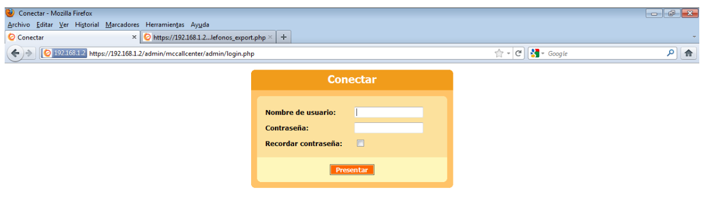
```

El sistema presenta 7 solapas: Administradores, Operadores, Teléfonos, Registros, Estados de Inicio, Estados Final y Ondas.

```{r Adm, echo=FALSE, fig.cap="Administradores" }

```

La solapa Administradores habilita la gestión de quienes podrán hacer uso del programa.

La solapa Operadores permita incorporar y eliminar operadores con sus respectivos nombres, asignarles regiones y cuotas de llamados y de éxito -- cantidad de llamados y de llamados exitosos (en este caso de encuestas efectivas) que se espera el operador realice en la jornada.

```{r Operadores, echo=FALSE, fig.cap="Solapa operadores" }
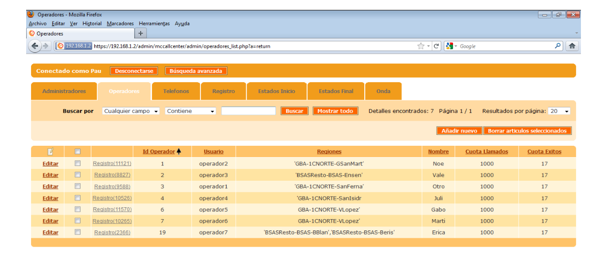
```

La asignación de regiones puede realizarse manualmente (escribiendo el nombre de la región), o bien seleccionando las regiones correspondientes que se despliegan del menú al que se accede en "modificar regiones". La ventaja que esta última modalidad conlleva es que evita errores al escribir las regiones (para cada onda surgirán las regiones que fueron cargadas en la importación de la base de números de teléfono). Por otra parte, la ventaja del formato manual es que acelera el proceso de asignación de regiones; una vez que se han pasado las regiones a asignar en la base (por ejemplo, en el procesador de textos o en el editor de regiones de otros Operadores), sólo es cuestión de pegarlas en el espacio correspondiente.

```{r Ope, echo=FALSE, fig.cap="Operadores" }
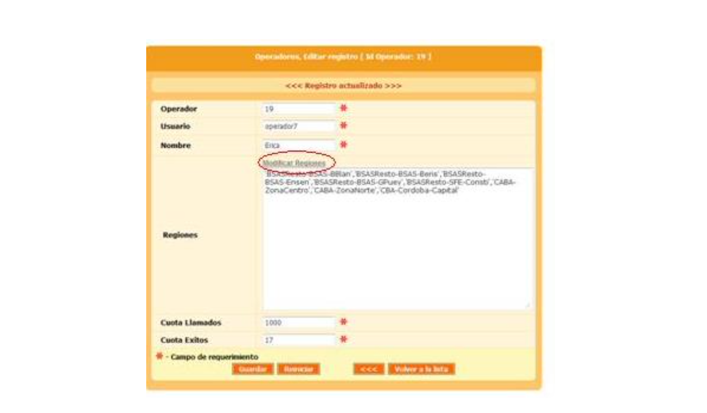
```

La tercera solapa, Teléfonos, es desde donde se importan y exportan las bases de datos de números de teléfonos. La importación se hace a través de un archivo .CSV donde en cada línea se completan los campos número de teléfono, número de onda, nombre, región y su código, envío o no de carta y tipo de prioridad del número. Desde aquí el Administrador puede modificar individualmente cada número y habilitarlo o deshabilitarlo. La deshabilitación se produce automáticamente en función del registro del número de teléfono que genera el Operador y de los puntajes asignados por el Administrador a ese "estado".

```{r Tel, echo=FALSE, fig.cap="Teléfonos" }
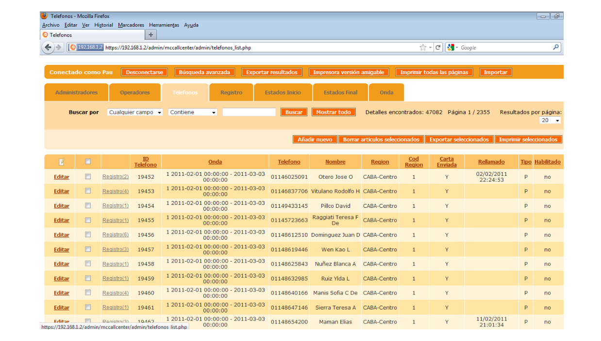
```

Desde Registros el Administrador puede advertir en tiempo real cuál es el estado de cada llamada. Desde aquí puede controlarse el registro del estado de cada llamada, cuándo comenzo y cuándo finalizó, quién la realizó y qué tecnología de telefonía utilizó (skype, VOIP, etc.).

```{r Regis, echo=FALSE, fig.cap="Registro" }
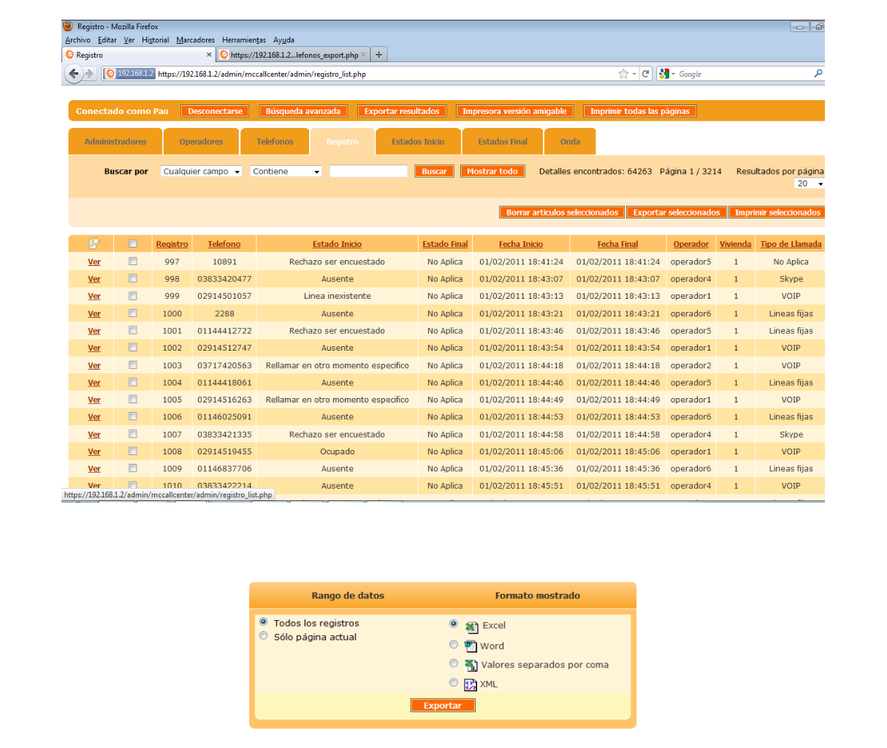
```

Las solapas de Estado de Inicio y Estado Final sirven para determinar cuáles son las condiciones de registro que pueden generar los Operadores. El sistema permite generar y editar estados de registro, por ejemplo "Aceptó ser encuestado" o "Ausente". Los Operadores generan registros en función del estado final de la llamada. Según cómo haya sido este estado el número volverá a aparecer (con condicionantes de tiempo en minutos) o no. Por ejemplo, en la imagen a continuación se ve que un número cuyo estado es "Ocupado" reaparece a los 20 minutos de generado el registro. Además, es necesario asignar puntos a cada estado siendo que cuando se suman 12 puntos el número queda inhabilitado. Así, como muestra el ejemplo, si el estado "Rechazó ser encuestado" suma 12 puntos, un teléfono al que se le haya asignado ese estado queda inhabilitado. En cambio, un llamado cuyo registro es "Ocupado" no suma ningún punto y no queda inhabilitado hasta tanto no se le asignen otros registros que acumulen 12 puntos.

```{r Estado, echo=FALSE, fig.cap="Estado de inicio" }
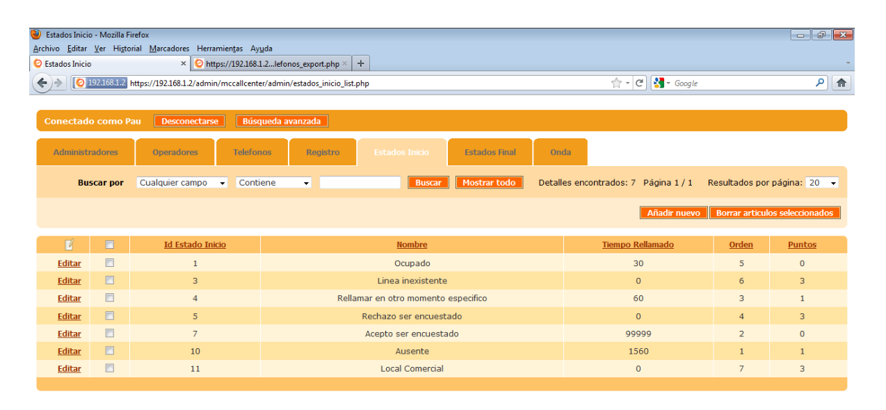
```

En la solapa "Ondas", el Administrador modifica las fechas de inicio y final de cada onda de relevamiento. Esto permite incorporar nuevas ondas y modificar la fecha de inicio y fin en función de cómo sea el desempeño del campo. Por ejemplo, si la onda 1 comenzara el 1° de febrero y finalizara el 3 de marzo, todos los números que hayan sido importados con la onda 1 aparecerán sólo entre el 1 de febrero y el 3 de marzo. Si el campo tuviese una baja tasa de respuesta y fuese necesario continuar hasta el 4 de marzo, será posible realizar el cambio el mismo 4 de marzo sin mayores complicaciones.

```{r Ond, echo=FALSE, fig.cap="Ondas" }
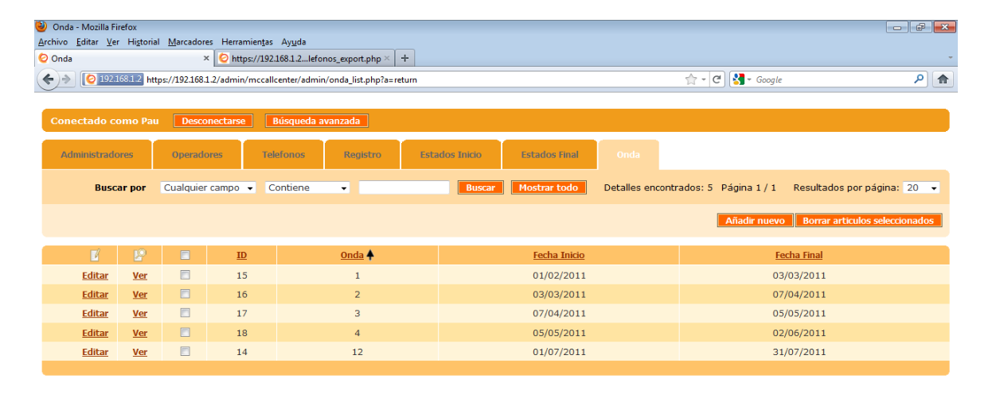
```

El sistema también permite modificar un registro que han realizado los Operadores. Para esto el supervisor debe seleccionar la opción "Cambiar" en la columna "Modificar estados" del registro correspondiente y marcar el registro correcto teniendo en cuenta que el Estado de Inicio y el Estado de finalización. El sistema no permite el cambio si no hay coherencia entre ambos estados. Por ejemplo, si en el Estado de Inicio se marca la opción "Ausente" y en el Estado de Finalización se selecciona "Completa", el sisema no permitirá el cambio. En caso de seleccionar la opción "Cancelar", el registro vuelve a ser el original.

```{r Canc, echo=FALSE, fig.cap="Cancelar" }
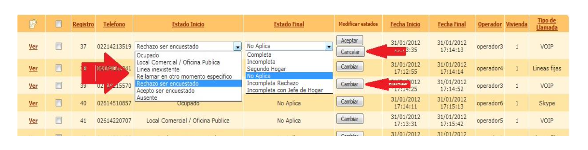
```

##### **LIME SURVEY**

El Lime Survey es el programa propuesto para carga la estructura del cuestionario (esto incluye la automatización de los pases y las validaciones necesarias), registrar las respuestas de los encuestados y establecer las consistencias y validaciones necesarias. Al igual que en el caso del Sistema de llamadas, se encuentra alojado en el servidor y se puede acceder a través del browser.

Se trata de un cuestionario sumamente flexible pensado para crear estructuras de encuestas, cargarlas, validarlas, modificarlas, exportar las respuestas y evaluarlas estadísticamente. Vale remarcar que el Lime Survey es un programa ya desarrollado en código abierto y que no requiere licencia alguna.

Cuando sea necesario modificar las respuestas cargadas durante el campo es posible hacerlo (una vez que el Operador generó registro) accediendo como Administrador.

```{r Lime, echo=FALSE, fig.cap="Lime Survey" }
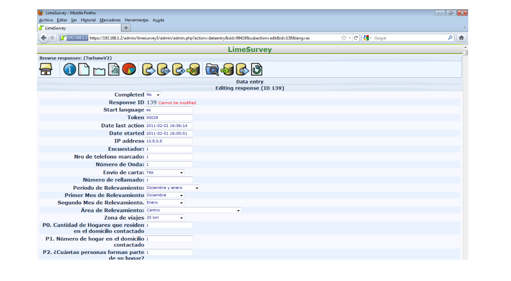
```

El Lime Survey, dispone de un aplicativo que permite hacer un análisis estadístico de las respuestas por cada pregunta en tiempo real. Por ejemplo, es posible observar cuántas encuestas fueron respondidas hasta el final o cuántas encuestas resultaron completas o respondieron "1" a "Cantidad de viajes por Argentina". Las estadísticas pueden exportarse en Excel, PDF o verse en la misma página web.

```{r SPSS, echo=FALSE, fig.cap="Formato SPSS" }
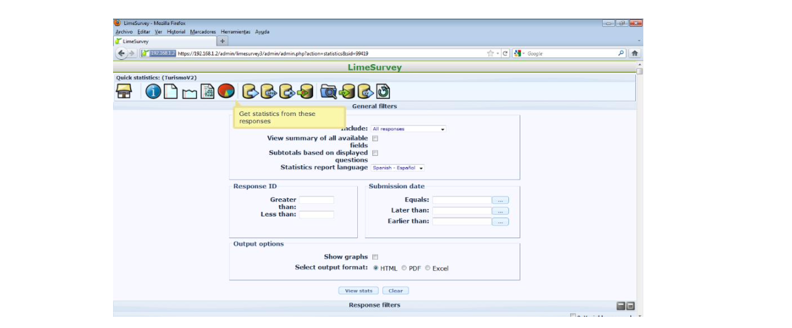
```

Por otro lado, todas las respuestas de la encuesta podrán ser exportadas en formato SPSS, lo que lo hace ideal para el posterior análisis de resultados.

##### **ELASTIX**

Elastix es un servidor virtual (ya desarrollado en código abierto y que no requiere licencias) dedicado a la gestión de las llamadas que permite la administración del tráfico de las llamadas en forma inteligente. Así, por ejemplo, puede elegir automáticamente el canal de salida de voz, entre VOIP, Skype o por par de cobre cuando el Operador no selecciona una tecnología específica. Además, permite grabar los audios de las conversaciones que realizan los Operadores con los encuestados (permite descargar los audios y los datos de cada uno de estos audios -como usuario que la realizó y duración de la llamada- y filtrar por fecha-, etc.).

```{r Fil, echo=FALSE, fig.cap="Filtrar" }
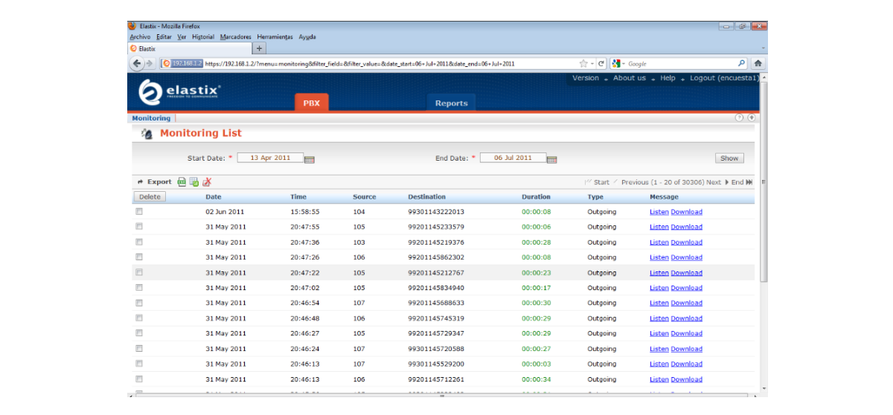
```

En caso que se desee se puede implementar la grabación de las encuestas realizadas, respondiendo a las máximas exigencias de seguridad requeridas (no solo se pueden grabar, sino que también el sistema permitiría escuchar las encuestas en tiempo real). Para favorecer el acceso a los audios se permite acceso a una interfaz que habilite al supervisor de campo acceder con mayor facilidad a los audios filtrando ya sea por fecha, por número de teléfono o por Estado Final. Este sistema permite hacer los chequeos de carga de datos ex post ya que el supervisor puede controlar que los datos de la encuesta se hayan cargado correctamente (mientras escucha el audio revisa los datos cargados).

```{r Aud, echo=FALSE, fig.cap="Audios" }
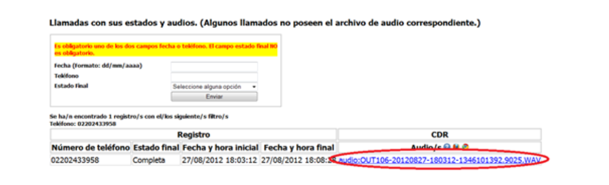
```

#### **OPERADOR**

El sistema informático permite desdoblar el campo entre Operadores en las instalaciones previstas de relevamiento (Operador "in-house") y Operadores instalados desde sus hogares ("Operadores remotos"). En general, al relevamiento remoto son asignados encuestadores de extrema confianza y con experiencia acumulada. De todas formas, el software permite una supervisión diaria (en tiempo real) sobre cada encuestador remoto.

El relevamiento con Operadores remotos se utiliza para casos especiales o para realizar una cantidad pequeña de encuestas diarias con el fin de aliviar el trabajo a los encuestadores "in-house".

##### **OPERADOR "IN-HOUSE"**

El Operador utiliza únicamente una ventana del navegador web desde donde realiza las llamadas y registra las respuestas de la encuesta. El procedimiento que se realiza es el siguiente: ingresar al sistema, realizar la llamada, eventualmente recabar los datos de las respuestas y registrar el resultado de la llamada.

El Operador accede con un usuario y contraseña a una pantalla con dos ventanas.

```{r Acce, echo=FALSE, fig.cap="Acceso operadores" }
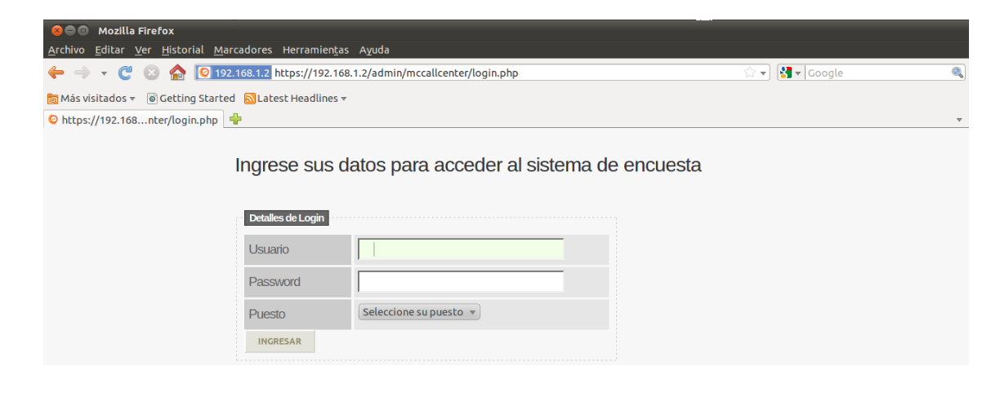
```

La ventana de la izquierda administra los números de teléfono (vinculada con el Sistema de administración de llamadas) y la de la derecha las respuestas de la encuesta (vinculada con el Lime Survey).

```{r Inter, echo=FALSE, fig.cap="Interfaz" }
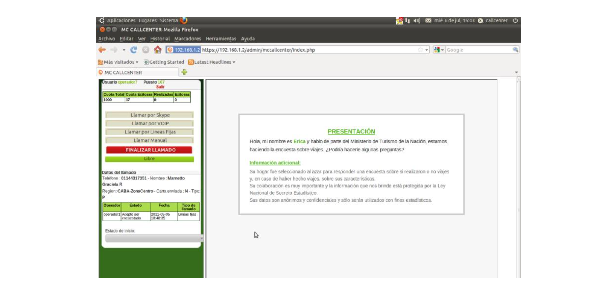
```

En la parte superior de la pantalla izquierda figura la cantidad de llamadas realizadas y la cantidad de llamadas exitosas. Debajo aparecen los servicios con los cuales se puede realizar la llamada (Skype, VoIP, Líneas Fijas y Línea Manual). El Operador selecciona la tecnología con la cual desea realizar la llamada, clickea sobre el botón correspondiente y automáticamente se comunica con ese número de teléfono. En el centro de la pantalla izquierda se muestran los datos y el historial del número telefónico correspondiente. Esto le permite al Operador saber a qué localidad está llamando y si ya han realizado llamados a ese hogar. En la parte inferior aparece un menú en el que se despliegan los estados posibles de generar.

En la pantalla derecha aparece la presentación que permite orientar al Operador al iniciar la encuesta. Si el llamado resultara en un caso que acepta ser encuestado surge un botón verde en la pantalla izquierda que activa la ventana derecha en la que se abre la encuesta.

```{r Int, echo=FALSE, fig.cap="Interfaz" }
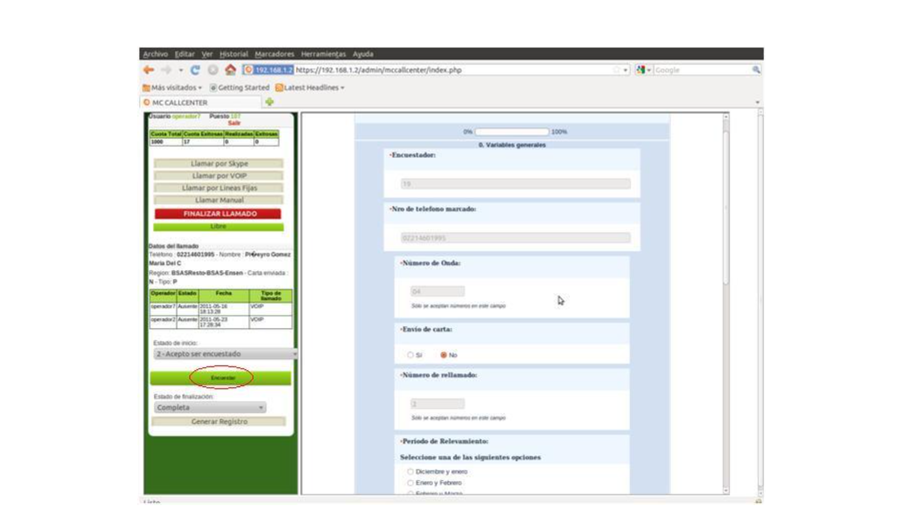
```

Al finalizar la encuesta, el Operador debe enviar las respuestas y generar registro en función del estado final de la llamada.

```{r In, echo=FALSE, fig.cap="Interfaz" }
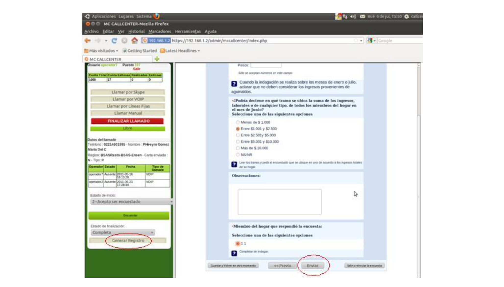
```

Si, en cambio, el llamado no presupone vinculación con el programa que recaba los resultados de la encuesta (el Lime Survey), por ejemplo, si el hogar rechazó ser encuestado, el Operador sólo debe generar registro y, una vez realizado esto, aparece el próximo número de teléfono.

```{r I, echo=FALSE, fig.cap="Interfaz" }
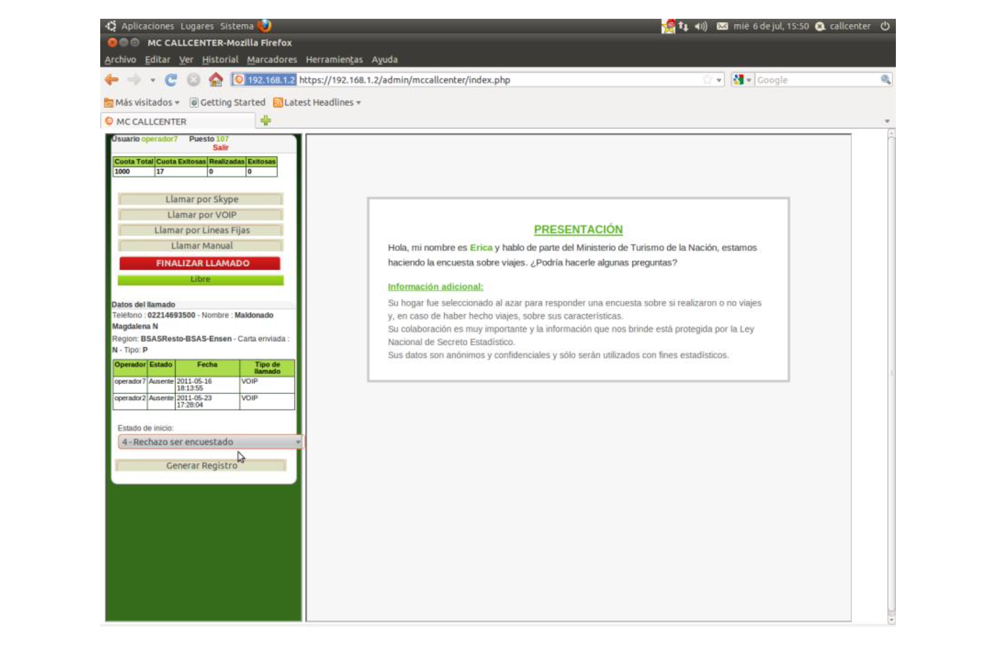
```

El sistema prevée un calendario que permite al Operador reasignar, manualmente, el día y la hora del re llamado en función de lo que el encuestado le diga al Operador.

```{r Gen, echo=FALSE, fig.cap="Generar registro" }
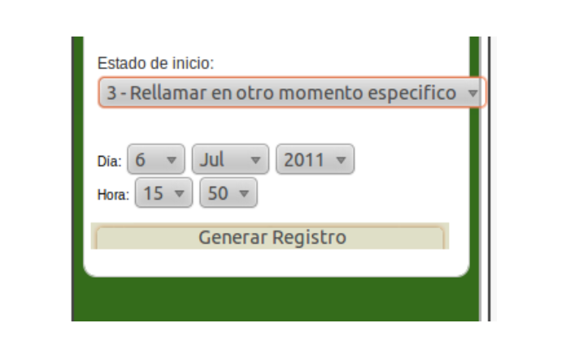
```

#### **OPERADOR REMOTO**

La modalidad de Operador remoto permite complementar el trabajo de los encuestadores tradicionales de manera segura y eficiente. La tecnología disponible para este esquema permite a los encuestadores remotos realizar la misma tarea que los encuestadores tradicionales desde fuera de las instalaciones de relevamiento garantizando la seguridad de la información y una amplia capacidad de supervisión.

Para esto el encuestador remoto debe disponer en su PC dos softwares: OpenVPN (que le permite acceder de manera segura al servidor de las encuestas) y un softphone gratuito (X- Lite o Zoiper dependiendo del sistema operativo que utilice en su PC) para realizar las llamadas internas, al supervisor, y externas, a los hogares, que le permiten acceder a la encuesta como si estuviera operando desde las instalaciones de relevamiento. Si lo Operadores no disponen del equipamiento necesario se los provee de una PC (con auriculares y micrófono) configurada con los softwares antes mencionados para que inmediatamente pueda disponerse a relevar.

## **MANUALDELENCUESTADORYGUÍADEEJERCICIOSAUTILIZARDURANTEELRELEVAMIENTO**

Se presenta a continuación el Manual del Encuestador y su correspondiente Guía de Ejercicios (tanto en sus versiones para el encuestador y para el instructor --también llamada Cuadernillo de Soluciones de Ejercicios) que serán utilizados durante los cursos de capacitación brindados a los encuestadores cada tres meses por el equipo metodológico de la EVyTH.

### **MANUAL DEL ENCUESTADOR**

El Manual del Encuestador tiene una misión fundamental en el relevamiento al asegurar y resguardar la calidad de la toma de datos. En esta línea, el Manual tiene como objetivo brindarles a los encuestadores las herramientas conceptuales de forma tal de garantizar la homogeneización de la terminología utilizada al efectuar las encuestas. Es por ello que, el Manual, constituye un protocolo tendiente a resguardar la calidad de la información relevada. Por otra parte, además, el Manual cumple otro rol que es la de otorgarle a los encuestadores una introducción al manejo de la herramienta CATI para el cargado de la información en tiempo real. Esta preparación conceptual es luego completada con la capacitación en campo donde los encuestadores, siguiendo la Guía de Ejercicios, simulan el cargado de distintas encuestas en el sistema informático al tiempo que resuelve casos prácticos que podrían presentarse durante el relevamiento.

#### **MÓDULO 1: PRESENTACIÓN DE LA EVYTH**

La información es obtenida a través de entrevistas telefónicas que se realizan a una muestra de hogares de los grandes aglomerados urbanos de todo el país.

La Encuesta de Viajes y Turismo de los Hogares tiene como **objetivo fundamental** proporcionar información sobre los viajes que realizan las personas residentes en Argentina: a dónde van, qué medios de transporte utilizan, dónde se alojan, cuáles son los motivos por los que viajan, cómo organizan sus viajes, qué actividades turísticas realizan, cuánto gastan, etc. La información relevada **sirve:**

-   Para conocer y caracterizar el turismo nacional, es decir, los viajes que realizan los residentes en el país dentro y fuera de su territorio.

-   Como insumo para estimaciones de los gastos de los hogares en viajes y turismo.

-   Para diseñar políticas de incentivo o fomento del turismo, mediante el estudio de las características sociodemográficas de los hogares que viajan y los que no viajan y de las modalidades de los viajes.

Para ello, la Encuesta releva información acerca de:

-   Las características sociodemográficas y ocupacionales de las personas que integran los hogares, así como los ingresos monetarios de los que dispone cada hogar.

-   La cantidad, las características y el gasto de cada uno de los viajes con pernocte realizados en Argentina y en el exterior en los dos meses anteriores al mes de relevamiento de la Encuesta

-   La cantidad, las características y el gasto de las visitas de un día realizadas en los últimos dos meses.

-   La realización o no de viajes de cualquier tipo durante el año calendario anterior.

La Encuesta se realizará en forma continua, con el objetivo de obtener información mensual, bimestral, trimestral y anual, según las características de las diferentes dimensiones o ejes de análisis. Mensualmente, se entrevistarán unos 2600 hogares residentes en todas las capitales de provincia y ciudades no capitales donde residan más de 100 mil personas.

La realización satisfactoria de la Encuesta en cada uno de los hogares contactados dependerá del vínculo que establezca el Encuestador con el encuestado. Usted, como Encuestador, será responsable de la orientación y conducción de la encuesta. Su desempeño y actitud determinarán en gran parte el resultado, la calidad y la confiabilidad de la información obtenida.

Por tal motivo, resulta indispensable que Ud. adquiera un cabal conocimiento sobre los objetivos y conceptos relacionados con la Encuesta, así como sobre la forma correcta en que debe ser realizada cada una de las preguntas.

Dadas las características de una entrevista telefónica, sólo si Usted maneja con soltura las definiciones y objetivos de cada sección de la encuesta, logrará que el encuestado entienda y responda lo que se le está preguntando, o bien, que Usted pueda extraer la información requerida en base a lo que el entrevistado le cuenta. Lógicamente, todo esto supone un alto nivel de concentración de su parte durante toda la entrevista, no sólo para poder captar y registrar la información en forma correcta, sino también para lograr mantener un tono ameno en la charla y que no decaiga el interés y la voluntad del entrevistado por seguir respondiendo la Encuesta.

##### **ESTRUCTURA DE LA ENCUESTA Y PRINCIPALES CONCEPTOS DE LA EVYTH:**

Esquemáticamente el Formulario Base se organiza según el cuadro a continuación:

```{r Cuestionario, echo=FALSE, fig.cap="Cuestionario Base" }
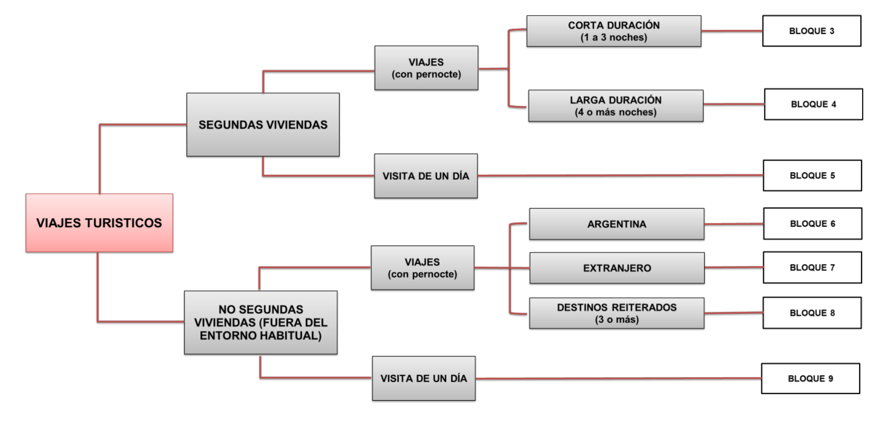
```

::: {.note}
Un **"viaje turístico"** es el desplazamiento de una o más personas miembros de un hogar a un lugar **fuera del entorno habitual.**
:::

::: {.note}
Los **viajes turísticos** pueden ser **viajes** propiamente dichos o **visitas de un día** (o excursión). La diferencia radica en que en las visitas de un día las personas no pernoctan en el lugar visitado, mientras que si lo hacen en los viajes.
:::

::: {.note}
**Por definición, todo viaje o visita de un día a una segunda vivienda no se considera parte del entorno habitual del hogar.**
:::

**Segunda vivienda:** vivienda de uso **temporario, propia o alquilada**, que el hogar tuvo **disponible** para su utilización en los **últimos dos meses.**

Tenga en cuenta que un viaje turístico:

-   Debe tener una duración **inferior a un año** y quien viajó no **debe haber fijado su residencia** en el lugar de **destino.**

-   Comprende los **traslados, estancias y todas las actividades** que las personas realizan en el lugar de destino.

-   Puede haber sido a **un solo destino o haber tenido varias etapas.**

-   Los **motivos** del viaje pueden ser esparcimiento, ocio o recreación; visita a familiares y amigos; negocios o motivos profesionales; estudios y formación; razones de salud, religión u otros (trámites, compras, etc.).

-   Se incluyen tanto los viajes en los que el viajero pernocta al menos una noche en el lugar visitado, como las visitas de un día (sin pernocte).

::: {.note}
**El ENTORNO HABITUAL consiste en una zona cercana al lugar de residencia del hogar más todos los lugares visitados con asiduidad.**
:::

```{r Cuadr, echo=FALSE, fig.cap="Cuadro" }
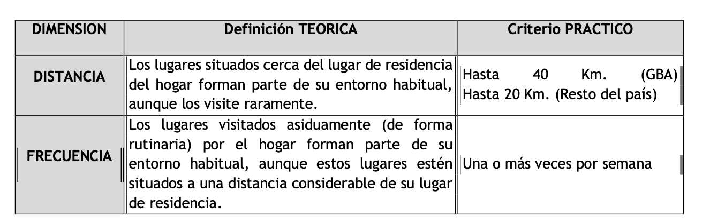
```

Por lo tanto, **los viajes** que aquí consideramos son los realizados a **destinos ubicados a más de 20/40 Km**. de la localidad donde está la vivienda principal y que fueron visitados con una **frecuencia no semanal**.

```{r Cuadro, echo=FALSE, fig.cap="Cuadro 2" }
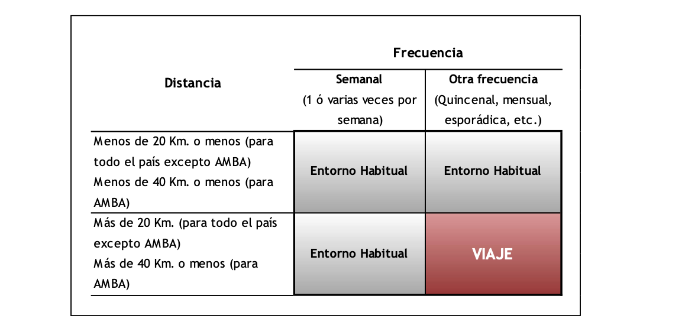
```

::: {.note}
**EXCLUSIONES: Un desplazamiento a un lugar fuera del entorno habitual**, en términos de distancia y frecuencia, **puede no ser un viaje**. Esto rige en todos los casos, **incluso cuando el viaje se realice a una segunda vivienda del hogar.**
:::

::: {.note}
**Exclusión 1. Empleado de alguna empresa o institución del lugar visitado:**
:::

Si una persona realizó un desplazamiento cuyo **motivo principal fue trabajar como empleado de una empresa o institución residente en el lugar visitado** (a cambio de un **salario**, se trate de un empleo registrado o no) no se considerará visitante de ese lugar y por tanto no se registrará el viaje.

No se considera **"empleado"** si quien viaja por trabajo brinda un servicio por el cual percibe honorarios, o bien si recibe dinero en concepto de "viáticos", es decir, una asignación para cubrir los gastos del viaje (pasajes, alojamiento, alimentación, etc.).

Por ejemplo, **NO se consideran viajeros cuando son empleados en el lugar de destino:**

-   trabajadores en temporada en hoteles, explotaciones agropecuarias, etc.;

-   trabajadores temporarios en internados, hospitales y similares;

-   estudiantes que viajan por períodos inferiores a 12 meses y trabajan para mantenerse (tanto quienes reciben un salario por su trabajo como quienes ayudan a una familia en las labores de la casa y el cuidado de los niños a cambio de la estancia y el mantenimiento);

-   quienes viajan como acompañantes (familiares, servicio doméstico, etc.) de aquellos que lo hacen por cualquiera de los motivos ya enunciados, aunque hayan realizado actividades turísticas.

En cambio, SÍ se consideran que realizaron viajes aquellas personas que viajaron por trabajo, pero no fueron empleados en el lugar de destino, por ejemplo:

-   conferenciantes, artistas de espectáculos y consultores;

-   un abogado que defiende en un juicio a una persona o empresa del lugar visitado;

-   un cirujano que viaja a realizar una operación por única vez.

::: {.note}
**Exclusión 2. Traslado como parte del trabajo:**
:::

**No** se consideran viajes aquellos desplazamientos realizados por las personas para quienes el **traslado es parte de su trabajo.** Por ejemplo, los pilotos de avión, conductores de camión o de ómnibus de larga distancia, viajantes de comercio y similares (incluyendo personal de seguridad, de asistencia -- azafatas-, etc.).

##### **PERIODOS DE REFERENCIA DE LA EVYTH**

::: {.note}
Esta Encuesta, indagará por la realización de viajes turísticos en los últimos dos meses. Por lo tanto, el período de referencia comprende los últimos dos meses anteriores a partir del último día del mes anterior al mes de realización de la Encuesta.
:::

Por ejemplo, si la Encuesta se realiza el 10 de noviembre de 2012, el período de referencia abarca del 1° de septiembre de 2011 al 31 de octubre de 2012, por lo que Usted deberá indagar por los viajes que el hogar realizó en esos dos meses.

**tabla pag 106 - 107**

Un viaje puede comenzar en un mes y finalizar en otro, inmediatamente posterior o no. Por definición el viaje se registra de acuerdo a la fecha de regreso. Por tanto, Usted deberá indagar por los viajes en los que la fecha de regreso corresponda a los dos meses incluidos en el periodo de referencia.

Por ejemplo, si una familia inicia su viaje el 20 de agosto y regresa el 2 de septiembre, se considera que ese viaje corresponde a septiembre, y sólo será registrado si este mes forma parte del periodo de referencia vigente al momento de realizar la encuesta.

##### **PAUTAS GENERALES PARA LA REALIZACIÓN DE LA ENTREVISTA TELEFÓNICA.**

Ud. va a comunicarse telefónicamente con hogares cuyos miembros tienen características muy diferentes en cuanto a: edad, nivel socio-económico, nivel educativo, personalidad, carácter, información, capacidad de comprensión, región de residencia, etc. De modo que Usted se entrenará para reconocer estas diferencias y acondicionará las estrategias de relevamiento de acuerdo a las mismas. Pero siempre deberá guiarse por las siguientes pautas:

-   Es necesario que ponga toda su atención y compresión en la tarea de relevamiento. Evite distracciones que entorpezcan su trabajo y que puedan llevarlo a una incorrecta captación de los datos. Mantener la concentración es fundamental tanto para realizar las preguntas como para registrar las respuestas, ya que los errores de digitación son difíciles de captar y la información perdida difícil de recuperar.

-   Lea las preguntas tal y como aparecen en la pantalla. Esto garantiza que todos los operadores procedan de la misma forma.

-   Asegúrese que el entrevistado haya comprendido la pregunta. Repita la pregunta tantas veces como sea necesario hasta que el entrevistado la haya entendido. Si es necesario, utilice ejemplos para facilitar la comprensión, teniendo en cuenta las particularidades del hogar entrevistado.

-   Mantenga un tono de voz firme pero cordial y agradable que favorezca un clima de confianza y de distensión con el entrevistado. Es fundamental establecer un lazo de confianza, por eso debe brindar todas las garantías de anonimato, privacidad y seguridad de la información. Recuerde al entrevistado que la confidencialidad y anonimato de los datos que brinde está protegida por leyes nacionales.

-   No apure innecesariamente los tiempos de la entrevista. En algunos casos hay miembros del hogar que recuerdan rápidamente las características de sus viajes y de los otros miembros del hogar. En otros casos esto lleva más tiempo, por lo tanto, es necesaria toda su paciencia para poder obtener la información de manera correcta.

-   Si la persona que atiende el llamado no cuenta con el tiempo suficiente para realizar la entrevista, pida hablar con otro miembro del hogar o, si no es posible, concierte una nueva entrevista para otro momento. Si un hogar responde la encuesta a desgano esa información suele ser incompleta y deficiente.

<!-- -->

-   No aliente la no respuesta del entrevistado. Evite mencionar ciertas frases, tales como: "me veo en la obligación de preguntarle los ingresos", "si usted quiere responde, si no quiere no responde", etc. Tiene que dar su máximo esfuerzo para evitar los registros con Ns/Nr, dado que esta categoría debe usarse sólo excepcionalmente: esta opción sólo aparece en la encuesta por la necesidad de darle continuidad al flujo de preguntas.

-   No induzca respuestas, ni dé por supuestas respuestas que el entrevistado no haya brindado.

-   En muchas preguntas Usted deberá "traducir" una respuesta coloquial del entrevistado a una de las categorías previstas en el cuestionario. Si bien en la mayoría de los casos esto suele ser sencillo, algunas veces encontrará situaciones de cierta complejidad que requieren una definición de su parte, para lo cual deberá haber asimilado cada uno de los conceptos relacionados con esta encuesta, tanto en lo que hace a su definición general como a las excepciones y casos infrecuentes. En general, en el sistema de ingreso, luego del enunciado de la pregunta, encontrará las definiciones conceptuales y otras aclaraciones a las cuales recurrir en caso de dudas.

-   Si persisten dudas en las respuestas brindadas por los entrevistados, antes de enviar la encuesta consulte con el supervisor o jefe de campo para resolverlas.

#### **MÓDULO 2: INICIO Y OPERACIONES BÁSICAS DEL SISTEMA DE INGRESO DE DATOS**

##### **INICIO DEL SISTEMA DE INGRESO ONLINE DE LA INFORMACIÓN**

Deberá encender su computadora y realizar las siguientes operaciones:

```{r detal, echo=FALSE, fig.cap="Detalles" }
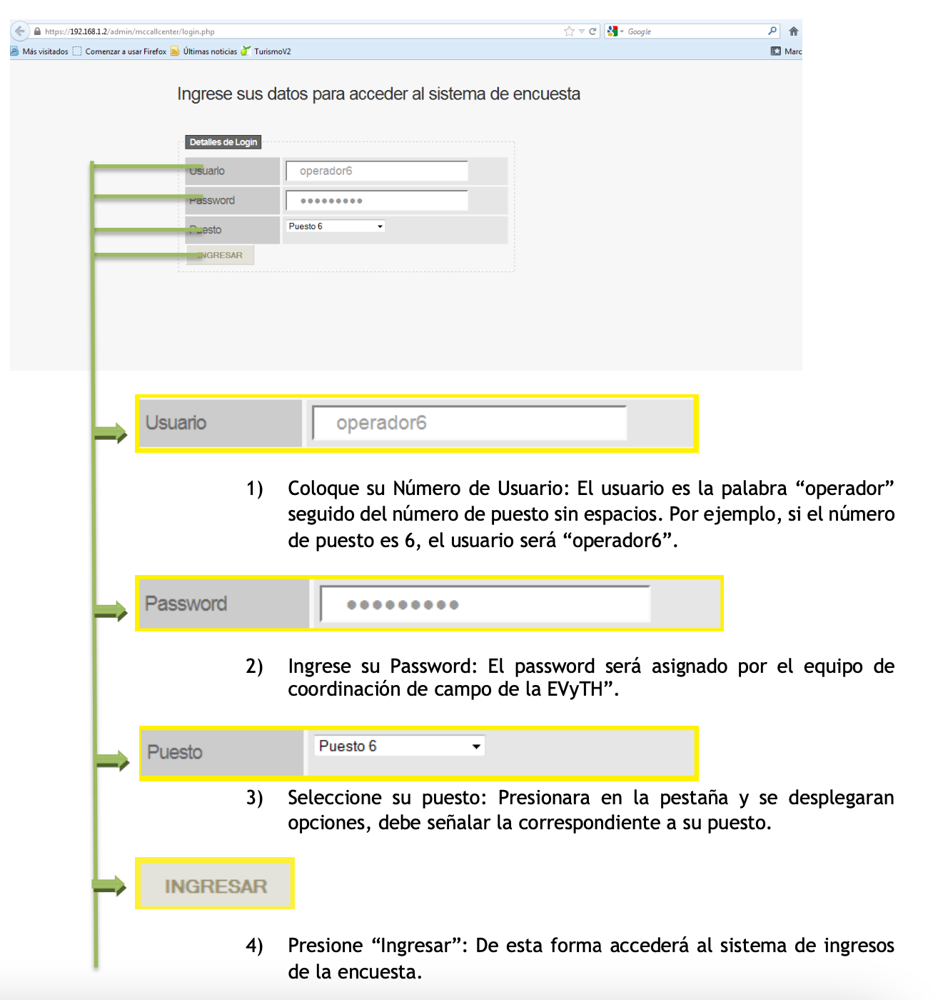
```

Ahora veremos cómo se completa la carátula que contiene el resumen del resultado del llamado realizado a cada domicilio.

##### **COMPLETAMIENTO DE LA CARÁTULA: "RESUMEN DEL LLAMADO"**

La Carátula de este Cuestionario debe ser completada en el momento en que se realiza el llamado telefónico, consignando las distintas situaciones que se presenten. Esta carátula constituye un resumen lógico de la llamada telefónica. En ella volcará información que surja de la realización de preguntas o del desarrollo de la entrevista.

En la pantalla aparecerá el número al que debe a llamar. Pero antes de efectuar el llamado deberá observar la información correspondiente al número que sale en pantalla (Provincia, detalle de llamadas, etc.), ya que la misma facilitará el dialogo con el entrevistado. Si el llamado que está por realizar no es el primero a ese hogar, en la pantalla le aparecerá el detalle de llamadas realizadas con anterioridad, con lo que dispondrá de información sobre lo que ocurrió previamente con ese hogar. Por ejemplo, si en el detalle de último llamado dice "Se cortó y no se pudo volver a encuestar", Ud. sabe que está por comunicarse con un hogar que ya fue contactado previamente, y es información adicional que le puede servir para lograr, esta vez, realizar la encuesta. Una vez concluido el llamado y enviado el "registro de llamado" le aparecerá el número al que deberá llamar a continuación.

```{r registr, echo=FALSE, fig.cap="registro de llamado" }
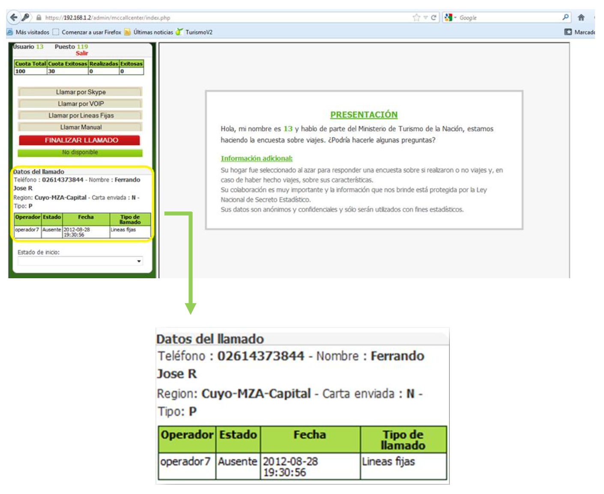
```

Observe la Historia del número telefónico ("Datos del llamado"): El historial le brindará información para afrontar la nueva llamada. Le permitirá saber si la encuesta ya ha sido iniciada, pero por algún motivo no fue terminada (si la vez anterior respondió un menor, si se pidió volver a llamar a esa hora, etc.). Podrá ser usada en la presentación para generar confianza con el encuestado. Si no aparece el historial implica que es la primera vez que se llama a ese hogar.

```{r i, echo=FALSE, fig.cap="Interfaz" }
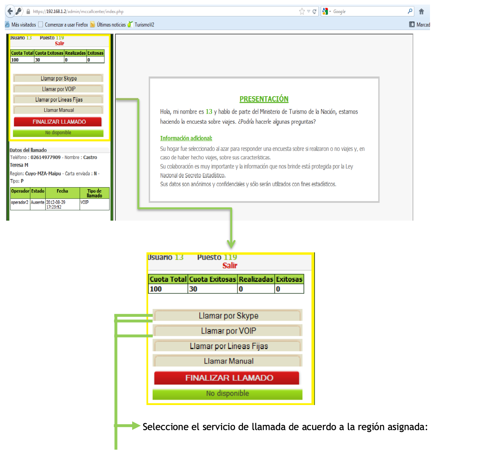
```

```{r interfa1, echo=FALSE, fig.cap="Interfaz" }
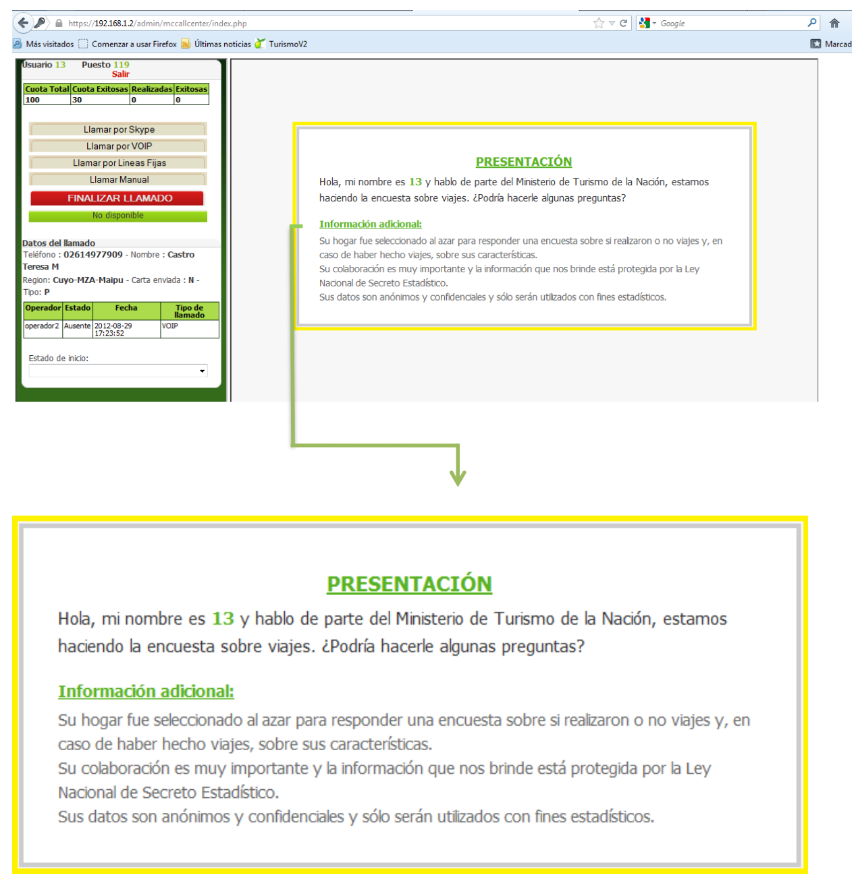
```

Si el llamado es respondido, deberá presentarse de la siguiente forma:

::: {.note}
Hola, mi nombre es ........ y hablo de parte del Ministerio de Turismo de la Nación, ¿podría hacerle unas preguntas sobre viajes?
:::

En caso de ser requerida, Usted le brindará mayor información:

::: {.note}
"Su hogar fue seleccionado al azar para responder una encuesta sobre si realizaron o no viajes y, en caso de haber hecho viajes, sobre sus características". "Su colaboración es muy importante y la información que nos brinde está protegida por la Ley Nacional de Secreto Estadístico. Sus datos son anónimos y confidenciales y sólo serán utilizados con fines estadísticos."
:::

Usted puede brindarle todas las explicaciones que el entrevistado requiera, de forma clara y sencilla. Puede seguir las aquí explicitadas o decirlas de otra forma, siempre y cuando se ajusten a la realidad.

-   Debe evitar mencionar la palabra "turismo", para no sesgar la comprensión del entrevistado, puesto que en esta Encuesta se indaga por viajes que pudieron haber sido por motivos no estrictamente ligados a lo que la gente entiende por "turismo".

-   Además, debe hacer hincapié en que es importante que responda la Encuesta aún si no han realizado viajes, puesto que conocer esto es tan importante como saber si han realizado viajes y sus características. Por ejemplo, puede argumentar lo siguiente:

::: {.note}
"Es importante que responda la Encuesta aún si no ha realizado viajes puesto que al Ministerio de Turismo le interesa conocer las razones por las que las personas no viajan, con el objetivo de implementar políticas activas que permitan que más gente pueda viajar".
:::

-   Si la persona contactada desea verificar la existencia de la encuesta o su identidad, Usted deberá informarle el número telefónico de la coordinación de campo y el horario en que pueden comunicarse, la dirección de correo electrónico a la que pueden escribir y/o el sitio web del Ministerio donde se informa sobre la realización de esta Encuesta.

-   Luego de la presentación, si es que el llamado telefónico fue respondido, y de la respuesta dada por la persona contactada, Usted deberá marcar una opción que corresponda al "Resultado inicial del llamado":

```{r interfa1, echo=FALSE, fig.cap="Interfaz" }
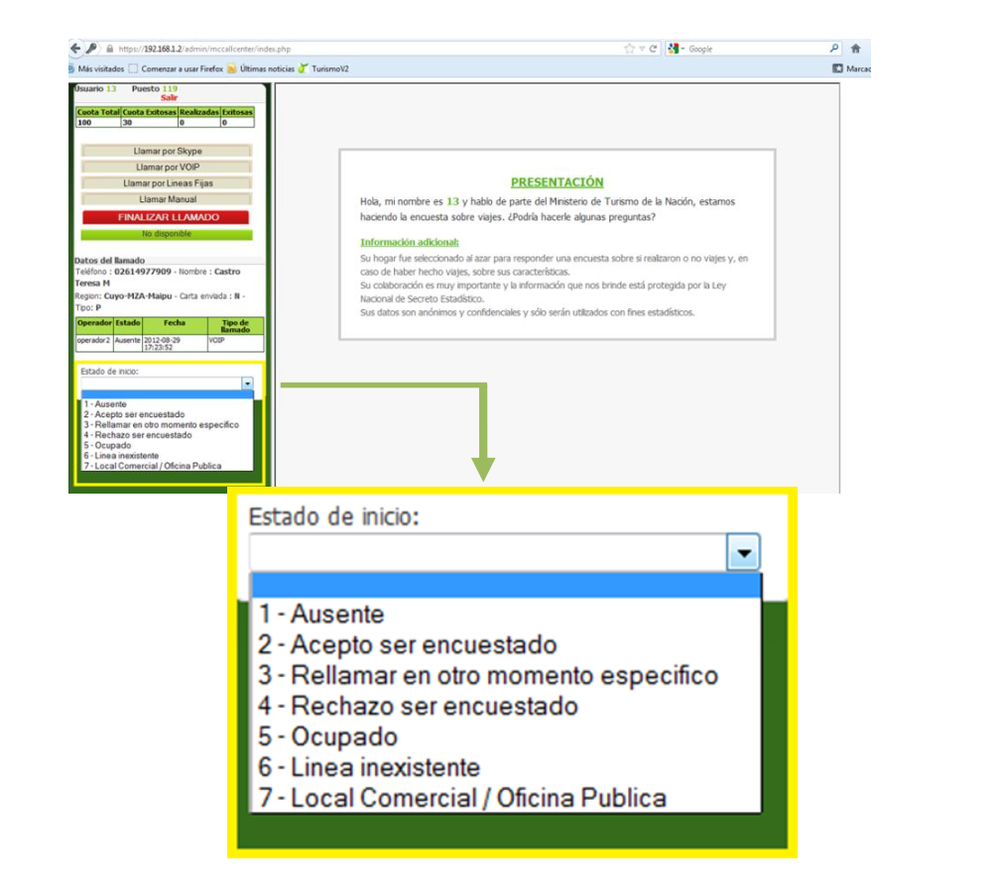
```

Deberá seleccionar una categoría dependiendo del resultado del llamado

**Ausente:** Marcará esta opción si nadie atiende el llamado y luego presionará “Generar Registro”. Este número volverá a aparecer minutos después.

```{r estado_de, echo=FALSE, fig.cap="Estado de inicio" }
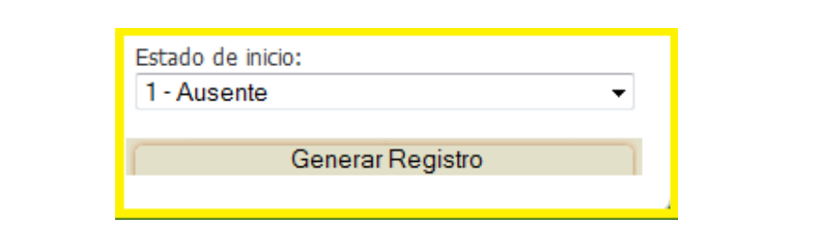
```

**Acepto ser encuestado:** Si la persona contactada forma parte de un hogar particular que reside en el domicilio contactado y acepta responder, abrirá la encuesta y procederá a su administración. Luego presionará “Encuestar”, de ese modo se habilitará el formulario de la encuesta para ser completado.

```{r encuest, echo=FALSE, fig.cap="Encuestar" }
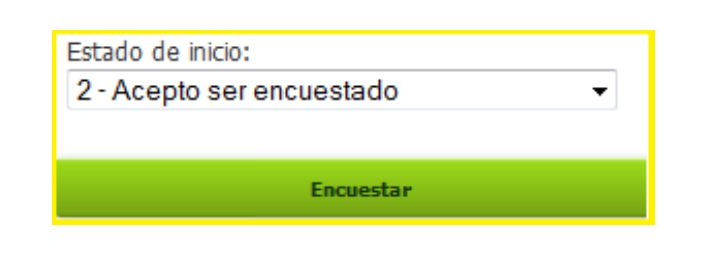
```

Luego de realizar la encuesta Usted deberá completar el resultado final del llamado (Estado de finalización):

**Completa:** La entrevista culminó exitosamente, con todas las respuestas completas hasta el final.

```{r encues, echo=FALSE, fig.cap="Aceptacion" }
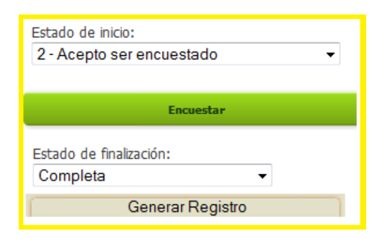
```

**Incompleta:** La entrevista se interrumpió antes de completar las preguntas sobre el jefe de hogar, pero la persona contactada acepta seguir contestando en otro momento. En tal caso se pacta un nuevo horario y/o día para completar la encuesta. Debe cortar y SIN generar Registro debe proceder de la siguiente manera:


```{r enc, echo=FALSE, fig.cap="Inicio a encuesta" }
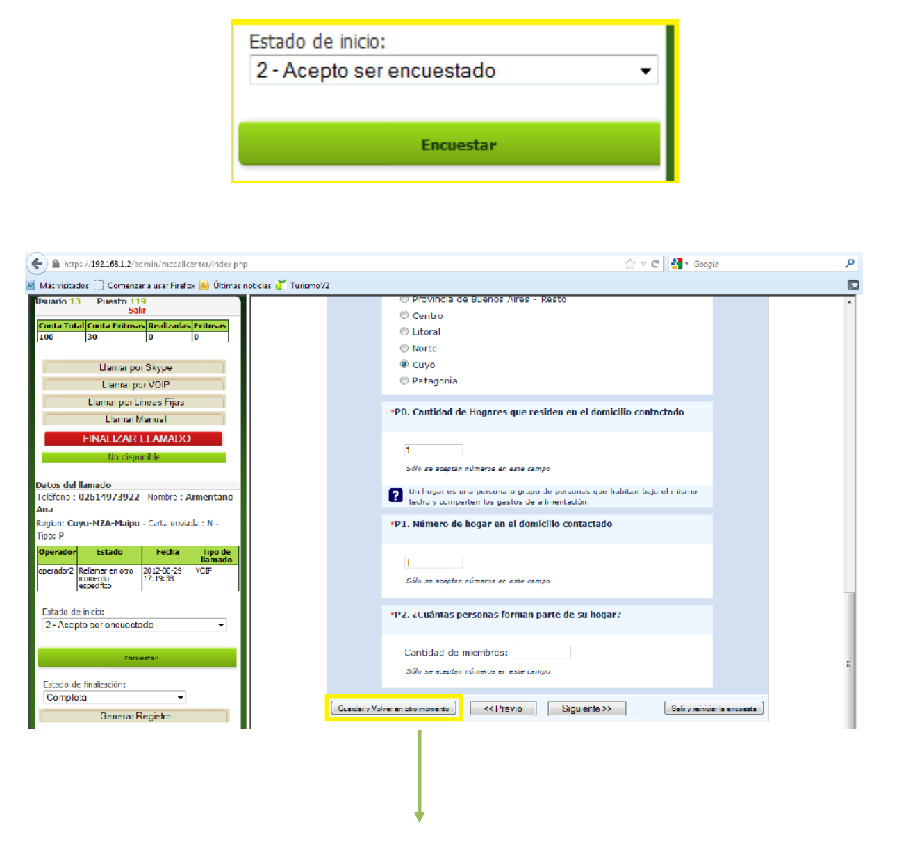
```


```{r en, echo=FALSE, fig.cap="guardar" }
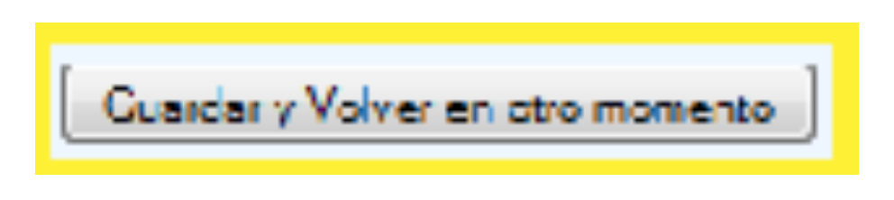
```

Seleccionara la opción “Guardar y Volver en otro momento”.

```{r en_no_ter, echo=FALSE, fig.cap="guardar una encuesta no termonada" }
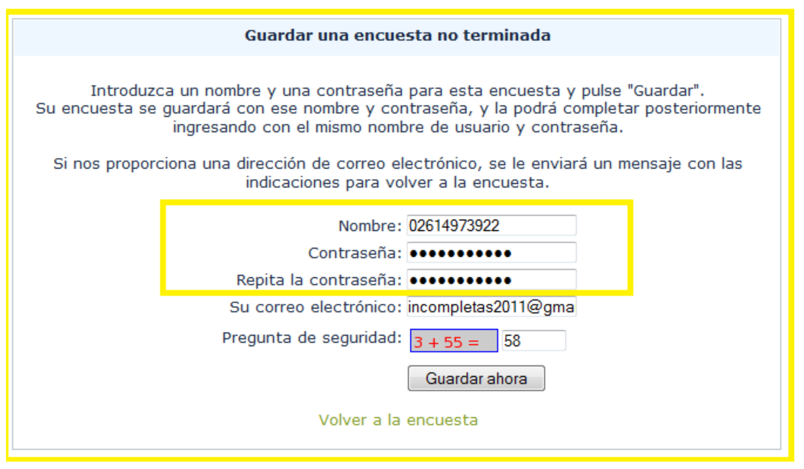
```

En el “Nombre”, “Contraseña” y “Repita la contraseña” ingrese el número de teléfono al que se llamó.


```{r en_no_termi, echo=FALSE, fig.cap="Completar datos" }
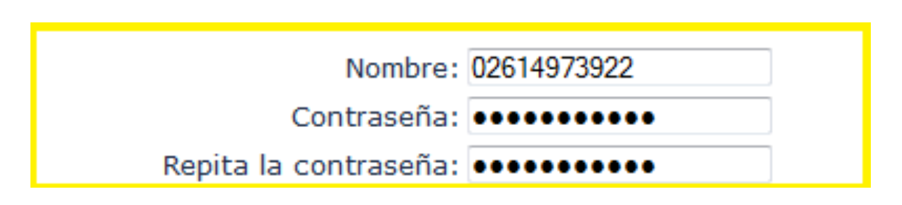
```

En el campo “Su correo electrónico” debe ingresar incompletas2011@gmail.com

```{r en_no_termina, echo=FALSE, fig.cap="Correo electronico" }
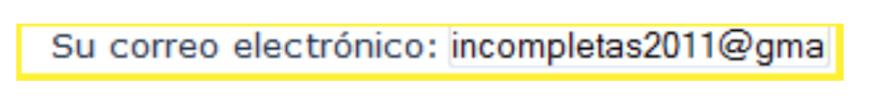
```

En el campo “Pregunta de seguridad” debe ingresar el resultado de la operación matemática indicada

```{r en_no_terminada, echo=FALSE, fig.cap="Pregunta de seguridad" }

```

Presione “Guardar ahora”.

```{r guard, echo=FALSE, fig.cap="Guargar ahora" }

```
Una vez hecho esto, se debe seleccionar el “Estado de finalización” (ubicado en el lado izquierdo de la pantalla), la opción “Incompleta” y seleccionara “Día” y “Hora” en que concertó una nueva entrevista. Luego presione “Generar Registro”.

```{r fin, echo=FALSE, fig.cap="Estado de finalizacion" }
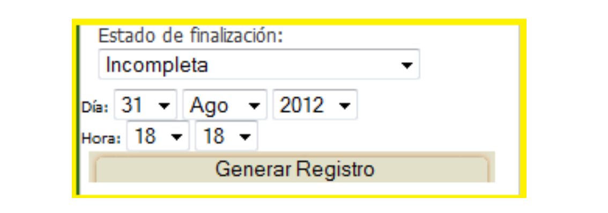
```


**Incompleta Rechazo:* La entrevista se interrumpió antes de completar las preguntas sobre el jefe de hogar porque la persona contactada se negó a continuar con la encuesta. En ese caso, la encuesta se da por finalizada ese día. Luego procederá de la misma forma que cuando se trató de una encuesta “Incompleta”. Finalmente seleccionara la opción “Incompleta Rechazo” y presionara “Generar Registro”.

